# Design Document: Full Docker Migration

## Overview

Dokumen ini menjelaskan desain teknis untuk migrasi penuh Horizon Trader Platform dari setup berbasis AAPanel ke setup Docker-only. Setelah migrasi, seluruh stack — Nginx reverse proxy, SSL (Let's Encrypt via Certbot), PostgreSQL database, Telegram bot, dan Next.js frontend — akan berjalan di dalam Docker container. Satu-satunya dependency di host server adalah Docker dan Docker Compose.

### Prinsip Desain

1. **Single Source of Truth**: Semua konfigurasi bersumber dari file `.env` — zero hardcoded values di seluruh config files.
2. **Bare Server Ready**: Deploy script dapat dijalankan di server baru yang hanya memiliki Docker terinstall.
3. **Idempotent Deployment**: Deploy script aman dijalankan berulang kali tanpa merusak data atau sertifikat yang sudah ada.
4. **Security by Default**: Hanya port HTTP/HTTPS yang terekspos ke host; semua service internal berkomunikasi via Docker network.
5. **Easy Backup**: Database menggunakan bind mount ke host directory untuk kemudahan backup.

### Perubahan dari Setup Saat Ini

| Aspek | AAPanel (Sekarang) | Docker-Only (Target) |
|-------|-------------------|---------------------|
| Nginx | Dikelola AAPanel di host | Container `nginx:1.27-alpine` |
| SSL | AAPanel Let's Encrypt plugin | Container `certbot/certbot` |
| Port mapping | `3888:3000`, `4888:4000` ke host | Hanya `80:80`, `443:443` via Nginx |
| Config file | `docker-compose.prod.yml` | `docker-compose.yml` (unified) |
| Deploy | `deploy.sh` → AAPanel proxy | `deploy-docker.sh` → self-contained |
| DB storage | Named volume `pgdata` | Bind mount `${DB_DATA_DIR}` |

## Architecture

### Arsitektur Service

```mermaid
graph TB
    Internet((Internet))

    subgraph Host["Host Server (Docker Only)"]
        subgraph DockerNetwork["horizon-net (Docker Bridge Network)"]
            Nginx["nginx<br/>nginx:1.27-alpine<br/>Port 80/443 → Host"]
            Certbot["certbot<br/>certbot/certbot<br/>SSL renewal setiap 12 jam"]
            Frontend["frontend<br/>Node 20 Alpine<br/>Next.js :3000"]
            Bot["bot<br/>Node 20 Alpine<br/>Express :4000"]
            DB["db<br/>postgres:16-alpine<br/>:5432"]
        end

        subgraph Volumes["Volumes & Mounts"]
            SSLVol["./certbot/conf<br/>(SSL certificates)"]
            ACMEVol["./certbot/www<br/>(ACME challenges)"]
            DBData["${DB_DATA_DIR}<br/>(PostgreSQL data)"]
            NginxConf["./nginx/<br/>(Config templates)"]
        end
    end

    Internet -->|":80 / :443"| Nginx
    Nginx -->|"/ → :3000"| Frontend
    Nginx -->|"/api/bot/ → :4000"| Bot
    Nginx -->|"/webhook/telegram → :4000"| Bot
    Frontend --> DB
    Bot --> DB
    Nginx --- SSLVol
    Certbot --- SSLVol
    Certbot --- ACMEVol
    Nginx --- ACMEVol
    DB --- DBData
    Nginx --- NginxConf
```



### Deploy Script Flow

```mermaid
flowchart TD
    Start([deploy-docker.sh]) --> ValidateEnv["Validasi .env<br/>Cek semua variabel wajib"]
    ValidateEnv -->|Gagal| ErrorExit1["❌ Tampilkan variabel yang kurang<br/>Exit 1"]
    ValidateEnv -->|OK| AutoConstruct["Auto-construct variabel:<br/>DATABASE_URL, WEBHOOK_URL,<br/>FRONTEND_URL, NEXT_PUBLIC_SITE_URL"]
    AutoConstruct --> SetDefaults["Set default untuk variabel opsional:<br/>FRONTEND_PORT=3000, BOT_PORT=4000, dll"]
    SetDefaults --> CreateDirs["Buat direktori:<br/>${DB_DATA_DIR}, ./certbot/conf, ./certbot/www"]
    CreateDirs --> CheckSSL{"Sertifikat SSL<br/>sudah ada?"}
    CheckSSL -->|Belum| SelfSigned["Generate self-signed cert<br/>openssl req -x509"]
    CheckSSL -->|Sudah| Build
    SelfSigned --> Build["docker compose build --no-cache"]
    Build -->|Gagal| ErrorExit2["❌ Tampilkan build error<br/>Exit 1"]
    Build -->|OK| StartContainers["docker compose up -d"]
    StartContainers --> WaitHealthy["Tunggu semua service healthy"]
    WaitHealthy --> CheckCert{"Self-signed cert<br/>atau Let's Encrypt?"}
    CheckCert -->|Self-signed| RequestLE["Minta sertifikat Let's Encrypt<br/>via certbot container (webroot)"]
    CheckCert -->|Let's Encrypt| HealthReport
    RequestLE -->|Gagal| WarnSSL["⚠️ Warning: SSL gagal<br/>Site berjalan dengan self-signed"]
    RequestLE -->|OK| ReloadNginx["docker exec nginx nginx -s reload"]
    WarnSSL --> HealthReport
    ReloadNginx --> HealthReport["Tampilkan health check status<br/>untuk semua service"]
    HealthReport --> Done([✅ Deploy selesai])
```



### Volume Strategy

```mermaid
graph LR
    subgraph BindMounts["Bind Mounts (Host ↔ Container)"]
        BM1["${DB_DATA_DIR} → /var/lib/postgresql/data"]
        BM2["./certbot/conf → /etc/letsencrypt"]
        BM3["./certbot/www → /var/www/certbot"]
        BM4["./nginx/nginx.conf → /etc/nginx/nginx.conf"]
        BM5["./nginx/conf.d/ → /etc/nginx/templates/"]
    end

    BM1 ---|"DB_Container"| DB[(PostgreSQL)]
    BM2 ---|"Nginx + Certbot"| SSL[SSL Certs]
    BM3 ---|"Nginx + Certbot"| ACME[ACME Challenge]
    BM4 ---|"Nginx"| NC[Nginx Main Config]
    BM5 ---|"Nginx (envsubst)"| NT[Nginx Templates]
```



**Catatan penting tentang `envsubst`**: Nginx official Docker image sudah memiliki built-in support untuk `envsubst`. File template di `/etc/nginx/templates/*.conf.template` akan otomatis di-process dan hasilnya ditulis ke `/etc/nginx/conf.d/*.conf` saat container start. Kita memanfaatkan fitur ini sehingga tidak perlu custom entrypoint.

## Components and Interfaces

### 1. Docker Compose (`docker-compose.yml`)

File utama yang mendefinisikan seluruh stack. Menggantikan `docker-compose.prod.yml`.

**Services:**

| Service | Image | Exposed Ports | Network |
|---------|-------|--------------|---------|
| `db` | `postgres:16-alpine` | `expose: 5432` (internal only) | `horizon-net` |
| `bot` | Build dari `bot/Dockerfile` | `expose: ${BOT_PORT}` (internal only) | `horizon-net` |
| `frontend` | Build dari `frontend/Dockerfile` | `expose: ${FRONTEND_PORT}` (internal only) | `horizon-net` |
| `nginx` | `nginx:1.27-alpine` | `ports: ${NGINX_HTTP_PORT}:80, ${NGINX_HTTPS_PORT}:443` | `horizon-net` |
| `certbot` | `certbot/certbot` | Tidak ada | `horizon-net` |

**Dependency chain:**
```
certbot ─(depends_on)─→ nginx ─(depends_on)─→ frontend ─(depends_on)─→ db
                                              bot ──────(depends_on)─→ db
```

**Environment variable auto-construction di docker-compose.yml:**
```yaml
bot:
  environment:
    DATABASE_URL: "postgresql://${POSTGRES_USER}:${POSTGRES_PASSWORD}@${POSTGRES_HOST:-db}:${POSTGRES_PORT:-5432}/${POSTGRES_DB}"
    TELEGRAM_WEBHOOK_URL: "https://${DOMAIN}/webhook/telegram"

frontend:
  environment:
    DATABASE_URL: "postgresql://${POSTGRES_USER}:${POSTGRES_PASSWORD}@${POSTGRES_HOST:-db}:${POSTGRES_PORT:-5432}/${POSTGRES_DB}"
    NEXT_PUBLIC_SITE_URL: "https://${DOMAIN}"
    FRONTEND_URL: "https://${DOMAIN}"
```

### 2. Nginx Config Templates

Menggunakan built-in `envsubst` dari Nginx Docker image. Template files disimpan di `nginx/templates/` dan di-mount ke `/etc/nginx/templates/`.

**File structure:**
```
nginx/
├── nginx.conf                          # Main config (rate limit zones pakai envsubst manual)
├── templates/
│   └── default.conf.template           # Server blocks — auto-processed oleh Nginx image
```

**Pendekatan envsubst:**

Untuk `nginx.conf` (main config yang berisi rate limit zones), kita menggunakan custom entrypoint yang menjalankan `envsubst` sebelum Nginx start, karena file di `/etc/nginx/nginx.conf` tidak di-process oleh built-in template mechanism.

Untuk `default.conf.template`, kita memanfaatkan built-in Nginx Docker image template support: file di `/etc/nginx/templates/*.conf.template` otomatis di-process dan hasilnya ditulis ke `/etc/nginx/conf.d/*.conf`.

**Variabel yang di-template:**
- `${DOMAIN}` — domain name untuk SSL cert path dan `server_name`
- `${FRONTEND_PORT}` — port upstream frontend (default: `3000`)
- `${BOT_PORT}` — port upstream bot (default: `4000`)
- `${NGINX_RATE_LIMIT_GENERAL}` — rate limit general zone
- `${NGINX_RATE_LIMIT_API}` — rate limit API zone
- `${NGINX_RATE_LIMIT_WEBHOOK}` — rate limit webhook zone

**Catatan**: `${NGINX_HTTP_PORT}` dan `${NGINX_HTTPS_PORT}` digunakan di `docker-compose.yml` untuk port mapping ke host, bukan di dalam Nginx config. Di dalam container, Nginx selalu listen di port `80` dan `443`.

### 3. Deploy Script (`deploy-docker.sh`)

Script bash baru yang menggantikan `deploy.sh`. Menangani seluruh lifecycle deployment.

**Interface:**
```bash
# Basic usage
bash deploy-docker.sh

# Script tidak menerima argument — semua konfigurasi dari .env
```

**Fungsi utama:**

| Fungsi | Deskripsi |
|--------|-----------|
| `validate_env()` | Cek keberadaan `.env`, validasi semua variabel wajib |
| `check_required_vars()` | Cek variabel wajib tidak kosong, tidak placeholder |
| `auto_construct_vars()` | Bangun `DATABASE_URL`, `WEBHOOK_URL`, `FRONTEND_URL` dari base vars |
| `set_defaults()` | Set default untuk variabel opsional (ports, rate limits) |
| `setup_directories()` | Buat `${DB_DATA_DIR}`, `./certbot/conf`, `./certbot/www` |
| `generate_self_signed()` | Generate self-signed cert jika belum ada sertifikat |
| `build_and_start()` | `docker compose build --no-cache && docker compose up -d` |
| `request_letsencrypt()` | Minta cert Let's Encrypt via certbot container |
| `health_check()` | Cek status semua service dan tampilkan report |

### 4. Certbot Container

**Entrypoint command:**
```bash
entrypoint: "/bin/sh -c 'trap exit TERM; while :; do certbot renew; sleep 12h & wait $${!}; done;'"
```

Ini menjalankan `certbot renew` setiap 12 jam. Certbot secara otomatis skip renewal jika sertifikat masih valid (belum mendekati expired — threshold default 30 hari).

**Reload Nginx setelah renewal:**
Deploy script mengkonfigurasi certbot dengan `--deploy-hook` yang mengirim signal reload ke Nginx container:
```bash
certbot certonly --webroot ... --deploy-hook "wget -qO- http://nginx:80/health || true"
```

Alternatif yang lebih reliable: certbot container menggunakan `--post-hook` dan Nginx container di-configure dengan `inotifywait` atau cron-based reload. Namun pendekatan paling sederhana adalah entrypoint certbot yang juga menjalankan reload:

```bash
entrypoint: "/bin/sh -c 'trap exit TERM; while :; do certbot renew --quiet && wget -qO- http://nginx:80/ > /dev/null 2>&1; sleep 12h & wait $${!}; done;'"
```

Karena Nginx perlu reload config setelah cert renewal, kita menggunakan pendekatan dimana deploy script menjalankan `docker exec horizon-nginx nginx -s reload` setelah initial cert request. Untuk auto-renewal, certbot entrypoint di-combine dengan reload signal.

### 5. Nginx Entrypoint Wrapper

Untuk menangani `envsubst` pada `nginx.conf` (main config), kita membuat wrapper script:

**File: `nginx/docker-entrypoint.sh`**
```bash
#!/bin/sh
# Process nginx.conf template
envsubst '${NGINX_RATE_LIMIT_GENERAL} ${NGINX_RATE_LIMIT_API} ${NGINX_RATE_LIMIT_WEBHOOK}' \
    < /etc/nginx/nginx.conf.template > /etc/nginx/nginx.conf

# Let the default Nginx entrypoint handle templates/ directory
exec /docker-entrypoint.sh "$@"
```

Ini memastikan:
1. `nginx.conf` di-process untuk rate limit variables
2. `default.conf.template` di-process oleh built-in mechanism untuk domain, ports, dll

## Data Models

### Environment Variables Schema

Semua variabel konfigurasi platform, dikelompokkan per section:

```
┌─────────────────────────────────────────────────────────┐
│ .env File Structure                                      │
├─────────────────────────────────────────────────────────┤
│                                                          │
│ ── Database ──────────────────────────────────────────── │
│ POSTGRES_HOST      = db              (default)           │
│ POSTGRES_PORT      = 5432            (default)           │
│ POSTGRES_DB        = horizon         (WAJIB)             │
│ POSTGRES_USER      = horizon_user    (WAJIB)             │
│ POSTGRES_PASSWORD  = ********        (WAJIB)             │
│ DB_DATA_DIR        = ./data/postgres (default)           │
│ DATABASE_URL       → auto-constructed by deploy script   │
│                                                          │
│ ── Domain & SSL ──────────────────────────────────────── │
│ DOMAIN             = example.com     (WAJIB)             │
│ SSL_EMAIL          = admin@...       (WAJIB)             │
│ FRONTEND_URL       → auto-constructed from DOMAIN        │
│ NEXT_PUBLIC_SITE_URL → auto-constructed from DOMAIN      │
│                                                          │
│ ── Telegram Bot ──────────────────────────────────────── │
│ TELEGRAM_BOT_TOKEN = ********        (WAJIB)             │
│ TELEGRAM_BOT_NAME  = MyBot           (opsional)          │
│ TELEGRAM_GROUP_ID  = -100...         (opsional)          │
│ TELEGRAM_WEBHOOK_URL → auto-constructed from DOMAIN      │
│                                                          │
│ ── Cloudflare R2 ─────────────────────────────────────── │
│ R2_ENDPOINT        = https://...     (opsional)          │
│ R2_ACCOUNT_ID      = ********        (opsional)          │
│ R2_ACCESS_KEY_ID   = ********        (WAJIB)             │
│ R2_SECRET_ACCESS_KEY = ********      (WAJIB)             │
│ R2_BUCKET_NAME     = horizon-media   (WAJIB)             │
│ R2_PUBLIC_URL      = https://...     (opsional)          │
│                                                          │
│ ── Admin Credentials ─────────────────────────────────── │
│ ADMIN_USERNAME     = admin           (WAJIB)             │
│ ADMIN_PASSWORD     = ********        (WAJIB)             │
│                                                          │
│ ── Service Ports ─────────────────────────────────────── │
│ FRONTEND_PORT      = 3000            (default)           │
│ BOT_PORT           = 4000            (default)           │
│ NGINX_HTTP_PORT    = 80              (default)           │
│ NGINX_HTTPS_PORT   = 443             (default)           │
│                                                          │
│ ── Nginx Rate Limiting ───────────────────────────────── │
│ NGINX_RATE_LIMIT_GENERAL  = 30r/s    (default)           │
│ NGINX_RATE_LIMIT_API      = 10r/s    (default)           │
│ NGINX_RATE_LIMIT_WEBHOOK  = 5r/s     (default)           │
│                                                          │
│ ── Application ───────────────────────────────────────── │
│ NODE_ENV           = production      (default)           │
│                                                          │
└─────────────────────────────────────────────────────────┘
```

### Variabel Wajib vs Opsional

**Wajib (deploy script akan gagal jika kosong):**
- `DOMAIN`, `SSL_EMAIL`
- `POSTGRES_DB`, `POSTGRES_USER`, `POSTGRES_PASSWORD`
- `TELEGRAM_BOT_TOKEN`
- `R2_ACCESS_KEY_ID`, `R2_SECRET_ACCESS_KEY`, `R2_BUCKET_NAME`
- `ADMIN_USERNAME`, `ADMIN_PASSWORD`

**Opsional (ada default value):**
- `POSTGRES_HOST` (default: `db`), `POSTGRES_PORT` (default: `5432`)
- `FRONTEND_PORT` (default: `3000`), `BOT_PORT` (default: `4000`)
- `NGINX_HTTP_PORT` (default: `80`), `NGINX_HTTPS_PORT` (default: `443`)
- `NGINX_RATE_LIMIT_*` (defaults: `30r/s`, `10r/s`, `5r/s`)
- `DB_DATA_DIR` (default: `./data/postgres`)
- `NODE_ENV` (default: `production`)

**Auto-constructed (dihitung oleh deploy script / docker-compose):**
- `DATABASE_URL` = `postgresql://${POSTGRES_USER}:${POSTGRES_PASSWORD}@${POSTGRES_HOST}:${POSTGRES_PORT}/${POSTGRES_DB}`
- `TELEGRAM_WEBHOOK_URL` = `https://${DOMAIN}/webhook/telegram`
- `FRONTEND_URL` = `https://${DOMAIN}`
- `NEXT_PUBLIC_SITE_URL` = `https://${DOMAIN}`

### File yang Diubah vs Dibuat Baru

| File | Status | Keterangan |
|------|--------|------------|
| `docker-compose.yml` | **Diubah** | Tambah certbot, ubah volumes, hapus port mapping internal |
| `docker-compose.prod.yml` | **Dihapus** | Digantikan oleh `docker-compose.yml` |
| `nginx/nginx.conf` | **Diubah** | Rename jadi template, rate limit pakai variabel |
| `nginx/conf.d/default.conf` | **Dipindah** | Jadi `nginx/templates/default.conf.template` |
| `nginx/docker-entrypoint.sh` | **Baru** | Wrapper untuk envsubst nginx.conf |
| `deploy-docker.sh` | **Baru** | Deploy script baru untuk bare server |
| `deploy.sh` | **Dihapus** | Digantikan oleh `deploy-docker.sh` |
| `.env.example` | **Diubah** | Comprehensive dengan semua section |
| `nginx/init-ssl.sh` | **Dihapus** | Fungsionalitas diintegrasikan ke deploy script |
