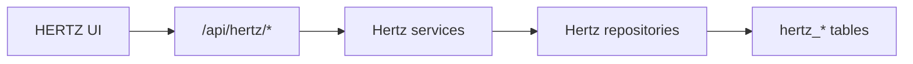
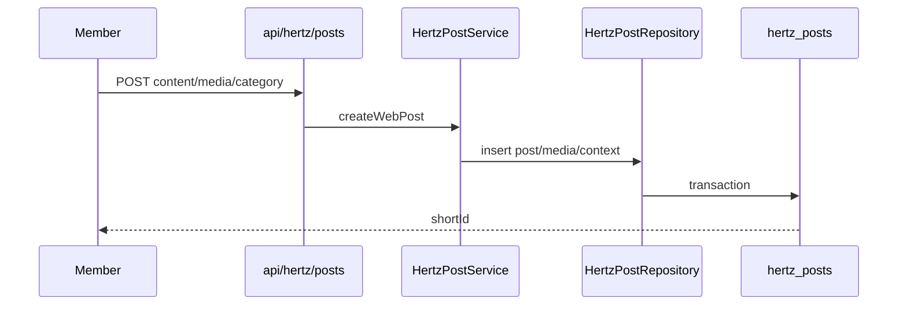

# Design Document: HERTZ Platform Refactor Completion

## Overview

Completion work converts the current HERTZ facade into a real HERTZ domain. The existing UI shell may remain, but backend runtime must move from `FeedService`/`feed_posts` compatibility to explicit HERTZ repositories, services, routes, and tests.

The highest priority is to fix runtime failures first, then migrate the domain layer, then complete DM/Blog/Admin, then run Docker and visual QA.

## Source of Truth



Legacy tables may remain for historical or reset compatibility, but HERTZ routes must not require them.

## Target Modules

```txt
shared/types/hertz.ts
shared/repositories/hertzPostRepository.ts
shared/repositories/hertzInteractionRepository.ts
shared/repositories/hertzCommunityNoteRepository.ts
shared/repositories/hertzDmRepository.ts
shared/repositories/hertzBlogRepository.ts
shared/services/hertzPostService.ts
shared/services/hertzInteractionService.ts
shared/services/hertzCommunityNoteService.ts
shared/services/hertzDmService.ts
shared/services/hertzBlogService.ts
shared/services/hertzAdminService.ts
```

API routes stay thin and should instantiate HERTZ services directly.

## HERTZ Post Flow



Post list and detail read from `hertz_posts`, join author, media, market context, primary note, and interaction counts.

## Category Mapping

Runtime values:

```txt
trading_room
life_coffee
general
community_note
```

Compatibility mapping:

```txt
#trading -> trading_room
#signal -> trading_room
#cerita -> life_coffee
#coffee -> life_coffee
#general -> general
#note -> community_note
```

UI labels remain human friendly.

## Interaction Flow

Each interaction has a repository method that resolves by `short_id`, checks publication state, writes the relevant `hertz_*` table, and returns updated viewer state/counts.

```txt
Pulse      -> hertz_reactions
Comment    -> hertz_comments
Repost     -> hertz_reposts
Bookmark   -> hertz_bookmarks
View       -> hertz_views
Note       -> hertz_community_notes + hertz_community_note_sources
Note rating-> hertz_community_note_ratings
```

## DM Flow

DM stays under `/hertz/messages` for UI and `/api/hertz/messages/*` for APIs. The service must expose richer DTOs:

```txt
Conversation: id, peer, lastMessage, unreadCount, lastMessageAt, archivedAt, blockState
Message: id, sender, body, attachments, deletedAt, createdAt, canDelete, canReport
Search result: id, displayName, username, avatarUrl, badge
```

Attachments use existing upload/media infrastructure where possible but persist to `hertz_message_attachments`.

## Blog Flow

Blog remains separate from HERTZ feed and uses `articles.category = 'blog'` unless a later migration creates a dedicated blog table. Completion work adds ownership controls, cover image handling, SEO metadata, and report/takedown handling.

## Admin Flow

Rename runtime service usage to HERTZ naming. Admin views should aggregate:

```txt
Pending Telegram HERTZ posts
Post moderation
Comment moderation
Community note moderation
Blog takedown
DM message reports with limited context
Credit settings
Activity logs
```

## Verification Strategy

1. Run unit/integration tests for HERTZ repositories and services.
2. Run API smoke against local app.
3. Run UI smoke for public pages.
4. Run Docker deploy path when daemon/env are available.
5. Run final audit against every requirement in this spec.

The final audit must not mark tasks complete from file existence alone.
