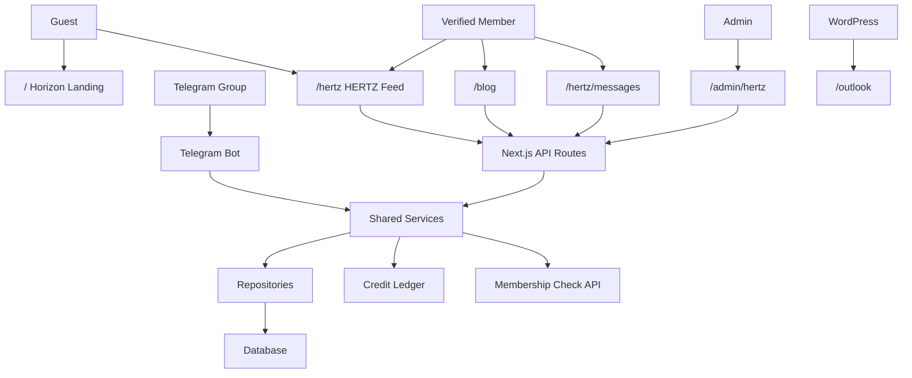

# Design Document: HERTZ Platform Refactor

## Overview

HERTZ Platform Refactor memisahkan Horizon menjadi:

- `/` sebagai landing page Horizon.
- `/hertz` sebagai social trading product HERTZ.
- `/blog`, `/outlook`, dan `/tools` sebagai product routes yang memakai desktop shell HERTZ.
- `/hertz/messages` sebagai Direct Message.

Refactor ini total. Tidak ada dual-mode `SIGNAL_LEDGER_ENABLED`. Domain lama `signal-ledger` diganti menjadi `hertz`, action lama `Signal` diganti menjadi `Pulse`, dan database baru memakai naming `hertz_*`.

## Architecture



## Route Map

```txt
/                         Horizon landing
/hertz                    HERTZ home/feed
/hertz/post/[shortId]     HERTZ post detail
/hertz/messages           Direct Message
/blog                     Blog list/editor/detail
/outlook                  WordPress Outlook
/tools                    Tools hub
/admin/hertz              HERTZ admin/moderation/settings
```

Old public route `/post/[id]` is obsolete after reset. Old admin route `/admin/signal-ledger` is replaced by `/admin/hertz`.

## Frontend Structure

```txt
frontend/src/app/
  page.tsx
  hertz/page.tsx
  hertz/post/[shortId]/page.tsx
  hertz/messages/page.tsx
  blog/page.tsx
  outlook/page.tsx
  tools/page.tsx
  admin/hertz/page.tsx
```

Feature components:

```txt
frontend/src/components/hertz/
  shell/
  feed/
  post/
  composer/
  market-rail/
  community-notes/
  messages/
  admin/
```

The app route files stay thin. Components are split by function to preserve maintainability.

## Shared Backend Structure

```txt
shared/types/
  hertz.ts
  hertzPost.ts
  hertzMessage.ts
  hertzBlog.ts
  hertzCredit.ts

shared/services/
  hertzFeedService.ts
  hertzPostService.ts
  hertzReactionService.ts
  hertzCommentService.ts
  hertzCommunityNoteService.ts
  hertzMessageService.ts
  hertzBlogService.ts
  hertzCreditService.ts
  hertzMembershipService.ts
  hertzAdminService.ts

shared/repositories/
  hertzPostRepository.ts
  hertzReactionRepository.ts
  hertzCommentRepository.ts
  hertzCommunityNoteRepository.ts
  hertzMessageRepository.ts
  hertzBlogRepository.ts
  hertzCreditRepository.ts
  hertzMembershipRepository.ts
```

API routes parse input, resolve session, call services, and serialize errors. Services own permissions, transactions, idempotency, and credit. Repositories own queries.

## Database Design

New domain tables use `hertz_*`.

Core tables:

```txt
hertz_posts
hertz_post_media
hertz_post_market_context
hertz_comments
hertz_reactions
hertz_reposts
hertz_bookmarks
hertz_community_notes
hertz_community_note_sources
hertz_community_note_ratings
hertz_views
hertz_reports
```

DM tables:

```txt
hertz_conversations
hertz_conversation_participants
hertz_messages
hertz_message_attachments
hertz_message_reports
hertz_blocks
```

Membership/session tables:

```txt
hertz_member_sessions
hertz_membership_checks
```

Credit settings/ledger:

```txt
hertz_credit_settings
hertz_credit_ledger
```

Migration may drop/create obsolete testing domain tables because old data is reset total. Destructive reset must not run against production without explicit confirmation.

## Important Models

### hertz_posts

```txt
id
short_id
author_id
source: web | telegram | admin
category: trading_room | life_coffee | general | community_note
type: original | quote | repost
status: pending_review | published | hidden | deleted | rejected
content
quoted_post_id
telegram_chat_id
telegram_message_id
published_at
edited_at
deleted_at
created_at
updated_at
```

`short_id` is public, immutable, unique, and formatted like `hz_k8m2q9la`.

### hertz_reactions

```txt
id
post_id
user_id
type: pulse
deleted_at
created_at
```

One active `pulse` per user per post.

### hertz_community_notes

Notes require at least one source URL. Feed can show primary note; detail can show multiple notes. Admin can hide/remove abuse.

### hertz_messages

Messages are private. Report review exposes only reported message plus limited surrounding context.

Attachment rules:

```txt
types: jpg, jpeg, png, webp
max file: 5MB
max per message: 4
```

## API Design

### Auth and membership

```txt
POST /api/auth/telegram
GET  /api/auth/me
POST /api/auth/logout
```

Membership check uses server-side bearer token. Frontend never sees the token.

### HERTZ feed

```txt
GET    /api/hertz/posts
POST   /api/hertz/posts
GET    /api/hertz/posts/[shortId]
PATCH  /api/hertz/posts/[shortId]
DELETE /api/hertz/posts/[shortId]
POST   /api/hertz/posts/[shortId]/pulse
POST   /api/hertz/posts/[shortId]/bookmark
POST   /api/hertz/posts/[shortId]/repost
POST   /api/hertz/posts/[shortId]/view
```

### Comments and community notes

```txt
GET    /api/hertz/posts/[shortId]/comments
POST   /api/hertz/posts/[shortId]/comments
PATCH  /api/hertz/comments/[commentId]
DELETE /api/hertz/comments/[commentId]

GET    /api/hertz/posts/[shortId]/community-notes
POST   /api/hertz/posts/[shortId]/community-notes
PATCH  /api/hertz/community-notes/[noteId]
DELETE /api/hertz/community-notes/[noteId]
POST   /api/hertz/community-notes/[noteId]/rating
```

### Blog

```txt
GET    /api/blog
POST   /api/blog
GET    /api/blog/[slug]
PATCH  /api/blog/[slug]
DELETE /api/blog/[slug]
POST   /api/admin/blog/[slug]/unpublish
```

### Direct Message

```txt
GET    /api/hertz/messages/conversations
POST   /api/hertz/messages/conversations/direct
GET    /api/hertz/messages/conversations/[conversationId]
GET    /api/hertz/messages/conversations/[conversationId]/messages
POST   /api/hertz/messages/conversations/[conversationId]/messages
POST   /api/hertz/messages/conversations/[conversationId]/read
DELETE /api/hertz/messages/[messageId]
POST   /api/hertz/messages/[messageId]/report
POST   /api/hertz/messages/users/[userId]/block
DELETE /api/hertz/messages/users/[userId]/block
```

### Admin

```txt
GET  /api/admin/hertz/pending
POST /api/admin/hertz/posts/[shortId]/publish
POST /api/admin/hertz/posts/[shortId]/reject
POST /api/admin/hertz/posts/[shortId]/hide
POST /api/admin/hertz/posts/[shortId]/restore
GET  /api/admin/hertz/credit-settings
PUT  /api/admin/hertz/credit-settings
GET  /api/admin/hertz/reports
```

## UI Design

### Figma source of truth

Figma file key:

```txt
wAvK5fG4g8PK5YZX2htijA
```

Primary frames:

```txt
40:2      V3 / Desktop Final Draft
84:2      V3 / Outlook Desktop Draft
84:1368   V3 / Blog Desktop Draft
84:2770   V3 / Tools Desktop Draft
84:4014   V3 / Direct Message Desktop Draft
104:2     Horizon Landing / Desktop Mock 02
```

Some Figma layer names may still contain old labels such as `Signal Ledger`, `Gallery`, or `HERTS`. The visible implementation follows the final product decisions: `HERTZ`, Home, Outlook, Blog, Tools, and Direct Message.

### Horizon landing

Reference: `Horizon Landing / Desktop Mock 02`.

Sections:

1. Hero Horizon.
2. HERTZ product gateway.
3. Outlook.
4. Blog.
5. Tools.
6. Membership CTA.
7. Simple footer.

Landing has SEO title, description, canonical, and OG image.

### HERTZ shell

Reference: `V3 / Desktop Final Draft`.

Left rail:

- atom logo,
- visible brand text `HERTZ`,
- Home,
- Outlook,
- Blog,
- Tools,
- Direct Message,
- admin-only menu if admin.

Icon direction:

- Home uses a home icon.
- Outlook uses a compass/leaf direction icon.
- Blog uses a file/article icon.
- Tools uses lucide `chart-candlestick`.
- Direct Message uses lucide `message-circle`.
- Admin-only navigation can use a shield/hexagon direction when present.

Center:

- timeline or page content,
- no old duplicate header/footer.
- dominant page background is full black `#000000`.

Right rail:

- Forex Market,
- Crypto Market,
- Stock Market,
- mini red/green line charts,
- mock/fallback data without live claim.

DM removes right rail.

### Feed post

Each post shows:

- category/source spine indicator,
- author avatar/initial,
- verified/admin badge,
- source and timestamp,
- content,
- image/media,
- Trading Room pair/risk fields when available,
- community note preview,
- action bar: comment, repost, Pulse, insight, bookmark, share.
- compact category tabs: All, Trading Room, Life & Coffee, General.
- composer chip treatment for chart/media, pair, and risk follows the Figma mock.

Long content truncates in feed and opens `/hertz/post/[shortId]`.

### Blog

Blog uses HERTZ shell but remains separate from feed. Verified member creates and publishes directly. Admin can moderate.

### Outlook

Outlook keeps current WordPress source and logic. HERTZ shell wraps the page. Fallback UI appears when WordPress is unavailable.

### DM

DM layout:

- conversation list,
- active thread,
- compose bar,
- attachment picker for images,
- unread indicators,
- block/report controls.
- Inbox, Unread, Admin, and Archived filter tabs where backend state exists.

Polling interval is 5-10 seconds.

DM uses no market right rail and follows `V3 / Direct Message Desktop Draft`.

## Telegram Bot Design

Telegram keeps current workflow:

- member post goes to pending,
- admin `/publish` publishes,
- admin post can follow current auto-publish behavior,
- hashtags map into HERTZ categories,
- media is stored as HERTZ post media,
- duplicate prevention uses Telegram message id,
- copy and admin queue wording use HERTZ.

## Credit Design

Credit amount comes from admin settings. Credit ledger is idempotent by event key:

```txt
event_type + entity_id + user_id
```

Credit eligible events:

- HERTZ post published,
- Telegram post published,
- Blog published,
- optional Pulse/comment/repost if admin enables them.

Non-credit events:

- DM,
- Outlook WordPress import by default.

## Security and Validation

- Guest writes return `401`.
- Unverified writes return `403` or membership failure.
- Membership recheck occurs on login and important write actions.
- User text is sanitized before render.
- Community note sources require http/https.
- DM attachment validates mime and extension.
- Tokens and raw secrets are never logged.
- Raw numeric IDs are not used in public post URLs.
- DM report moderation exposes limited context only.

## Testing Strategy

Build checks:

```txt
npm.cmd --workspace frontend run build
npm.cmd --workspace bot run build
npm.cmd --workspaces=false run test
```

Visual QA:

- compare desktop HERTZ to Figma frames,
- compare landing to `Horizon Landing / Desktop Mock 02`,
- verify Figma node ids `40:2`, `84:2`, `84:1368`, `84:2770`, `84:4014`, and `104:2`,
- verify final visible brand spelling is `HERTZ`,
- verify final menu does not show stale Gallery/Signal Ledger copy,
- verify no duplicate old header/footer,
- verify right rail market panels,
- verify DM has no right rail,
- verify long post detail routing.

Backend QA:

- guest read-only,
- verified member actions,
- membership recheck,
- credit idempotency,
- Telegram `/publish`,
- Blog direct publish,
- DM attachments/report,
- community note source requirement.

Docker QA:

- run production-like Docker build path,
- verify env values are documented,
- verify seed/reset does not run destructive production reset without confirmation.
