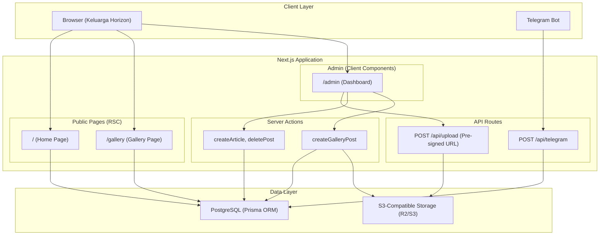
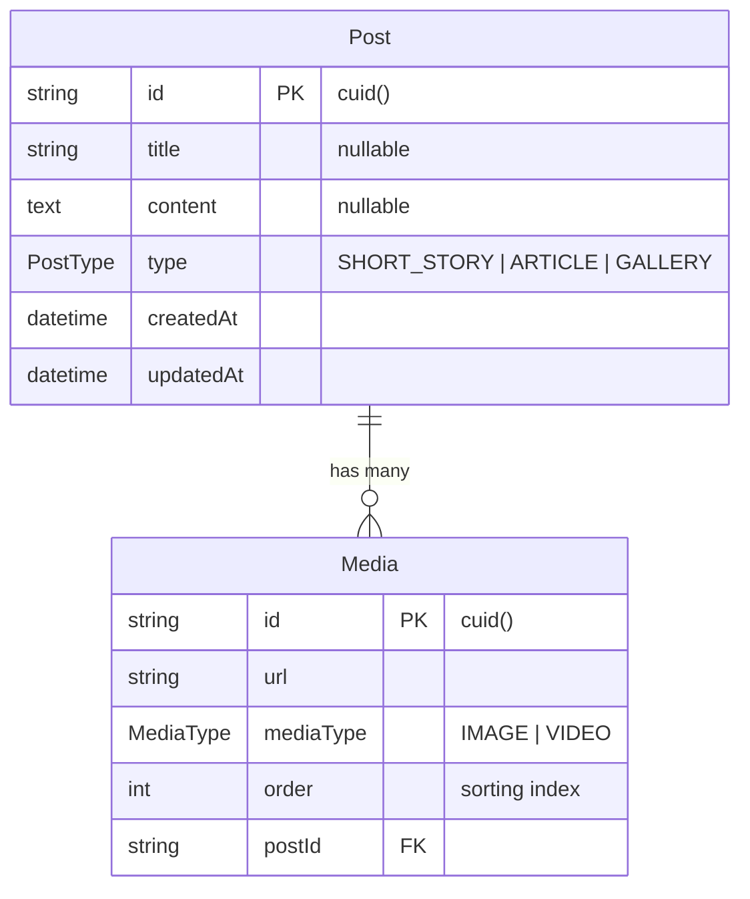

# Design Document: Horizon Community Platform

## Overview

Horizon Community Platform adalah aplikasi web komunitas untuk para trader dengan nuansa "keluarga" yang hangat. Platform ini menggabungkan tiga jenis konten utama: micro-blogging (Short Story), artikel panjang (Article), dan galeri media bergaya Instagram (Gallery). Seluruh konten dikelola melalui Admin Dashboard dan Telegram Bot Webhook.

### Keputusan Desain Utama

1. **Next.js App Router dengan Server Components**: Menggunakan React Server Components (RSC) sebagai default untuk halaman publik guna mengoptimalkan performa dan SEO. Client Components hanya digunakan untuk komponen interaktif (carousel, form admin).

2. **Server Actions untuk mutasi data**: Menghindari pembuatan API route terpisah untuk operasi CRUD admin. Server Actions memberikan type-safety end-to-end dan mengurangi boilerplate.

3. **Pre-signed URL untuk upload S3**: Upload file dilakukan langsung dari browser ke S3/R2 menggunakan pre-signed URL, menghindari beban server untuk transfer file besar (terutama video hingga 25MB).

4. **Single Post model dengan enum PostType**: Menggunakan satu tabel `Post` dengan discriminator `type` (SHORT_STORY, ARTICLE, GALLERY) daripada tabel terpisah per tipe konten. Ini menyederhanakan query dan relasi.

5. **Password-based auth sederhana untuk Admin**: Menggunakan environment variable `ADMIN_PASSWORD` tanpa sistem user/session yang kompleks, sesuai kebutuhan single-admin platform.

## Architecture

### Arsitektur Tingkat Tinggi



### Pola Arsitektur

- **Server-Side Rendering (SSR)**: Halaman publik (Home, Gallery) di-render di server menggunakan RSC untuk performa optimal dan SEO.
- **Client-Side Interactivity**: Komponen yang membutuhkan interaksi (carousel, form, admin panel) menggunakan `"use client"` directive.
- **API Route untuk Webhook**: Telegram webhook menggunakan API Route karena menerima request eksternal.
- **Server Actions untuk Admin**: Operasi CRUD admin menggunakan Server Actions untuk type-safety dan simplicity.

### Struktur Direktori

```
app/
├── layout.tsx              # RootLayout: font, tema, Navbar
├── page.tsx                # HomePage (RSC)
├── gallery/
│   └── page.tsx            # GalleryPage (RSC)
├── admin/
│   └── page.tsx            # AdminDashboard (Client Component)
└── api/
    ├── telegram/
    │   └── route.ts        # Telegram Webhook handler
    └── upload/
        └── route.ts        # Pre-signed URL generator

components/
├── navbar.tsx              # Navigasi global
├── feed-card.tsx           # Kartu post di Home
├── gallery-card.tsx        # Kartu galeri
├── media-carousel.tsx      # Embla carousel wrapper
└── admin/
    ├── auth-form.tsx       # Form login admin
    ├── gallery-upload-form.tsx
    ├── article-editor-form.tsx
    └── post-moderation-list.tsx

lib/
├── prisma.ts               # Prisma client singleton
├── s3.ts                   # S3 client & helpers
├── telegram-parser.ts      # Parse Telegram commands
├── content-formatter.ts    # Format konten dengan line breaks
├── validators.ts           # File size & type validation
└── actions/
    ├── post-actions.ts     # Server Actions: article, delete, auth
    └── gallery-actions.ts  # Server Actions: gallery upload
```

## Components and Interfaces

### 1. Layout & Navigation

#### `RootLayout` (`app/layout.tsx`)
- Mengatur font (Nunito untuk heading, Inter untuk body) via `next/font/google`
- Mengatur warna tema global via Tailwind config
- Merender `<Navbar />` di semua halaman

#### `Navbar` (`components/navbar.tsx`)
```typescript
interface NavLink {
  label: string;
  href: string;
  external?: boolean;
}

// Links: Beranda (/), Gallery (/gallery), Tools (external)
```
- Komponen server, stateless
- Menampilkan logo/nama "Horizon" dan tiga tautan navigasi
- Tautan "Tools" menggunakan `target="_blank"` dan `rel="noopener noreferrer"`

### 2. Public Pages

#### `HomePage` (`app/page.tsx`)
```typescript
// Server Component
// Query: Post where type IN (SHORT_STORY, ARTICLE), orderBy createdAt desc
// Renders: List of <FeedCard /> components
```

#### `FeedCard` (`components/feed-card.tsx`)
```typescript
interface FeedCardProps {
  post: Post; // includes type, title, content, createdAt
}
```
- Membedakan tampilan SHORT_STORY vs ARTICLE secara visual
- SHORT_STORY: tampilan compact tanpa title yang menonjol
- ARTICLE: menampilkan title secara prominent dengan styling berbeda
- Memformat konten dengan mempertahankan line breaks

#### `GalleryPage` (`app/gallery/page.tsx`)
```typescript
// Server Component
// Query: Post where type = GALLERY, include media orderBy order asc
// Renders: List of <GalleryCard /> components
```

#### `GalleryCard` (`components/gallery-card.tsx`)
```typescript
interface GalleryCardProps {
  post: Post & { media: Media[] };
}
```
- Jika media > 1: render `<MediaCarousel />`
- Jika media = 1: render media tunggal (image atau video)
- Menampilkan caption di bawah media

#### `MediaCarousel` (`components/media-carousel.tsx`)
```typescript
interface MediaCarouselProps {
  media: Media[]; // sorted by order
}
```
- Client Component (`"use client"`)
- Menggunakan `embla-carousel-react` untuk swipeable carousel
- Merender `` untuk IMAGE dan `<video controls>` untuk VIDEO
- Styling: `w-full aspect-square object-cover`

### 3. Admin Dashboard

#### `AdminPage` (`app/admin/page.tsx`)
- Client Component untuk mengelola state autentikasi
- Menampilkan form password jika belum terautentikasi
- Setelah autentikasi: menampilkan tab/section untuk Gallery Upload, Article Editor, dan Moderasi

#### `AdminAuthForm` (`components/admin/auth-form.tsx`)
```typescript
interface AdminAuthFormProps {
  onAuthenticated: () => void;
}
```
- Form input password
- Validasi terhadap `ADMIN_PASSWORD` via Server Action
- Menampilkan pesan error jika password salah

#### `GalleryUploadForm` (`components/admin/gallery-upload-form.tsx`)
```typescript
interface GalleryUploadFormProps {
  onSuccess: () => void;
}
```
- Multi-file input (`accept="image/*,video/*"`)
- Validasi client-side: image max 5MB, video max 25MB
- Upload ke S3 via pre-signed URL
- Input caption untuk gallery post
- Menyimpan post + media ke database setelah upload berhasil

#### `ArticleEditorForm` (`components/admin/article-editor-form.tsx`)
```typescript
interface ArticleEditorFormProps {
  onSuccess: () => void;
}
```
- Form dengan field Title (text input) dan Content (textarea)
- Textarea mendukung line breaks
- Submit via Server Action

#### `PostModerationList` (`components/admin/post-moderation-list.tsx`)
```typescript
interface PostModerationListProps {
  posts: Post[];
  onDelete: (postId: string) => void;
}
```
- Menampilkan daftar semua post
- Tombol "Delete" per post
- Konfirmasi sebelum delete
- Delete cascade: hapus post + media dari DB + file dari S3

### 4. API Routes

#### Telegram Webhook (`app/api/telegram/route.ts`)
```typescript
// POST handler
interface TelegramMessage {
  message: {
    chat: { id: number };
    from: { id: number };
    text?: string;
  };
}
```
- Validasi `chat.id` terhadap `ALLOWED_CHAT_ID`
- Memproses pesan dari semua anggota grup yang diizinkan
- Parse command `/story <text>` → SHORT_STORY
- Parse command `/cerita <text>` → ARTICLE (baris pertama = title, sisanya = content)
- Abaikan pesan tanpa command yang dikenali
- Selalu return HTTP 200 OK

#### Upload Pre-signed URL (`app/api/upload/route.ts`)
```typescript
// POST handler
interface UploadRequest {
  filename: string;
  contentType: string;
}

interface UploadResponse {
  presignedUrl: string;
  finalUrl: string;
}
```
- Generate pre-signed URL untuk upload ke S3/R2
- Validasi content type (image/* atau video/*)
- Return pre-signed URL dan final URL

### 5. Server Actions

#### `lib/actions/post-actions.ts`
```typescript
async function createArticle(formData: FormData): Promise<void>
async function deletePost(postId: string): Promise<void>
async function validateAdminPassword(password: string): Promise<boolean>
```

#### `lib/actions/gallery-actions.ts`
```typescript
async function createGalleryPost(data: {
  caption: string;
  media: Array<{ url: string; mediaType: MediaType; order: number }>;
}): Promise<void>
```

### 6. Utility Libraries

#### `lib/s3.ts`
```typescript
function getS3Client(): S3Client
async function generatePresignedUrl(key: string, contentType: string): Promise<string>
async function deleteS3Object(key: string): Promise<void>
```

#### `lib/telegram-parser.ts`
```typescript
interface ParsedCommand {
  type: 'SHORT_STORY' | 'ARTICLE' | 'IGNORED';
  title?: string;
  content?: string;
}

function parseTelegramMessage(text: string): ParsedCommand
```

#### `lib/content-formatter.ts`
```typescript
function formatContent(content: string): string
// Mempertahankan line breaks, sanitize HTML jika perlu
```

#### `lib/validators.ts`
```typescript
interface FileValidationInput {
  size: number;       // in bytes
  mediaType: 'IMAGE' | 'VIDEO';
}

function validateFileSize(input: FileValidationInput): { valid: boolean; error?: string }
```

## Data Models

### Prisma Schema

```prisma
generator client {
  provider = "prisma-client-js"
}

datasource db {
  provider = "postgresql"
  url      = env("DATABASE_URL")
}

model Post {
  id        String   @id @default(cuid())
  title     String?
  content   String?  @db.Text
  type      PostType
  media     Media[]
  createdAt DateTime @default(now())
  updatedAt DateTime @updatedAt
}

model Media {
  id        String    @id @default(cuid())
  url       String
  mediaType MediaType
  order     Int
  postId    String
  post      Post      @relation(fields: [postId], references: [id], onDelete: Cascade)
}

enum PostType {
  SHORT_STORY
  ARTICLE
  GALLERY
}

enum MediaType {
  IMAGE
  VIDEO
}
```

### Entity Relationship Diagram



### Data Flow per Fitur

1. **Short Story (via Telegram)**: Telegram → Webhook → Parse `/story` → Insert Post(type=SHORT_STORY, content=text)
2. **Article (via Telegram)**: Telegram → Webhook → Parse `/cerita` → Insert Post(type=ARTICLE, title=line1, content=rest)
3. **Article (via Admin)**: Admin Form → Server Action → Insert Post(type=ARTICLE, title, content)
4. **Gallery (via Admin)**: Admin Form → Pre-signed URL → Upload to S3 → Server Action → Insert Post(type=GALLERY) + Media records
5. **Delete Post**: Admin → Server Action → Delete Post (cascade Media) + Delete S3 files (for Gallery)

## Correctness Properties

*A property is a characteristic or behavior that should hold true across all valid executions of a system — essentially, a formal statement about what the system should do. Properties serve as the bridge between human-readable specifications and machine-verifiable correctness guarantees.*

### Property 1: File size validation menolak file yang melebihi batas

*For any* file dengan mediaType IMAGE dan ukuran > 5MB, atau mediaType VIDEO dan ukuran > 25MB, fungsi validasi SHALL menolak file tersebut. Sebaliknya, *for any* file dengan ukuran di bawah atau sama dengan batas yang sesuai, validasi SHALL menerima file tersebut.

**Validates: Requirements 6.2, 6.3**

### Property 2: Chat-level authorization memproses hanya grup yang diizinkan

*For any* Telegram message dengan chat ID dan user ID apapun, webhook SHALL memproses pesan tersebut jika dan hanya jika chat ID sama dengan ALLOWED_CHAT_ID — terlepas dari user ID pengirim.

**Validates: Requirements 9.2, 9.3**

### Property 3: Parsing command /story menghasilkan SHORT_STORY

*For any* string teks non-kosong `t`, parsing pesan `/story t` SHALL menghasilkan ParsedCommand dengan type=SHORT_STORY dan content=`t`.

**Validates: Requirements 9.4**

### Property 4: Parsing command /cerita mengekstrak title dan content

*For any* string multi-baris dimana baris pertama adalah `title` dan sisa baris adalah `body`, parsing pesan `/cerita title\nbody` SHALL menghasilkan ParsedCommand dengan type=ARTICLE, title=`title`, dan content=`body`.

**Validates: Requirements 9.5, 9.6, 12.2**

### Property 5: Pesan tanpa command yang dikenali diabaikan

*For any* string teks yang tidak dimulai dengan `/story ` atau `/cerita `, parsing pesan tersebut SHALL menghasilkan ParsedCommand dengan type=IGNORED.

**Validates: Requirements 9.7**

### Property 6: Round-trip konten post mempertahankan format asli

*For any* string konten post yang mengandung line breaks, menyimpan (serialize) lalu menampilkan (format/render) konten tersebut SHALL menghasilkan output yang mempertahankan semua line breaks dan setara dengan input asli.

**Validates: Requirements 7.3, 12.1, 12.3**

## Error Handling

### Strategi Error Handling per Layer

#### 1. API Layer (Telegram Webhook)
- **Invalid chat ID**: Return HTTP 200 OK tanpa processing (sesuai best practice Telegram Bot API untuk menghindari retry)
- **Missing/malformed message body**: Return HTTP 200 OK, log warning
- **Unrecognized command**: Return HTTP 200 OK, abaikan pesan
- **Database error saat save**: Return HTTP 500, log error detail

#### 2. Admin Dashboard
- **Password salah**: Tampilkan pesan error "Password tidak valid" tanpa detail teknis
- **ADMIN_PASSWORD tidak dikonfigurasi**: Tampilkan pesan "Admin access tidak tersedia"
- **File size melebihi batas**: Tampilkan pesan validasi spesifik ("Ukuran gambar maksimal 5MB" / "Ukuran video maksimal 25MB")
- **File type tidak valid**: Tampilkan pesan "Hanya file gambar dan video yang diizinkan"
- **S3 upload gagal**: Tampilkan pesan error generik, log detail error, rollback partial uploads
- **Database error**: Tampilkan pesan error generik, log detail, rollback jika ada file yang sudah terupload

#### 3. Public Pages
- **Database connection error**: Tampilkan halaman error yang ramah dengan pesan "Sedang ada gangguan, silakan coba lagi nanti"
- **Missing media files (S3 404)**: Tampilkan placeholder image/icon, jangan crash halaman
- **Empty state**: Tampilkan pesan yang ramah ("Belum ada cerita dari Keluarga Horizon")

#### 4. S3 Storage
- **Pre-signed URL generation gagal**: Return error ke client, log detail
- **Delete object gagal**: Log error, jangan block delete post dari database (eventual consistency)
- **Invalid credentials**: Log critical error, return 500 ke admin

### Error Logging
- Gunakan `console.error` untuk server-side errors dengan context (request ID, timestamp, operation)
- Jangan expose stack traces atau detail internal ke client
- Log semua S3 operations untuk audit trail

## Testing Strategy

### Unit Tests

Unit tests menggunakan contoh spesifik untuk memverifikasi behavior komponen individual:

1. **Telegram Parser** (`lib/telegram-parser.ts`)
   - Test parsing `/story hello world` → `{ type: 'SHORT_STORY', content: 'hello world' }`
   - Test parsing `/cerita Judul\nIsi artikel` → `{ type: 'ARTICLE', title: 'Judul', content: 'Isi artikel' }`
   - Test parsing pesan biasa → `{ type: 'IGNORED' }`
   - Test edge cases: empty string setelah command, command tanpa spasi

2. **File Validation** (`lib/validators.ts`)
   - Test image 4MB → accepted
   - Test image 6MB → rejected
   - Test video 20MB → accepted
   - Test video 30MB → rejected
   - Test edge case: exactly 5MB image, exactly 25MB video

3. **Content Formatter** (`lib/content-formatter.ts`)
   - Test string dengan `\n` → line breaks dipertahankan
   - Test string tanpa line breaks → output sama dengan input
   - Test empty string → empty output

4. **Admin Auth** (`lib/actions/post-actions.ts`)
   - Test password benar → return true
   - Test password salah → return false
   - Test ADMIN_PASSWORD undefined → return false

5. **Component Tests** (React Testing Library)
   - Navbar: verifikasi 3 links dengan href dan atribut yang benar
   - FeedCard: verifikasi perbedaan visual SHORT_STORY vs ARTICLE
   - GalleryCard: verifikasi rendering image vs video
   - MediaCarousel: verifikasi inisialisasi embla-carousel

### Property-Based Tests

Property-based tests menggunakan library **fast-check** untuk TypeScript/JavaScript. Setiap test dijalankan minimum 100 iterasi dengan input yang di-generate secara random.

1. **Property 1: File size validation** — Tag: `Feature: horizon-community-platform, Property 1: File size validation menolak file yang melebihi batas`
   - Generator: random file size (0 - 100MB), random mediaType (IMAGE | VIDEO)
   - Assertion: accepted iff (IMAGE && size <= 5MB) || (VIDEO && size <= 25MB)

2. **Property 2: Chat-level authorization** — Tag: `Feature: horizon-community-platform, Property 2: Chat-level authorization memproses hanya grup yang diizinkan`
   - Generator: random chat ID (number), random user ID (number)
   - Assertion: processed iff chatId === ALLOWED_CHAT_ID

3. **Property 3: /story parsing** — Tag: `Feature: horizon-community-platform, Property 3: Parsing command /story menghasilkan SHORT_STORY`
   - Generator: random non-empty string `t`
   - Assertion: parseTelegramMessage(`/story ${t}`) === { type: 'SHORT_STORY', content: t }

4. **Property 4: /cerita parsing** — Tag: `Feature: horizon-community-platform, Property 4: Parsing command /cerita mengekstrak title dan content`
   - Generator: random non-empty string `title`, random string `body` (bisa multi-line)
   - Assertion: parseTelegramMessage(`/cerita ${title}\n${body}`) === { type: 'ARTICLE', title, content: body }

5. **Property 5: Unrecognized messages** — Tag: `Feature: horizon-community-platform, Property 5: Pesan tanpa command yang dikenali diabaikan`
   - Generator: random string yang tidak dimulai dengan `/story ` atau `/cerita `
   - Assertion: parseTelegramMessage(text) === { type: 'IGNORED' }

6. **Property 6: Content round-trip** — Tag: `Feature: horizon-community-platform, Property 6: Round-trip konten post mempertahankan format asli`
   - Generator: random string dengan line breaks (`\n`)
   - Assertion: formatContent(content) mempertahankan semua line breaks dari content asli

### Integration Tests

1. **Telegram Webhook endpoint**: Test full request/response cycle dengan mock database
2. **Admin CRUD operations**: Test create article, create gallery, delete post dengan test database
3. **S3 upload flow**: Test pre-signed URL generation dan upload dengan mock S3 client
4. **Database cascade delete**: Test bahwa delete Post juga menghapus Media records

### Test Tools & Configuration

- **Test Runner**: Vitest (kompatibel dengan Next.js dan fast-check)
- **Property-Based Testing**: fast-check
- **Component Testing**: React Testing Library + @testing-library/jest-dom
- **Mocking**: Vitest built-in mocking untuk Prisma client dan S3 client
- **Minimum PBT iterations**: 100 per property test
