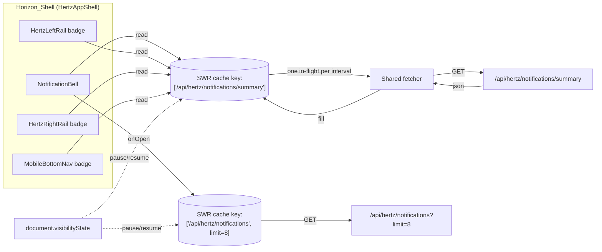
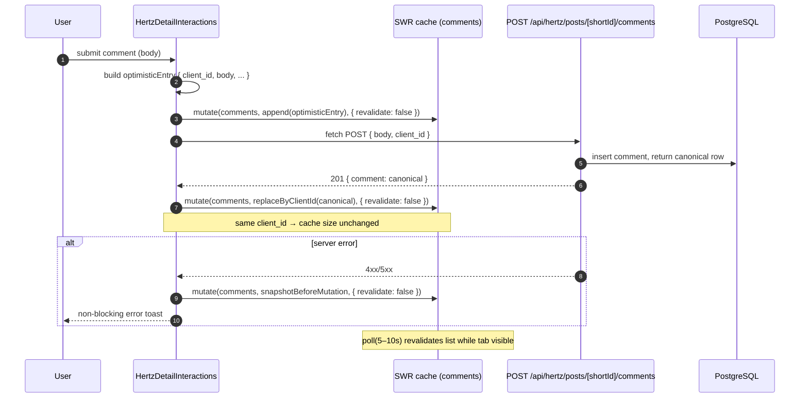
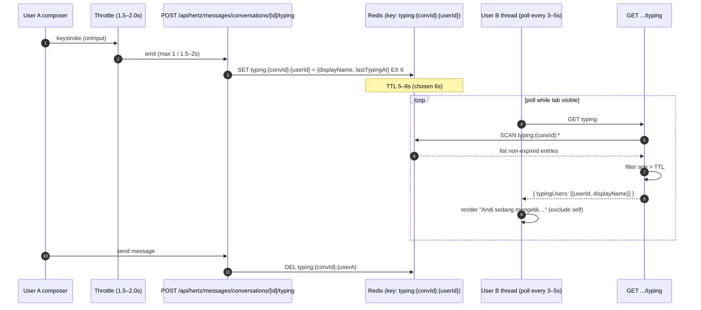
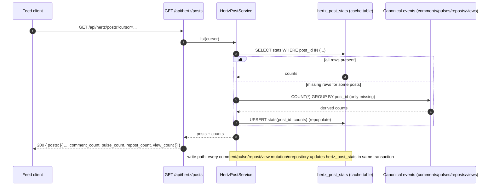

# Design Document

## Overview

Horizon Social UX Uplift adalah pass UX dan perceived-speed di atas Horizon yang sudah ada (HERTZ feed, profile, DM, notifications, blog, outlook, tools, gallery, admin). Design ini tidak melakukan redesign produk dan tidak menambah domain bisnis baru. Tujuan utamanya:

- Mengunci visual identity di **satu base background dan satu accent** lewat `globals.css` (Requirement 1) dan menyebar token tersebut sampai ke admin shell.
- Mengganti navigasi internal anchor (`<a href>`) ke `next/link` agar transisi terasa instan (Requirement 2).
- Memindahkan high-frequency mutation (komentar, like/pulse, bookmark, mark-as-read, DM send) ke shared client cache **SWR** dengan optimistic update + visibility-pause polling (Requirement 3, 4, 5, 13, 15).
- Menambah social primitives yang masih hilang: **public profile `/@username`** (Requirement 7), **DM-from-profile** (Requirement 8), **typing indicator polling + Redis TTL** (Requirement 9), **notification bell dropdown** ala Minbloom (Requirement 12).
- Memperbaiki layout DM agar hanya area pesan yang scrolling (Requirement 11) dan composer mengirim dengan `Enter`, baris baru dengan `Shift+Enter` (Requirement 10).
- Backend efficiency: incremental DM polling `?after=<id>` (Requirement 14) dan denormalized counter cache `hertz_post_stats` (Requirement 16).
- Bundle dan public-page performance: lazy-load komponen berat, image optimization discipline, hapus `force-dynamic` di public pages (Requirement 17, 18, 19).

Pengiriman dilakukan dalam 4 phase yang sejalan dengan rollout di requirements.md:

1. **Phase 1 — Foundations & visible UX**: Design tokens, SPA navigation, SWR layer (notifications + comments), optimistic UI, DM fixed-height layout.
2. **Phase 2 — Social primitives**: Public profile `/@username`, DM-from-profile, typing indicator, notification bell dropdown, comments auto-refresh.
3. **Phase 3 — Backend efficiency**: Incremental DM polling, dropdown limit, counter cache `hertz_post_stats`, visibility-pause shared.
4. **Phase 4 — Bundle/public-page perf**: Bundle analyzer, lazy-load berat, image discipline, ISR vs `force-dynamic` review.

Dependency baru yang diperbolehkan oleh keputusan teknis: **SWR** (client cache) dan **Redis** (typing TTL, notification cache dedupe, opsional rate-limiter). Tidak ada WebSocket/SSE di spec ini (Requirement 20).

## Architecture

### A.1 Notification flow: `HertzAppShell` → `NotificationBell` → SWR cache → summary endpoint



Inti: `useNotificationSummary()` adalah **satu** SWR hook yang dipakai semua badge consumer. Karena cache key sama, SWR melakukan dedupe otomatis (Requirement 13). Polling 20–30s untuk dropdown list (Requirement 12.11), ~25s untuk summary, semuanya tunduk pada visibility-pause (Requirement 15).

### A.2 Optimistic comment submit lifecycle



`client_id` (UUID generated di client) adalah primary anchor untuk reconcile antara optimistic dan canonical entry. API server harus echo balik `client_id` di response sehingga `replaceByClientId` idempoten (Requirement 4.4).

### A.3 Typing indicator: throttle → POST → Redis TTL → poll → render



Dipisahkannya emit POST dari poll GET adalah deliberate: emit di-throttle di client supaya server tidak hammered, dan poll independen sehingga user lain tetap terlihat sedang mengetik bahkan jika emit pertama dan poll pertama tidak sinkron.

### A.4 Feed counter cache hit/miss



Counter cache **eventually consistent** (Requirement 16.4). Jika row hilang, fallback ke canonical query lalu repopulate (Requirement 16.5). Reconciliation drift di-handle oleh cron job opsional (lihat Risks).

## Components and Interfaces

Bagian ini memetakan setiap concrete file ke requirement ID. Notasi `[NEW]` = file baru, `[MOD]` = file existing yang diubah.

### C.1 Design tokens (Requirement 1)

| File | Status | Perubahan |
|---|---|---|
| `frontend/src/app/globals.css` | [MOD] | Tambah/normalisasi token: `--horizon-bg-base: #0a0a0f`, `--horizon-accent: #13d27b`, `--horizon-surface`, `--horizon-surface-strong`, `--horizon-border`, `--horizon-text`, `--horizon-text-muted`. Token sekunder untuk `#10b981`, `#00e38a`, `#34d399`, `#059669` di-expose hanya sebagai derived state token (`--horizon-accent-soft`, `--horizon-accent-strong`, `--horizon-success`). |
| `frontend/src/components/layout/HertzLayout.module.css` | [MOD] | `background` ke `var(--horizon-bg-base)`. Hapus literal `#0f0f14`. |
| `frontend/src/components/layout/HertzAppShell.module.css` | [MOD] | Token-only background, border, text muted. |
| `frontend/src/app/admin/(dashboard)/layout.module.css` | [MOD] | Refactor admin shell, sidebar, header, content card ke token global yang sama (Requirement 1.6). Tidak boleh ada literal `#0f0f14`, `#10b981`, `#00e38a`, `#34d399`, `#059669`, atau `rgba(...)` border ad-hoc. |
| `frontend/src/features/hertz/messages/messages.module.css` | [MOD] | Panel DM ke `var(--horizon-surface)` / `var(--horizon-surface-strong)`. |
| `frontend/src/features/hertz/notifications/notifications.module.css` | [MOD] | Sama dengan DM panel. |
| `frontend/src/app/HorizonLanding.module.css` | [MOD] | Base background pakai `--horizon-bg-base`; gradient mulai dari token yang sama (Requirement 1.7). |

### C.2 SPA navigation (Requirement 2)

| File | Status | Perubahan |
|---|---|---|
| `frontend/src/components/layout/HertzLayout.tsx` | [MOD] | Mobile brand `<a href="/hertz">` → `<Link href="/hertz">`. |
| `frontend/src/components/feed/HertzLeftRail.tsx` | [MOD] | Semua menu, admin link, profile link → `<Link>`. |
| `frontend/src/components/hertz/MobileBottomNav.tsx` | [MOD] | Bottom nav `<a>` → `<Link>`. |
| `frontend/src/app/hertz/post/[shortId]/page.tsx` | [MOD] | Back link `<a href="/hertz">` → `<Link>`. |
| `frontend/src/components/feed/HertzAuthorLine.tsx` | [MOD] | Username/avatar → `<Link href={`/@${username}`}>`. |
| `frontend/src/components/feed/HertzAvatar.tsx` | [MOD] | Wrap di `<Link>` jika `username` tersedia. |

External URL dan resource yang harus full-reload tetap pakai `<a>` (Requirement 2.3).

### C.3 SWR layer (Requirement 3, 13, 15)

| File | Status | Tujuan |
|---|---|---|
| `frontend/src/lib/swr/config.ts` | [NEW] | `SWRConfig` provider value: shared `revalidateOnFocus`, `revalidateOnReconnect`, `keepPreviousData`, custom `isVisible()` untuk visibility-pause. |
| `frontend/src/lib/swr/fetcher.ts` | [NEW] | Typed fetcher berdasarkan `apiResponse` envelope (`{ ok, data, error }`). Throw `ApiError` agar SWR menangkap dan mengisi `error`. |
| `frontend/src/lib/swr/visibility.ts` | [NEW] | Hook `useVisibilityRefreshInterval(ms)` yang return `0` saat `document.visibilityState === 'hidden'`. Dipakai semua hook polling. |
| `frontend/src/lib/swr/optimistic.ts` | [NEW] | Helper `withOptimistic({ key, mutator, request, reconcileBy })` membungkus pattern: snapshot → mutate(no revalidate) → fetch → reconcile/rollback → trigger revalidate. |
| `frontend/src/lib/swr/hooks/useAuthMe.ts` | [NEW] | `useSWR('/api/auth/me')`. |
| `frontend/src/lib/swr/hooks/useNotificationSummary.ts` | [NEW] | `useSWR('/api/hertz/notifications/summary', f, { refreshInterval: visibilityAware(25000) })`. Single key, di-share semua badge consumer. |
| `frontend/src/lib/swr/hooks/useNotificationList.ts` | [NEW] | `useSWR(['/api/hertz/notifications', limit])`, `refreshInterval: visibilityAware(25000)` saat dropdown open. |
| `frontend/src/lib/swr/hooks/useCommentList.ts` | [NEW] | Key `['/api/hertz/posts/comments', shortId]`, polling 5–10s, visibility-aware. |
| `frontend/src/lib/swr/hooks/useDmInbox.ts` | [NEW] | Migrasi dari fetch+useEffect di `useMessages.ts`. |
| `frontend/src/lib/swr/hooks/useDmThread.ts` | [NEW] | Key `['/api/hertz/messages/conversations', conversationId, lastMessageId]`. Incremental polling pakai `?after=<id>` (Requirement 14). |
| `frontend/src/lib/swr/hooks/useTypingStatus.ts` | [NEW] | Polling 3–5s dari `GET .../typing` saat thread open + visible. |
| `frontend/src/app/layout.tsx` | [MOD] | Wrap `{children}` dengan `<SWRConfig value={swrGlobalConfig}>`. |

### C.4 Comments refactor (Requirement 5)

| File | Status | Perubahan |
|---|---|---|
| `frontend/src/components/feed/HertzDetailInteractions.tsx` | [MOD] | Hapus `refreshPreserveScroll(router)` di success path. Pakai `useCommentList(shortId)` + `withOptimistic`. Mutation API tidak berubah; hanya client wiring. |
| `frontend/src/features/hertz/comments/CommentList.tsx` | [MOD] | Render dari SWR data; tampilkan skeleton saat `isLoading`; preserve scroll position di reconcile (Requirement 5.6). |
| `frontend/src/lib/hertzRefresh.ts` | [MOD] | `refreshPreserveScroll` tetap ada untuk error fallback (Requirement 5.5). |

### C.5 Public profile `/@username` (Requirement 7)

**Implementasi yang dipilih: catch-all-style single-segment dynamic route dengan literal `@` di awal segmen value.**

Investigasi konflik dengan parallel-route convention `@`:
- Next.js App Router menganggap **folder name** yang diawali `@` sebagai parallel route slot (mis. `app/@modal/page.tsx`).
- Yang kita parse adalah **value of dynamic segment**, bukan folder name. Folder name `[atUsername]` netral.
- URL `/@john` cocok ke segment dynamic `[atUsername]` dengan value `"@john"`. Tidak ada folder bernama `@john`, jadi tidak ada konflik konvensi.
- Risiko: dynamic single-segment akan match juga ke value tanpa `@` (mis. `/random-slug`). Untuk itu page handler **harus reject** segment yang tidak diawali `@` dengan `notFound()` agar slug existing seperti `/blog`, `/outlook`, `/post`, `/admin`, `/api`, `/artikel`, `/gallery`, `/hertz`, `/tools` tetap ter-handle oleh folder mereka (Next.js memprioritaskan static segment sebelum dynamic).

| File | Status | Tujuan |
|---|---|---|
| `frontend/src/app/[atUsername]/page.tsx` | [NEW] | Server Component. Param: `{ atUsername: string }`. Logic: jika tidak match `^@[A-Za-z0-9_]{1,32}$` → `notFound()`. Strip `@`, lookup member, render `<PublicProfileView>`. |
| `frontend/src/app/[atUsername]/not-found.tsx` | [NEW] | 404 spesifik public profile (Requirement 7.5). |
| `frontend/src/components/profile/PublicProfileView.tsx` | [NEW] | Client island untuk DM CTA + tabs. Server component pass DTO + `viewerId`. |
| `shared/services/hertzPublicProfileService.ts` | [NEW] | `getPublicProfileByUsername(username): Promise<PublicProfileDto \| null>`. Hanya field whitelist. |
| `shared/dto/publicProfile.ts` | [NEW] | DTO type + mapper dari domain entity → public DTO. |

URL canonicalization (Requirement 7.7): page selalu render dengan address bar `/@<username>`. Karena route segment value sudah berisi `@`, address bar otomatis konsisten — tidak perlu rewrite.

### C.6 DM-from-profile (Requirement 8)

| File | Status | Perubahan |
|---|---|---|
| `frontend/src/components/profile/PublicProfileDmButton.tsx` | [NEW] | Tombol "Kirim DM". Authenticated → POST conversation lalu `router.push('/hertz/messages?conversation=<id>')`. Self → tidak render. Unauthenticated → render dalam state yang prompt login (`href="/admin/login?redirect=...`). |
| `frontend/src/features/hertz/messages/useMessages.ts` | [MOD] | Tambah selector untuk auto-focus composer ketika `conversation` query param ada. |
| `frontend/src/app/api/hertz/messages/conversations/route.ts` | [MOD] | `POST { recipientId }` jaminan idempoten: jika conversation aktif sudah ada, return existing dengan `200` (atau `200` + flag `existing: true`). Saat ini kemungkinan sudah idempoten via `service.createDirect`; design ini menegaskannya. |

### C.7 Typing indicator (Requirement 9)

| File | Status | Tujuan |
|---|---|---|
| `frontend/src/lib/redis.ts` | [NEW] | Thin Redis client wrapper (ioredis). Lazy singleton. |
| `frontend/src/app/api/hertz/messages/conversations/[conversationId]/typing/route.ts` | [NEW] | `POST` set typing key dengan `EX 6`. `GET` SCAN typing keys untuk `conversationId`, filter `lastTypingAt > now - TTL`, exclude self. |
| `frontend/src/features/hertz/messages/MessageComposer.tsx` | [MOD] | `onChange` panggil throttled `emitTyping()` (1.5–2s). `onSend` clear typing untuk self. |
| `frontend/src/features/hertz/messages/MessageThread.tsx` | [MOD] | Render `useTypingStatus(conversationId)` — text "X sedang mengetik…" di atas composer. |
| `frontend/src/lib/throttle.ts` | [NEW] | Pure throttle util (testable via PBT). |

### C.8 Notification bell dropdown (Requirement 12)

| File | Status | Tujuan |
|---|---|---|
| `frontend/src/components/notifications/NotificationBell.tsx` | [NEW] | Anchor di top-right `HertzAppShell`. Badge dari `useNotificationSummary`. |
| `frontend/src/components/notifications/NotificationDropdown.tsx` | [NEW] | Desktop popover (360–420px width, max-height 70dvh). Render `useNotificationList(8)`. "Mark all as read" dengan optimistic. |
| `frontend/src/components/notifications/NotificationDropdown.mobile.tsx` | [NEW] | Mobile bottom-sheet variant. |
| `frontend/src/components/notifications/NotificationItem.tsx` | [NEW] | Item row dengan separator. On click → mark-as-read + SPA nav ke `item.href`. |
| `frontend/src/components/layout/HertzAppShell.tsx` | [MOD] | Mount `<NotificationBell>` di area top-right. |

### C.9 DM layout (Requirement 11)

| File | Status | Perubahan |
|---|---|---|
| `frontend/src/features/hertz/messages/messages.module.css` | [MOD] | `.dmLayout` ganti `min-height` ke `height: calc(100dvh - var(--horizon-shell-offset, 120px))` desktop, `calc(100svh - var(--horizon-mobile-offset, 0px))` mobile. `.messageList` jadi `flex: 1; overflow-y: auto; min-height: 0`. Header & composer pinned. |
| `frontend/src/features/hertz/messages/MessageThread.tsx` | [MOD] | Auto-scroll ke bawah jika sudah di bawah; surface "new message" affordance jika user scroll ke atas (Requirement 11.6/11.7). |

### C.10 Incremental DM polling (Requirement 14)

| File | Status | Perubahan |
|---|---|---|
| `frontend/src/app/api/hertz/messages/conversations/[conversationId]/route.ts` | [MOD] | `GET` parse `searchParams.get('after')`. Jika ada, panggil `service.threadAfter(user, conversationId, after)`. Jika tidak, behavior lama. Backward compatible. |
| `shared/services/hertzDmService.ts` | [MOD] | `threadAfter(user, conversationId, afterMessageId)`: query `WHERE id > $afterMessageId` dengan ordering canonical. |
| `shared/repositories/hertzDmRepository.ts` | [MOD] | Method `listMessagesAfter(conversationId, afterId)`. |
| `frontend/src/features/hertz/messages/useMessages.ts` | [MOD] | Setelah initial fetch tanpa `after`, polling subsequent dengan `?after=<lastMessageId>`. Append-only. |

### C.11 Counter cache (Requirement 16)

| File | Status | Perubahan |
|---|---|---|
| `shared/migrations/20260601_001_create_hertz_post_stats.sql` | [NEW] | DDL + backfill. |
| `shared/repositories/hertzPostStatsRepository.ts` | [NEW] | `getMany(postIds)`, `incr(postId, field, delta)`, `upsert(postId, counts)`. |
| `shared/repositories/hertzPostRepository.ts` | [MOD] | `findMany` join `hertz_post_stats`. Saat row missing, fallback canonical aggregate + `upsert`. |
| `shared/repositories/hertzCommentRepository.ts` | [MOD] | Setelah insert/delete comment, panggil `hertzPostStatsRepository.incr(postId, 'comment_count', ±1)` dalam transaction yang sama. |
| `shared/repositories/hertzPulseRepository.ts` | [MOD] | Same pattern untuk `pulse_count`. |
| `shared/repositories/hertzRepostRepository.ts` | [MOD] | Same pattern untuk `repost_count`. |
| `shared/repositories/hertzPostViewRepository.ts` | [MOD] | Same pattern untuk `view_count`. |
| `scripts/backfill-hertz-post-stats.ts` | [NEW] | Idempotent batched backfill, dry-run + apply mode. |
| `scripts/reconcile-hertz-post-stats.ts` | [NEW] | Cron-friendly drift reconciliation. |

Logic update di repository (bukan trigger DB) sesuai keputusan teknis: lebih mudah di-trace, di-test, dan disinkronkan dengan optimistic UI.

### C.12 Visibility pause (Requirement 15)

| File | Status | Perubahan |
|---|---|---|
| `frontend/src/lib/swr/visibility.ts` | [NEW] | (lihat C.3) Hook + `isVisible` predicate. |
| `frontend/src/lib/swr/config.ts` | [MOD] | Pasang `isVisible` global. |
| `frontend/src/features/hertz/messages/MessageComposer.tsx` | [MOD] | Skip `emitTyping()` saat `document.hidden` (Requirement 15.3). |

### C.13 Image optimization (Requirement 18)

Daftar enumerated raw `` site yang harus di-evaluate:

- `frontend/src/components/feed/HertzPostMedia.tsx`
- `frontend/src/components/feed/HertzAvatar.tsx`
- `frontend/src/features/hertz/messages/DmAvatar.tsx`
- `frontend/src/features/hertz/messages/MessageThread.tsx`
- `frontend/src/features/hertz/messages/MessageComposer.tsx`
- `frontend/src/components/blog/BlogCard.tsx`
- `frontend/src/components/outlook/OutlookCard.tsx`
- `frontend/src/app/blog/[slug]/page.tsx` (hero/cover)
- `frontend/src/app/outlook/[slug]/page.tsx`
- `frontend/src/app/artikel/**` (hero/cover)

Aturan: jika `src` host masuk `images.remotePatterns` di `next.config.mjs` → wajib `next/image`. Jika tidak, tetap `` minimal dengan `loading="lazy"`, `decoding="async"`, `width`/`height` atau `aspect-ratio`.

### C.14 Lazy-load kandidat `next/dynamic` (Requirement 19)

| Komponen | File | Trigger |
|---|---|---|
| `ProfitabilityTool` | `frontend/src/components/tools/ProfitabilityTool.tsx` | Saat tab tool dibuka. |
| `ChallengeTrackerTool` | `frontend/src/components/tools/ChallengeTrackerTool.tsx` | Saat tab tool dibuka. |
| `ElliottWaveTool`, `OrderBookTool` | (existing) | Tab tool dibuka. |
| `OutlookEditor` | `frontend/src/components/admin/OutlookEditor.tsx` | Saat admin masuk halaman edit. |
| `ArticleEditor` | `frontend/src/components/admin/ArticleEditor.tsx` | Same. |
| `LogViewer` | `frontend/src/components/admin/LogViewer.tsx` | Tab logs. |
| `Charts` (admin) | `frontend/src/components/admin/Charts.tsx` | Dashboard widget visible. |
| `HertzComposer` (full) | `frontend/src/components/feed/HertzComposer.tsx` | Saat user buka composer. |
| `ReportDialog`, `ShareSheet`, post-detail modal | various | On open. |
| `Sparkline` (recharts) | `frontend/src/components/feed/Sparkline.tsx` | Visible-only. |

Placeholder: skeleton ringan konsisten dengan Requirement 6.

### C.15 `force-dynamic` review per page (Requirement 17)

| Page | Sekarang | Target |
|---|---|---|
| `app/page.tsx` (landing) | `force-dynamic` | **`revalidate = 300`** (ISR). |
| `app/blog/page.tsx` | `force-dynamic` | **`revalidate = 120`**. |
| `app/blog/[slug]/page.tsx` | `force-dynamic` | **`revalidate = 300`**. |
| `app/outlook/page.tsx` | `force-dynamic` | **`revalidate = 120`**. |
| `app/outlook/[slug]/page.tsx` | `force-dynamic` | **`revalidate = 300`**. |
| `app/gallery/page.tsx` | `force-dynamic` | **`revalidate = 300`**. |
| `app/hertz/page.tsx` | `force-dynamic` | **Tetap dynamic** (session-bound feed actions). Public feed initial dapat ISR di phase berikut. |
| `app/hertz/post/[shortId]/page.tsx` | `force-dynamic` | **Tetap dynamic** (session-aware actions). |
| `app/hertz/profile/page.tsx` | `force-dynamic` | **Tetap dynamic** (session-bound, Requirement 17.4). |
| `app/hertz/messages/page.tsx` | `force-dynamic` | **Tetap dynamic**. |
| `app/hertz/notifications/page.tsx` | `force-dynamic` | **Tetap dynamic**. |
| Admin pages | `force-dynamic` | **Tetap dynamic** (admin gate). |

Untuk page yang dipindah ke ISR, viewer-specific data (mis. like state, bookmark state) di-fetch di client setelah render via SWR (Requirement 17.3).

## Data Models

### D.1 `hertz_post_stats` (Postgres)

```sql
CREATE TABLE IF NOT EXISTS hertz_post_stats (
  post_id        BIGINT PRIMARY KEY REFERENCES hertz_posts(id) ON DELETE CASCADE,
  comment_count  INTEGER NOT NULL DEFAULT 0,
  pulse_count    INTEGER NOT NULL DEFAULT 0,
  repost_count   INTEGER NOT NULL DEFAULT 0,
  view_count     BIGINT  NOT NULL DEFAULT 0,
  updated_at     TIMESTAMPTZ NOT NULL DEFAULT now(),
  CONSTRAINT hertz_post_stats_non_negative CHECK (
    comment_count >= 0 AND pulse_count >= 0 AND repost_count >= 0 AND view_count >= 0
  )
);

CREATE INDEX IF NOT EXISTS idx_hertz_post_stats_updated_at
  ON hertz_post_stats (updated_at DESC);
```

Backfill:

```sql
INSERT INTO hertz_post_stats (post_id, comment_count, pulse_count, repost_count, view_count)
SELECT p.id,
       COALESCE((SELECT COUNT(*) FROM hertz_comments c WHERE c.post_id = p.id AND c.deleted_at IS NULL), 0),
       COALESCE((SELECT COUNT(*) FROM hertz_pulses   x WHERE x.post_id = p.id), 0),
       COALESCE((SELECT COUNT(*) FROM hertz_reposts  r WHERE r.post_id = p.id), 0),
       COALESCE((SELECT COUNT(*) FROM hertz_post_views v WHERE v.post_id = p.id), 0)
FROM hertz_posts p
ON CONFLICT (post_id) DO UPDATE SET
  comment_count = EXCLUDED.comment_count,
  pulse_count   = EXCLUDED.pulse_count,
  repost_count  = EXCLUDED.repost_count,
  view_count    = EXCLUDED.view_count,
  updated_at    = now();
```

`ON CONFLICT DO UPDATE` membuat backfill **idempotent** sehingga aman dijalankan ulang (Requirement 16.4, dan untuk migrate-rollout tanpa downtime).

### D.2 Typing status (Redis)

- **Key shape**: `typing:{conversationId}:{userId}`
- **Value (JSON-encoded string)**: `{ "displayName": string, "lastTypingAt": <ms epoch> }`
- **TTL**: `EX 6` detik (di tengah range 5–8s, Requirement 9.3).
- **Read pattern**: `SCAN MATCH typing:{conversationId}:* COUNT 100`. Untuk volume kecil cukup; jika hot, gunakan `SET` per conversation dengan hash dan TTL per-field via separate key.
- **Filter**: server tetap memeriksa `lastTypingAt > now - TTL_ms` sebelum return; record yang melebihi TTL **wajib** disaring meski Redis belum sempat expire (Requirement 9.6).
- **Clear on send**: `DEL typing:{conversationId}:{userId}` (Requirement 9.7).

### D.3 Public_Profile DTO (whitelist fields)

```ts
export interface PublicProfileDto {
  username: string;            // tanpa prefix @
  displayName: string;
  avatarUrl: string | null;
  bio: string | null;          // sanitized
  publicCounters: {
    posts: number;
    pulses: number;
    repostsReceived: number;
  };
  joinedAt: string;            // ISO date (yyyy-mm only granularity)
  isSelf: boolean;             // true jika viewer === target
  hasExistingDm: boolean;      // dipakai untuk varian copy DM CTA
}
```

Field yang **tidak** boleh masuk DTO (Requirement 7.3): `email`, `telegramUserId`, `lastLoginAt`, `creditBalance`, `notificationSummary`, atau apapun yang session-bound.

### D.4 SWR cache keys (canonical)

| Resource | Key |
|---|---|
| Auth me | `'/api/auth/me'` |
| Notification summary | `'/api/hertz/notifications/summary'` |
| Notification list (dropdown) | `['/api/hertz/notifications', limit]` |
| Comment list | `['/api/hertz/posts/comments', shortId]` |
| DM inbox | `'/api/hertz/messages/inbox'` |
| DM thread (initial) | `['/api/hertz/messages/conversations', conversationId]` |
| DM thread (incremental) | sama dengan initial; tracked via `lastMessageId` di state (bukan key) untuk hindari cache fragmentation |
| Typing status | `['/api/hertz/messages/conversations', conversationId, 'typing']` |
| Public profile | tidak via SWR (server-rendered); DM CTA state via local state |

## API Contracts

### E.1 `GET /api/hertz/messages/conversations/[id]?after=<messageId>`

Backward-compatible extension dari endpoint existing.

**Request**:
- Method: `GET`
- Query: `after?: string` (message id; canonical ordering ID, integer or ULID sesuai schema existing).

**Response (200)**:
```json
{
  "ok": true,
  "data": {
    "conversation": { /* conversation summary */ },
    "messages": [ { "id": "...", "body": "...", "createdAt": "..." } ],
    "isPartial": true
  }
}
```
- Tanpa `after`: full initial page, `isPartial: false`.
- Dengan `after`: hanya messages dengan id strict greater than `after`, `isPartial: true`.

**Edge cases**:
- `401 AUTH_REQUIRED`: viewer tidak login.
- `403 FORBIDDEN`: viewer bukan participant.
- `404 NOT_FOUND`: conversation tidak ada.
- `400 BAD_REQUEST`: `after` malformed.

### E.2 `POST /api/hertz/messages/conversations/[id]/typing`

**Request**:
- Method: `POST`
- Body: kosong (`{}`). Server identifikasi user via session.

**Response (204)**:
- No content. Idempotent.

**Edge cases**:
- `401 AUTH_REQUIRED`.
- `403 FORBIDDEN`.
- `429 RATE_LIMITED` (jika rate-limit Redis aktif untuk emit; opsional).

### E.3 `GET /api/hertz/messages/conversations/[id]/typing`

**Request**:
- Method: `GET`.

**Response (200)**:
```json
{
  "ok": true,
  "data": {
    "typingUsers": [
      { "userId": "u_123", "displayName": "Andi", "lastTypingAt": 1735632100000 }
    ]
  }
}
```
- Self otomatis di-exclude.
- Record dengan `lastTypingAt < now - TTL_ms` di-filter.

**Edge cases**: sama dengan thread route.

> Catatan implementasi: jika dirasa boros request, `typing` boleh **digabung ke thread response** sebagai field `typingUsers`. Design ini tetap mendaftarkan endpoint terpisah agar typing poll bisa lebih sering (3–5s) tanpa harus poll seluruh thread.

### E.4 `GET /api/hertz/notifications?limit=<n>`

Sudah ada. Pastikan `limit` di-honor dengan range `[1, 50]` (dropdown hanya pakai 5–10).

**Response (200)** (existing shape):
```json
{ "ok": true, "data": { "notifications": [ ... ], "unreadCount": 3 } }
```

### E.5 `GET /@<username>` (page route)

Bukan API JSON, tapi page route yang dijabarkan untuk kelengkapan kontrak.

- **200**: render `PublicProfileView` dari DTO.
- **404**: segment tidak diawali `@`, atau username tidak match user manapun, atau format tidak valid (`/^@[A-Za-z0-9_]{1,32}$/`).
- **301/302** (opsional, future): redirect ke canonical casing username jika lookup case-insensitive matches.

### E.6 `POST /api/hertz/messages/conversations` (idempotent direct DM)

**Request**:
```json
{ "recipientId": "u_target" }
```

**Response (200 atau 201)**:
```json
{ "ok": true, "data": { "conversation": { "id": "c_...", ... }, "existing": true } }
```
- `existing: true` + `200`: conversation aktif sudah ada, di-reuse (Requirement 8.3).
- `existing: false` + `201`: created (Requirement 8.4).
- `409 CONFLICT` hanya jika data inkonsisten (mis. recipient memblokir viewer); UI tetap fallback ke flow login/error.

## Correctness Properties

*A property is a characteristic or behavior that should hold true across all valid executions of a system — essentially, a formal statement about what the system should do. Properties serve as the bridge between human-readable specifications and machine-verifiable correctness guarantees.*

### Property 1: Optimistic merge round-trip (append, confirm, idempotent, rollback)

*For any* initial cache snapshot `S` and any optimistic mutation with `client_id = c` producing optimistic entry `o`, given a server response either `Ok(canonical)` echoing the same `client_id` or `Err`, the SWR cache satisfies:

- _Append on apply_: after `mutate(append(o), { revalidate: false })`, `cache = S ++ [o]`.
- _Reconcile preserves size_: after `Ok(canonical)`, applying `replaceByClientId(canonical)`, `len(cache) == len(S) + 1` and the entry referenced by `c` is `canonical`, not `o`.
- _Idempotency_: applying the same optimistic mutation `N ≥ 1` times with the same `client_id` produces the same cache state as applying it once.
- _Rollback_: after `Err`, applying the rollback yields `cache deepEqual S`.

**Validates: Requirements 4.1, 4.2, 4.3, 4.4, 4.5, 5.1, 12.7**

### Property 2: SWR dedupe across consumers

*For any* integer `N ≥ 2` and any SWR cache key `k`, when `N` components mount concurrently within the SWR dedupe window and each calls `useSWR(k, fetcher)`, the underlying `fetcher` is invoked **exactly once** until the dedupe window elapses.

**Validates: Requirements 3.2, 13.1, 13.2, 13.3**

### Property 3: Visibility-pause invariant

*For any* random sequence of `visibilityState` transitions `(t_i, state_i)` over a duration `T`, and *for any* polling interval `P` registered through the SWR layer (notification summary, notification list, comments, DM thread, typing), the counter of issued network fetches increments **only** during sub-intervals where `state == 'visible'`. Equivalently, while `state == 'hidden'` no scheduled poll fires; on the first transition `hidden → visible` exactly one revalidation is issued, then the normal interval resumes.

**Validates: Requirements 3.5, 5.4, 9.8, 12.12, 13.4, 14.6, 15.1, 15.2, 15.3, 15.4**

### Property 4: Typing throttle bound

*For any* sequence of keystroke timestamps and *for any* throttle minimum `m` between 1500ms and 2000ms, the number of typing emissions produced by the throttle utility over an observation window of duration `T` is at most `ceil(T / m)`. Two consecutive emissions are always separated by at least `m` milliseconds.

**Validates: Requirements 9.1**

### Property 5: Typing TTL filter

*For any* `currentUserId` and *for any* list of stored typing statuses `[(userId_i, lastTypingAt_i)]` with random ages, *for any* TTL `τ ∈ [5000ms, 8000ms]`, the typing endpoint response is exactly the set:

```
{ s ∈ statuses | s.userId ≠ currentUserId ∧ (now - s.lastTypingAt) ≤ τ }
```

with no extra entries and no missing entries that satisfy the predicate.

**Validates: Requirements 9.2, 9.3, 9.5, 9.6**

### Property 6: DM composer send predicate

*For any* keyboard event `(key, shiftKey)` and *for any* composer state `(body, attachments, uploading)`, the function `shouldSend(...)` returns `true` if and only if:

```
key === 'Enter' ∧ ¬shiftKey ∧ ¬uploading ∧ (body.trim().length > 0 ∨ attachments.length > 0)
```

When `shouldSend` is `false` and `key === 'Enter' ∧ shiftKey`, the composer inserts a newline; when `shouldSend` is `false` and `(key !== 'Enter' ∨ ¬shiftKey)`, the composer makes no send and no newline insertion.

**Validates: Requirements 10.1, 10.2, 10.3, 10.4**

### Property 7: Incremental DM poll is monotonic and append-only

*For any* canonical message list `M` for a conversation, *for any* `afterId ∈ ids(M) ∪ {⊥}`, and *for any* local cache `C` that is a prefix (in canonical order) of `M`:

- `thread(afterId).messages = { m ∈ M | id(m) > afterId }` (or full initial page when `afterId = ⊥`).
- After `C ← C ++ thread(lastId(C)).messages`, `C` is still a prefix of `M`.
- When `thread(lastId(C)).messages = []`, `C` is unchanged.

**Validates: Requirements 14.1, 14.2, 14.4, 14.5**

### Property 8: Counter cache idempotency and correctness

*For any* sequence of mutation events `E = [(post_id_i, kind_i, delta_i, event_id_i)]` with `delta_i ∈ {+1, -1}` and `kind_i ∈ {comment, pulse, repost, view}`, applying the events through `hertzPostStatsRepository` satisfies:

- _Idempotency_: applying any event with the same `event_id` more than once yields the same final counter as applying it exactly once.
- _Correctness_: for each `(post_id, kind)`, the cached counter equals the signed sum of `delta_i` over the *distinct* `event_id` set for that `(post_id, kind)`.
- _Non-negative_: `comment_count, pulse_count, repost_count, view_count ≥ 0` for all reachable states (enforced by repository clamp / DB CHECK).

**Validates: Requirements 16.2, 16.4**

### Property 9: Public profile DTO whitelist

*For any* domain member entity with all private fields populated (such as `email`, `telegramUserId`, `lastLoginAt`, `creditBalance`, `notificationSummary`), the result of `toPublicProfileDto(member, viewerId)` has its top-level keys equal to the fixed whitelist `{ username, displayName, avatarUrl, bio, publicCounters, joinedAt, isSelf, hasExistingDm }`, with no extra keys, and `publicCounters` keys equal to `{ posts, pulses, repostsReceived }`.

**Validates: Requirements 7.3**

### Property 10: `/@username` segment parser

*For any* string `s` provided as the route segment value, the parser `parsePublicProfileSegment(s)` satisfies:

- Returns `{ username }` if and only if `s` matches `/^@[A-Za-z0-9_]{1,32}$/`, with `username = s.slice(1)`.
- Returns a sentinel `NotFound` for inputs `''`, `'@'`, any input not starting with `@`, any input with characters outside `[A-Za-z0-9_]` after the `@`, any input longer than 33 characters total, or any input containing `/`.

This property models the catch-all routing decision: `/@foo` → `username = 'foo'`; `/@` → 404; `/@foo/bar` is not even reached because it is two segments and does not match the dynamic single-segment route (covered as a SMOKE check).

**Validates: Requirements 7.1, 7.2, 7.5**

### Out-of-scope for property-based tests

The following acceptance criteria are validated by other test types and are **not** turned into property-based tests:

- Design tokens existence (Req 1) → SMOKE: ripgrep / file scan in CI.
- SPA navigation behavior (Req 2.1, 2.4) → E2E (Playwright) examples.
- Skeleton loaders (Req 6.1–6.5) → component render examples.
- Notification dropdown UI (Req 12.1–12.10) → component examples.
- DM fixed-height layout (Req 11.x) → Playwright layout assertions (jsdom cannot measure CSS layout).
- ISR / `force-dynamic` removal (Req 17.x) → page module export check.
- Image discipline (Req 18.x) → static lint scan.
- Lazy-load + bundle analyzer (Req 19.x) → bundle-size budget assertion.
- Out-of-scope (Req 20.x) → repo-level negative invariant (no touched files in WAF/Cloudflare/realtime areas).

## Error Handling

### Client-side

- **SWR fetcher errors**: typed `ApiError` (from `apiResponse` envelope) bubbles into SWR `error` state. Hooks return `{ data, error, isLoading, mutate }`. UI shows non-blocking inline error or toast (consistent with existing `Toast.tsx`).
- **Optimistic rollback**: on non-2xx the layer restores the pre-mutation snapshot and shows a retry-friendly toast (Requirement 4.2). Rollback **never** calls `router.refresh()` automatically; that is reserved for the documented fallback (Requirement 5.5) when the mutation could not be reconciled.
- **Typing endpoint failure**: indicator hidden; send is **never blocked** (Requirement 9.9).
- **DM idempotency conflict**: if `POST conversations` returns `existing: true`, UI silently uses the existing conversation; no error surface.

### Server-side

- **Auth gate** on every typing/conversation/notification route (existing `getCurrentMember` pattern).
- **Conversation membership check** before `threadAfter` returns data (`403 FORBIDDEN`).
- **Counter cache write failures**: repository wraps the increment in the same transaction as the canonical event insert; if the increment fails, the transaction rolls back (the canonical event is not committed). On read path, missing rows trigger fallback recompute + UPSERT.
- **Redis unavailability** (typing): emit POST returns `503` and client treats it as a no-op; poll GET returns empty `typingUsers`. Send/receive of messages is unaffected because typing is purely a UX hint.
- **Public profile**: unknown username → `notFound()` (App Router `not-found.tsx`) returning native 404.
- **Migration safety**: backfill is `INSERT ... ON CONFLICT DO UPDATE`, batched (`LIMIT 1000` per chunk by `post_id` range), so it can be re-run safely without downtime.

## Testing Strategy

### Test framework choice (set up within this spec)

| Layer | Tool | Reason |
|---|---|---|
| Unit + integration (logic) | **Vitest** | Native ESM/TS support, fast; works with Next 16 alongside `next/jest` is unnecessary. |
| Property-based | **fast-check** | Tight Vitest integration via `it.prop`. Covers throttle, optimistic merge, counter delta, parser, TTL filter, visibility. |
| API mocking | **MSW** | For SWR hook tests against mocked endpoints. |
| Component | **@testing-library/react** | Standard for React 19; works with Vitest + jsdom. |
| E2E smoke | **Playwright** | DM fixed-height layout, SPA nav, notification dropdown open/close, public profile DM CTA. |
| Bundle | **@next/bundle-analyzer** | Measures Phase 4 reductions. |

Folder layout:

```
frontend/
  src/__tests__/
    swr/
      dedupe.property.test.ts
      visibility.property.test.ts
      optimistic.property.test.ts
    typing/
      throttle.property.test.ts
      ttlFilter.property.test.ts
    dm/
      composer.property.test.ts
      threadAfter.property.test.ts
    counters/
      counterCache.property.test.ts
    profile/
      publicProfileDto.property.test.ts
      segmentParser.property.test.ts
    smoke/
      tokens.test.ts
      forceDynamic.test.ts
      imageDiscipline.test.ts
  e2e/
    spa-navigation.spec.ts
    dm-layout.spec.ts
    notification-bell.spec.ts
    public-profile-dm.spec.ts
```

### Property test configuration

- Each property test runs **minimum 100 iterations** via fast-check default (`numRuns: 100`).
- Each test tagged with a comment of the form: `// Feature: horizon-social-ux-uplift, Property <N>: <title>`.
- Properties consume **pure logic only**: extracted utilities (`throttle.ts`, `optimistic.ts`, `parsePublicProfileSegment`, `toPublicProfileDto`, `hertzPostStatsRepository` against an in-memory adapter, `shouldSend` predicate, `filterTypingStatuses`, `threadAfter` against an in-memory message list).

### Build / typecheck commands (no dev server — VPS rule)

From workspace root:

```sh
pnpm --filter ./frontend build           # next build (production compile + type check)
pnpm --filter ./frontend typecheck       # tsc --noEmit if available
pnpm --filter ./frontend test --run      # vitest single run
pnpm --filter ./frontend test:e2e        # playwright test (CI mode)
pnpm --filter ./frontend analyze         # ANALYZE=true next build
```

`test`, `test:e2e`, and `analyze` scripts to be added in `frontend/package.json`. No dev server is started for verification.

### Migration verification

1. **Dry-run**: `tsx scripts/backfill-hertz-post-stats.ts --dry-run` prints planned UPSERTs without committing.
2. **Apply**: `tsx scripts/backfill-hertz-post-stats.ts --apply --batch=1000` runs batched UPSERTs; idempotent.
3. **Assertion**: for a sample of 100 random posts, run `scripts/reconcile-hertz-post-stats.ts --sample=100 --assert`. The script computes canonical aggregates for the sample and asserts equality with `hertz_post_stats` rows; failures are logged but the script keeps the cache writable (eventual consistency).

### Bundle analyzer & target

- Add `@next/bundle-analyzer` (already considered in Phase 4).
- Baseline measured **before** Phase 4 with `pnpm --filter ./frontend analyze`. Snapshot stats stored in `frontend/.bundle-baseline.json`.
- Target: **≥ 10% reduction in client-side JS** for routes `/hertz` and `/tools` after lazy-load + image-discipline + force-dynamic refactor.

### Smoke checklist (manual, mobile + desktop)

Mobile (≤ 768px):

- [ ] Bottom nav SPA transitions feel instant.
- [ ] Notification bell opens as bottom sheet.
- [ ] DM page: only message list scrolls, header + composer pinned.
- [ ] Public profile `/@<self>` shows Edit profile (no DM CTA).
- [ ] Typing indicator appears within ~5s after the other side starts typing.

Desktop (≥ 1024px):

- [ ] Left rail SPA transitions, hover prefetch via DevTools.
- [ ] Notification bell popover anchored top-right, 360–420px width, max-height ≤ 70vh.
- [ ] Comment posts append optimistically; counter on the post card increments immediately.
- [ ] Counter cache: refresh feed; counters render with the post (no flicker / no late jump from 0).

## Migration & Rollout Plan

### Phase 1 — Foundations (Phase 1 in requirements)

Batch 1.1: Design tokens (Requirement 1) — tokens-only change. Safe, no behavior shift.
Batch 1.2: SPA navigation (Requirement 2) — pure JSX swap.
Batch 1.3: SWR provider + `useNotificationSummary` + `useCommentList` (Requirement 3, 5.1, 13).
Batch 1.4: Optimistic update wiring for comments + pulse + bookmark (Requirement 4 against existing endpoints).
Batch 1.5: DM fixed-height CSS (Requirement 11), composer attachment-only Enter (Requirement 10).

### Phase 2 — Social primitives

Batch 2.1: Public profile route `/@username` + service + DTO (Requirement 7).
Batch 2.2: DM-from-profile button + idempotent `POST conversations` (Requirement 8).
Batch 2.3: Typing endpoint + Redis client + composer wiring + indicator render (Requirement 9).
Batch 2.4: Notification bell + dropdown + mobile sheet (Requirement 12).

### Phase 3 — Backend efficiency

Batch 3.1: `hertz_post_stats` migration + backfill in production (idempotent batched).
Batch 3.2: Repository updates for incr/decr in same transaction as canonical events.
Batch 3.3: Feed query refactor to read from `hertz_post_stats` with fallback.
Batch 3.4: Incremental DM polling: API change accept `?after`, hook update.
Batch 3.5: Reconcile cron script.

### Phase 4 — Bundle / public-page perf

Batch 4.1: Bundle analyzer setup + baseline snapshot.
Batch 4.2: `next/dynamic` rollout for the kandidat list.
Batch 4.3: Image discipline pass — replace raw `` per the enumerated list.
Batch 4.4: `force-dynamic` removal on public pages per the table; client SWR fetch for viewer-specific overlays.

### Backward compatibility

- **Incremental DM polling**: server keeps the old behavior when `after` query param is missing (Requirement 14.2). Old clients keep working.
- **Counter cache backfill**: idempotent UPSERT; can be run live in chunks. Read path falls back to canonical if cache row missing.
- **Notification bell feature flag**: `NEXT_PUBLIC_HERTZ_NOTIFICATION_BELL=on|off` (env-driven). Allows rolling the bell to staging first while keeping the existing `/hertz/notifications` page intact (Requirement 12.10).
- **Token refactor**: pure CSS-variable swap; runtime fallback for any module that hasn't been migrated yet remains the existing literal until edited (no behavioral break per file).

### Rollback strategy

- Each phase is independently revertable.
- For Phase 3 counter cache: a feature flag `HERTZ_USE_POST_STATS_CACHE=on|off` can fall back to canonical aggregates if drift is detected.
- For typing: removing the bell mount and the indicator render is sufficient; Redis keys auto-expire.

## Risks & Mitigations

| Risk | Likelihood | Impact | Mitigation |
|---|---|---|---|
| Catch-all `/@<username>` collides with existing top-level slugs (`/blog`, `/outlook`, `/admin`, `/post`, `/tools`, `/api`, `/artikel`, `/gallery`, `/hertz`) | Low | High | Next.js prioritizes static segments before dynamic. Page handler also rejects any segment not matching `/^@[A-Za-z0-9_]{1,32}$/` with `notFound()`. |
| Parallel-route convention `@` confusion | Low | Med | Folder name is `[atUsername]`, not `@username`. Parallel-route convention is folder-based; dynamic segment values containing `@` are not interpreted as parallel slots. |
| SWR migration coexists with legacy fetch+useEffect components out of scope | Med | Low | Both patterns can coexist. SWR caches are independent of any local `useState` data. New code uses SWR; legacy is migrated opportunistically per phase. |
| Typing in multi-instance backend | Med | Med | Redis is the single source of truth (TTL key per `(conversation, user)`). No per-instance memory store. |
| Counter cache drift due to race conditions, partial transactions, or repository bugs | Med | Med | (1) Wrap canonical event insert + counter incr in **same transaction**. (2) Ship `reconcile-hertz-post-stats.ts` as cron (daily). (3) Read fallback to canonical aggregate when row missing. |
| `force-dynamic` removal leaks session data into ISR cache | Low | High | Public pages must not call `getCurrentMember()` in their server component. Viewer-specific data is fetched on the client via SWR after hydration. Per-page audit checklist in Phase 4. |
| Public profile leaks private fields | Low | High | DTO whitelist enforced by Property 9 (PBT). Mapper has explicit allowed-keys array; any new private field is **excluded by default**. |
| Bundle-size regression on Phase 4 lazy-load (chunk thrashing) | Low | Low | Bundle analyzer baseline + comparison; budget enforced in CI (Phase 4). |
| Throttle implementation drift between client typing and other potential throttled emitters | Low | Low | Single `lib/throttle.ts` utility, covered by Property 4. |

## Out-of-Scope Confirmation

Per **Requirement 20**, the following are explicitly **not** in this design:

- aaPanel WAF code or aaPanel WAF configuration changes.
- Cloudflare/WAF rule changes for the public curl 502/444 symptom.
- WebSocket or SSE realtime transport for DM, comments, or typing.
- Login rate-limit, media upload hardening, env file permission tightening, `npm audit` fixes, or nginx TLS hardening — these are tracked separately.

A future spec that introduces WebSocket/SSE transport is allowed to **replace** the polling-based behaviors here without breaking the public contracts on `/@username`, the DM action, the Notification_Dropdown, the Counter_Cache, or the Design_Tokens (Requirement 20.4).
