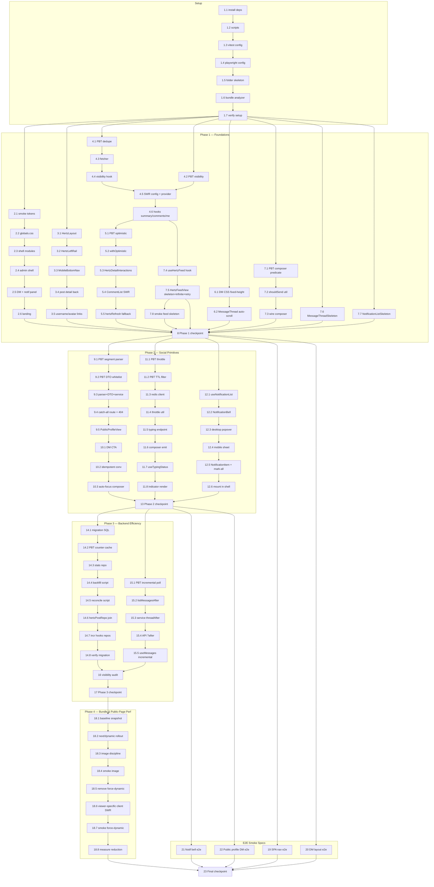

# Implementation Plan: Horizon Social UX Uplift

## Overview

Rencana implementasi ini menerjemahkan `design.md` menjadi pekerjaan koding inkremental yang dapat dieksekusi oleh coding agent. Strukturnya:

1. **Setup** — install dan konfigurasi test framework (Vitest + fast-check + Testing Library + MSW + Playwright + bundle-analyzer) sebagai prasyarat semua PBT/E2E task.
2. **Phase 1 — Foundations & visible UX** — design tokens, SPA navigation, SWR layer + visibility-pause, optimistic helper, comments refactor, DM fixed-height layout, composer Enter predicate.
3. **Phase 2 — Social primitives** — public profile `/@username`, DM-from-profile, typing indicator (Redis TTL), notification bell dropdown.
4. **Phase 3 — Backend efficiency** — counter cache `hertz_post_stats` (migration + backfill + reconcile), incremental DM polling, visibility-pause audit.
5. **Phase 4 — Bundle & public-page perf** — bundle baseline, `next/dynamic` rollout, image discipline, hapus `force-dynamic` di public pages, ukur target ≥10% reduction.

Aturan workflow yang diwarisi dari `AGENTS.md`:

- **VPS rule**: tidak menjalankan dev server. Verifikasi pakai `pnpm --filter ./frontend build`, `test --run`, `test:e2e`, dan `analyze`.
- **TDD-first**: untuk setiap fitur, tulis property test / unit test / E2E test sebelum implementasi.
- **Commit per task** setelah verifikasi lulus.
- **Tasks bertanda `*`** adalah task test yang opsional (boleh di-skip untuk MVP cepat) — tetapi sangat dianjurkan dijalankan dan tetap dimasukkan ke dependency graph.

Setiap task PBT mereferensikan satu Property (P1–P10) dari `design.md` dan diberi tag komentar `// Feature: horizon-social-ux-uplift, Property <N>: <title>` di file test, minimum 100 iterasi (default fast-check). Property tests **hanya** mengonsumsi pure logic / extracted utils / in-memory adapter — bukan komponen UI berat atau jaringan riil.

## Tasks

### Setup — Test Framework, Tooling, Folder Skeleton

- [ ] 1. Install dan konfigurasi tooling test + bundle-analyzer di `frontend/`
  - [ ] 1.1 Install dev dependencies di `frontend/package.json`
    - Tambah `vitest`, `@vitest/ui`, `fast-check`, `@fast-check/vitest`, `@testing-library/react`, `@testing-library/jest-dom`, `@testing-library/user-event`, `jsdom`, `msw`, `@playwright/test`, `@next/bundle-analyzer`, `tsx` (jika belum), `cross-env`.
    - Jalankan `pnpm --filter ./frontend install` untuk memverifikasi resolusi dependency.
    - _Requirements: 19.5_
  - [ ] 1.2 Tambah scripts di `frontend/package.json`
    - `"test": "vitest"`, `"test:run": "vitest --run"`, `"test:e2e": "playwright test"`, `"analyze": "cross-env ANALYZE=true next build"`, `"typecheck": "tsc --noEmit"`.
    - Pastikan tidak menumpuk script existing yang sudah dipakai pipeline lain.
    - _Requirements: 19.5_
  - [ ] 1.3 Buat `frontend/vitest.config.ts`
    - Environment `jsdom`, `globals: true`, alias path mengikuti `tsconfig.json`, setupFiles `frontend/vitest.setup.ts`.
    - Setup `vitest.setup.ts` dengan `@testing-library/jest-dom`, polyfill `document.visibilityState` helper.
    - _Requirements: 3.5, 15.4_
  - [ ] 1.4 Buat `frontend/playwright.config.ts`
    - CI mode (`workers: process.env.CI ? 1 : undefined`), `reporter: 'list'`, `use.baseURL` dari env, browser `chromium` only di CI default.
    - Pastikan `webServer` **tidak** dijalankan otomatis di VPS — gunakan `baseURL` ke build artifact yang sudah ada (dokumentasikan di README e2e).
    - _Requirements: 11.1, 11.2_
  - [ ] 1.5 Buat folder skeleton test
    - `frontend/src/__tests__/{swr,typing,dm,counters,profile,smoke}/.gitkeep`.
    - `frontend/e2e/.gitkeep`.
    - _Requirements: 3.1_
  - [ ] 1.6 Konfigurasi `@next/bundle-analyzer` di `frontend/next.config.mjs`
    - Wrap config dengan `withBundleAnalyzer({ enabled: process.env.ANALYZE === 'true' })`.
    - Pastikan tidak mengubah output saat `ANALYZE` tidak set.
    - _Requirements: 19.5_
  - [ ] 1.7 Verifikasi setup
    - Jalankan `pnpm --filter ./frontend test:run` (kosong, sukses), `pnpm --filter ./frontend typecheck`, dan `pnpm --filter ./frontend build`.
    - Commit: `chore(horizon-social-ux-uplift): setup vitest + fast-check + playwright + bundle analyzer`.

### Phase 1 — Foundations & Visible UX

#### 1A. Design Tokens

- [ ] 2. Lock visual identity ke design tokens global
  - [ ] 2.1 Tulis smoke test scan untuk literal warna terlarang
    - File: `frontend/src/__tests__/smoke/tokens.test.ts`.
    - Scan `frontend/src/**/*.{css,module.css,tsx,ts}` (kecuali `globals.css` dan file token-derived) untuk literal `#0f0f14`, `#10b981`, `#00e38a`, `#34d399`, `#059669` di luar token derivation.
    - Tag: `// Feature: horizon-social-ux-uplift, Smoke: design tokens`.
    - _Requirements: 1.1, 1.2, 1.3, 1.4, 1.9_
  - [ ] 2.2 Tambah/normalisasi tokens di `frontend/src/app/globals.css`
    - `--horizon-bg-base: #0a0a0f`, `--horizon-accent: #13d27b`, `--horizon-surface`, `--horizon-surface-strong`, `--horizon-border`, `--horizon-text`, `--horizon-text-muted`.
    - Expose `#10b981`, `#00e38a`, `#34d399`, `#059669` hanya sebagai derived (`--horizon-accent-soft`, `--horizon-accent-strong`, `--horizon-success`).
    - _Requirements: 1.1, 1.2, 1.3, 1.4_
  - [ ] 2.3 Refactor shell modules ke token
    - `frontend/src/components/layout/HertzLayout.module.css` → background `var(--horizon-bg-base)`.
    - `frontend/src/components/layout/HertzAppShell.module.css` → token-only (background, border, text muted).
    - _Requirements: 1.5, 1.8_
  - [ ] 2.4 Refactor admin shell module ke token
    - `frontend/src/app/admin/(dashboard)/layout.module.css` — sidebar, header, content card → token global. Tidak boleh ada literal `#0f0f14`/`#10b981`/`#00e38a`/`#34d399`/`#059669`.
    - _Requirements: 1.6, 1.8_
  - [ ] 2.5 Refactor panel DM dan notifications ke token
    - `frontend/src/features/hertz/messages/messages.module.css` — `.dmLayout`, `.threadHeader`, `.composer` → `var(--horizon-surface)` / `var(--horizon-surface-strong)`.
    - `frontend/src/features/hertz/notifications/notifications.module.css` — panel, row, divider → token global.
    - _Requirements: 1.3, 1.8_
  - [ ] 2.6 Refactor landing page base ke token
    - `frontend/src/app/HorizonLanding.module.css` — base background `var(--horizon-bg-base)`; gradient mulai dari token yang sama.
    - _Requirements: 1.7, 1.8_

#### 1B. SPA Navigation

- [ ] 3. Ganti `<a href>` internal menjadi `<Link>` di shell-level navigation
  - [ ] 3.1 Refactor link internal di `frontend/src/components/layout/HertzLayout.tsx`
    - Mobile brand `<a href="/hertz">` → `<Link href="/hertz">`.
    - _Requirements: 2.1, 2.2, 2.5_
  - [ ] 3.2 Refactor link internal di `frontend/src/components/feed/HertzLeftRail.tsx`
    - Semua menu, admin link, profile link → `<Link>`.
    - _Requirements: 2.1, 2.2, 2.4, 2.5_
  - [ ] 3.3 Refactor link internal di `frontend/src/components/hertz/MobileBottomNav.tsx`
    - Bottom nav `<a>` → `<Link>` (tetap pakai `prefetch={false}` jika diperlukan, dijabarkan per item).
    - _Requirements: 2.1, 2.2, 2.4, 2.5_
  - [ ] 3.4 Refactor post detail back link
    - `frontend/src/app/hertz/post/[shortId]/page.tsx` — back link `<a href="/hertz">` → `<Link>`.
    - _Requirements: 2.1, 2.2_
  - [ ] 3.5 Wrap username + avatar ke `<Link href={'/@${username}'}>` di feed/profile/comments/DM
    - `frontend/src/components/feed/HertzAuthorLine.tsx`, `frontend/src/components/feed/HertzAvatar.tsx`. URL eksternal / download tetap pakai `<a>` (Req 2.3).
    - _Requirements: 2.1, 2.2, 2.3, 7.4_

#### 1C. SWR Layer + Visibility-Pause

- [ ] 4. Bangun shared SWR layer + visibility-aware polling
  - [ ] 4.1 Property test untuk SWR dedupe across consumers (Property 2)
    - File: `frontend/src/__tests__/swr/dedupe.property.test.ts`.
    - Tag: `// Feature: horizon-social-ux-uplift, Property 2: SWR dedupe across consumers`.
    - Skenario: `N ≥ 2` consumers mount paralel dengan key sama → underlying fetcher dipanggil tepat 1x dalam dedupe window.
    - Validasi: Requirements 3.2, 13.1, 13.2, 13.3.
    - _Requirements: 3.2, 13.1, 13.2, 13.3_
  - [ ] 4.2 Property test untuk visibility-pause invariant (Property 3)
    - File: `frontend/src/__tests__/swr/visibility.property.test.ts`.
    - Tag: `// Feature: horizon-social-ux-uplift, Property 3: Visibility-pause invariant`.
    - Skenario: random sequence transisi `visible/hidden`, polling interval `P`. Counter fetch hanya bertambah selama `visible`; transisi `hidden→visible` memicu tepat 1 revalidasi lalu interval normal lanjut.
    - Validasi: Requirements 3.5, 5.4, 9.8, 12.12, 13.4, 14.6, 15.1, 15.2, 15.3, 15.4.
    - _Requirements: 3.5, 5.4, 9.8, 12.12, 13.4, 14.6, 15.1, 15.2, 15.3, 15.4_
  - [ ] 4.3 Implement `frontend/src/lib/swr/fetcher.ts`
    - Typed fetcher membaca envelope `{ ok, data, error }`. Throw `ApiError` jika `!ok`.
    - _Requirements: 3.3_
  - [ ] 4.4 Implement `frontend/src/lib/swr/visibility.ts`
    - Hook `useVisibilityRefreshInterval(ms)` mereturn `0` saat `document.visibilityState === 'hidden'`. Helper `isVisible()` dipakai di config.
    - _Requirements: 3.5, 15.1, 15.2, 15.4_
  - [ ] 4.5 Implement `frontend/src/lib/swr/config.ts` + provider mount
    - `SWRConfig` value: `revalidateOnFocus`, `revalidateOnReconnect`, `keepPreviousData`, custom `isVisible()`.
    - Mount di `frontend/src/app/layout.tsx` membungkus `{children}` dengan `<SWRConfig>`.
    - _Requirements: 3.1, 3.5, 13.1, 15.4_
  - [ ] 4.6 Implement hook `useAuthMe`, `useNotificationSummary`, `useCommentList`, `useDmInbox`
    - `frontend/src/lib/swr/hooks/useAuthMe.ts` (key `'/api/auth/me'`).
    - `frontend/src/lib/swr/hooks/useNotificationSummary.ts` (refresh interval ±25s, visibility-aware).
    - `frontend/src/lib/swr/hooks/useCommentList.ts` (key `['/api/hertz/posts/comments', shortId]`, polling 5–10s, visibility-aware).
    - `frontend/src/lib/swr/hooks/useDmInbox.ts` (key `'/api/hertz/messages/inbox'`, visibility-aware). Migrasi dari pattern fetch+useEffect di `useMessages.ts`; di phase ini hanya disediakan hook-nya, konsumen migrasi inbox dilakukan saat refactor DM (Phase 3).
    - _Requirements: 3.1, 3.3, 3.4, 5.2, 5.3, 5.4, 13.1_

#### 1D. Optimistic Helper + Comments Refactor

- [ ] 5. Implement optimistic-update helper dan migrasi komentar ke SWR
  - [ ] 5.1 Property test untuk optimistic merge round-trip (Property 1)
    - File: `frontend/src/__tests__/swr/optimistic.property.test.ts`.
    - Tag: `// Feature: horizon-social-ux-uplift, Property 1: Optimistic merge round-trip`.
    - Skenario: append-on-apply, reconcile-preserves-size by `client_id`, idempotency `N ≥ 1` apply, rollback `deepEqual` snapshot.
    - Validasi: Requirements 4.1, 4.2, 4.3, 4.4, 4.5, 5.1, 12.7.
    - _Requirements: 4.1, 4.2, 4.3, 4.4, 4.5, 5.1, 12.7_
  - [ ] 5.2 Implement `frontend/src/lib/swr/optimistic.ts`
    - Helper `withOptimistic({ key, mutator, request, reconcileBy })`: snapshot → mutate(no revalidate) → fetch → reconcile/rollback → trigger revalidate.
    - Public API stable, return `{ data, error }`.
    - _Requirements: 4.1, 4.2, 4.3, 4.4, 4.5_
  - [ ] 5.3 Refactor `frontend/src/components/feed/HertzDetailInteractions.tsx` ke SWR + optimistic
    - Hapus `refreshPreserveScroll(router)` di success path. Pakai `useCommentList(shortId)` + `withOptimistic`.
    - Mutation API endpoint tidak berubah; hanya client wiring. `client_id` UUID dibuat di client dan di-echo server.
    - _Requirements: 4.1, 4.2, 4.3, 4.4, 4.5, 5.1, 5.6_
  - [ ] 5.4 Refactor `frontend/src/features/hertz/comments/CommentList.tsx`
    - Render data dari SWR; tampilkan skeleton saat `isLoading`; preserve scroll position saat reconcile.
    - _Requirements: 5.1, 5.6, 6.5_
  - [ ] 5.5 Pertahankan `frontend/src/lib/hertzRefresh.ts` sebagai fallback error path
    - `refreshPreserveScroll` tetap dipakai pada error fallback (Req 5.5), bukan di success path.
    - _Requirements: 5.5_

#### 1E. DM Fixed-Height Layout + Composer Enter Predicate

- [ ] 6. Implement DM fixed-height layout
  - [ ] 6.1 Refactor `frontend/src/features/hertz/messages/messages.module.css`
    - `.dmLayout`: `height: calc(100dvh - var(--horizon-shell-offset, 120px))` desktop; mobile pakai `100svh - var(--horizon-mobile-offset, 0px)`. Hapus `min-height` di kontainer DM.
    - `.messageList`: `flex: 1; overflow-y: auto; min-height: 0`.
    - `.threadHeader`, `.composer`: pinned via flex layout.
    - _Requirements: 11.1, 11.2, 11.3, 11.4, 11.5_
  - [ ] 6.2 Update behavior auto-scroll di `MessageThread.tsx`
    - File: `frontend/src/features/hertz/messages/MessageThread.tsx`.
    - Track posisi scroll. Jika user di bawah → auto-scroll on new message; jika scrolled-up → preserve posisi + munculkan affordance "pesan baru".
    - _Requirements: 11.6, 11.7_

- [ ] 7. Implement DM composer Enter send predicate
  - [ ] 7.1 Property test untuk `shouldSend` predicate (Property 6)
    - File: `frontend/src/__tests__/dm/composer.property.test.ts`.
    - Tag: `// Feature: horizon-social-ux-uplift, Property 6: DM composer send predicate`.
    - Skenario: untuk semua kombinasi `(key, shiftKey, body, attachments, uploading)`, `shouldSend` true ⇔ `key==='Enter' ∧ ¬shiftKey ∧ ¬uploading ∧ (body.trim().length > 0 ∨ attachments.length > 0)`. Newline disisipkan saat `Enter+Shift`.
    - Validasi: Requirements 10.1, 10.2, 10.3, 10.4.
    - _Requirements: 10.1, 10.2, 10.3, 10.4_
  - [ ] 7.2 Extract pure predicate `shouldSend` ke util
    - File baru: `frontend/src/features/hertz/messages/composerPredicate.ts`.
    - Export pure `shouldSend(state)` dan `shouldInsertNewline(state)`.
    - _Requirements: 10.1, 10.2, 10.3, 10.4_
  - [ ] 7.3 Wire `shouldSend` ke `MessageComposer.tsx`
    - File: `frontend/src/features/hertz/messages/MessageComposer.tsx`. Konsumsi predicate; `Enter`-send menggunakan optimistic path (Req 4.x).
    - _Requirements: 10.1, 10.2, 10.3, 10.4, 10.5_

#### 1F. Infinite Feed & Skeleton Loaders

- [ ] 7.4 Implement `useHertzFeed` infinite hook (SWR Infinite + retry)
  - File baru: `frontend/src/lib/swr/hooks/useHertzFeed.ts`.
  - Pakai `useSWRInfinite` dengan key generator `(pageIndex, previousPageData) => previousPageData && previousPageData.nextCursor === null ? null : ['/api/hertz/posts', cursor]`.
  - Expose `{ posts, error, isLoadingInitialData, isLoadingMore, hasReachedEnd, loadMore, retry }`. `retry` memanggil `mutate()` pada page yang gagal tanpa membuang halaman yang sudah ter-load (preserve `keepPreviousData`).
  - Visibility-aware: tidak ada interval polling untuk feed (read-on-scroll); `revalidateOnFocus` + `revalidateOnReconnect` mengikuti default SWR config.
  - _Requirements: 6.2, 6.3, 6.4_

- [ ] 7.5 Refactor `HertzFeedView` ke skeleton + infinite scroll + retry
  - File: `frontend/src/components/feed/HertzFeedView.tsx`.
  - Konsumsi `useHertzFeed`. Render saat `isLoadingInitialData === true` dengan skeleton list yang match layout `HertzPostCard` (gunakan komponen baru `frontend/src/components/feed/HertzPostCardSkeleton.tsx` — buat di task ini).
  - Trigger `loadMore` via `IntersectionObserver` pada sentinel `<div ref={sentinelRef} />` di akhir list dengan `rootMargin: '600px 0px'` (threshold "dekat bottom").
  - Saat `isLoadingMore === true`, render footer skeleton/spinner di bawah list tanpa unmount post existing (`keepPreviousData` aktif via SWR config global).
  - Saat `error` muncul untuk page apa pun, render retry control (button "Coba lagi") di footer; klik panggil `retry()`. Tidak boleh discard posts yang sudah ter-load.
  - Saat `hasReachedEnd === true`, hentikan observer dan render end-of-feed marker ringan.
  - _Requirements: 6.1, 6.2, 6.3, 6.4_

- [ ] 7.6 Implement `MessageThreadSkeleton` component (DM thread initial-load skeleton)
  - File baru: `frontend/src/features/hertz/messages/MessageThreadSkeleton.tsx`.
  - Render placeholder bubble alternating left/right (3–6 baris) yang match dimensi rough `MessageThread` row, plus header + composer placeholder agar layout tidak shift saat skeleton diganti data riil.
  - Komponen ini akan dikonsumsi oleh `MessageThread.tsx` saat `isLoading && messages.length === 0`. Wiring dilakukan dalam task 11.8 (yang sudah menyentuh `MessageThread.tsx` untuk typing indicator) — tambahkan import + render conditional di sana saat task 11.8 dieksekusi.
  - _Requirements: 6.5_

- [ ] 7.7 Implement `NotificationListSkeleton` component (notification list skeleton)
  - File baru: `frontend/src/components/notifications/NotificationListSkeleton.tsx`.
  - Render 4–6 placeholder rows yang match dimensi `NotificationItem` (avatar circle + dua baris teks + timestamp ghost), plus separator antar item agar dropdown tidak jumpy saat data masuk.
  - Komponen ini akan dikonsumsi oleh `NotificationDropdown.tsx` (task 12.3) dan `NotificationDropdown.mobile.tsx` (task 12.4) saat `useNotificationList(...).isLoading && data === undefined`. Wiring dilakukan dalam task 12.3/12.4.
  - _Requirements: 6.5_

- [ ]* 7.8 Component test untuk skeleton + retry behavior pada `HertzFeedView`
  - File: `frontend/src/__tests__/smoke/feedSkeleton.test.tsx`.
  - Tag: `// Feature: horizon-social-ux-uplift, Smoke: feed skeleton + infinite + retry`.
  - Skenario (MSW + Testing Library):
    - Initial render → assert skeleton terlihat (`role="status"` atau `data-testid="hertz-post-skeleton"`).
    - Resolve page 1 → assert posts terlihat, skeleton hilang.
    - Trigger `loadMore` (manual call hook atau intersection mock) lalu mock page 2 fail → assert retry button muncul DAN posts page 1 tetap terlihat (Req 6.4).
    - Klik retry → mock page 2 success → assert posts append, retry button hilang.
  - _Requirements: 6.1, 6.2, 6.3, 6.4_

- [ ] 8. Checkpoint Phase 1 — verifikasi build & test
  - Jalankan `pnpm --filter ./frontend build && pnpm --filter ./frontend test:run && pnpm --filter ./frontend test:e2e`.
  - Pastikan semua tests pass; ask user jika ada blocker.

### Phase 2 — Social Primitives

#### 2A. Public Profile `/@username`

- [ ] 9. Implement public profile route + DTO + view
  - [ ] 9.1 Property test untuk segment parser (Property 10)
    - File: `frontend/src/__tests__/profile/segmentParser.property.test.ts`.
    - Tag: `// Feature: horizon-social-ux-uplift, Property 10: /@username segment parser`.
    - Skenario: untuk string arbitrary `s`, parser return `{ username }` jika dan hanya jika `s` match `^@[A-Za-z0-9_]{1,32}$`; selain itu `NotFound`. Termasuk edge `''`, `'@'`, `'@foo/bar'`, panjang > 33, karakter di luar `[A-Za-z0-9_]`.
    - Validasi: Requirements 7.1, 7.2, 7.5.
    - _Requirements: 7.1, 7.2, 7.5_
  - [ ] 9.2 Property test untuk public profile DTO whitelist (Property 9)
    - File: `frontend/src/__tests__/profile/publicProfileDto.property.test.ts`.
    - Tag: `// Feature: horizon-social-ux-uplift, Property 9: Public profile DTO whitelist`.
    - Skenario: untuk member entity dengan semua private fields (`email`, `telegramUserId`, `lastLoginAt`, `creditBalance`, `notificationSummary`) terisi acak, `toPublicProfileDto(member, viewerId)` punya top-level keys persis `{ username, displayName, avatarUrl, bio, publicCounters, joinedAt, isSelf, hasExistingDm }` dan `publicCounters` keys persis `{ posts, pulses, repostsReceived }`.
    - Validasi: Requirements 7.3.
    - _Requirements: 7.3_
  - [ ] 9.3 Implement util parser + DTO mapper + service
    - `frontend/src/lib/profile/parsePublicProfileSegment.ts` — pure parser.
    - `shared/dto/publicProfile.ts` — `PublicProfileDto` type + `toPublicProfileDto(member, viewerId)` mapper dengan whitelist eksplisit.
    - `shared/services/hertzPublicProfileService.ts` — `getPublicProfileByUsername(username): Promise<PublicProfileDto | null>`.
    - _Requirements: 7.1, 7.2, 7.3, 7.5, 7.6_
  - [ ] 9.4 Buat catch-all route page + 404
    - `frontend/src/app/[atUsername]/page.tsx` — server component, parse segment, lookup member, render `<PublicProfileView>`. Reject segment yang tidak match regex via `notFound()`.
    - `frontend/src/app/[atUsername]/not-found.tsx` — 404 spesifik public profile.
    - _Requirements: 7.1, 7.2, 7.5, 7.7_
  - [ ] 9.5 Implement `PublicProfileView` (client island)
    - File: `frontend/src/components/profile/PublicProfileView.tsx`.
    - Props: `dto: PublicProfileDto`, `viewerId: string | null`. Render header, counters publik, tabs posts/pulses/reposts, dan slot DM CTA.
    - Saat `dto.isSelf === true`, tampilkan "Edit profile" alih-alih DM CTA.
    - _Requirements: 7.1, 7.3, 7.6, 8.6_

#### 2B. DM-from-Profile

- [ ] 10. Implement DM CTA dari public profile + idempotent conversation create
  - [ ] 10.1 Implement `PublicProfileDmButton`
    - File: `frontend/src/components/profile/PublicProfileDmButton.tsx`.
    - Authenticated → `POST /api/hertz/messages/conversations` → `router.push('/hertz/messages?conversation=<id>')`.
    - Self → tidak render (Req 8.6).
    - Unauthenticated → state prompt login dengan `href="/admin/login?redirect=..."`, tidak hit API (Req 8.5).
    - _Requirements: 8.1, 8.2, 8.5, 8.6, 8.7_
  - [ ] 10.2 Pastikan endpoint `POST /api/hertz/messages/conversations` idempotent
    - File: `frontend/src/app/api/hertz/messages/conversations/route.ts`.
    - Saat conversation aktif sudah ada, return `200` dengan `existing: true`. Saat baru, return `201` `existing: false`.
    - _Requirements: 8.3, 8.4_
  - [ ] 10.3 Auto-focus composer saat `?conversation=<id>`
    - File: `frontend/src/features/hertz/messages/useMessages.ts`.
    - Selector untuk auto-focus composer saat query param `conversation` ada.
    - _Requirements: 8.7_

#### 2C. Typing Indicator

- [ ] 11. Implement typing indicator polling + Redis TTL
  - [ ] 11.1 Property test untuk typing throttle bound (Property 4)
    - File: `frontend/src/__tests__/typing/throttle.property.test.ts`.
    - Tag: `// Feature: horizon-social-ux-uplift, Property 4: Typing throttle bound`.
    - Skenario: untuk sequence keystroke timestamp arbitrary dan `m ∈ [1500, 2000]`, jumlah emisi ≤ `ceil(T/m)`; jarak antar emisi ≥ `m` ms.
    - Validasi: Requirements 9.1.
    - _Requirements: 9.1_
  - [ ] 11.2 Property test untuk typing TTL filter (Property 5)
    - File: `frontend/src/__tests__/typing/ttlFilter.property.test.ts`.
    - Tag: `// Feature: horizon-social-ux-uplift, Property 5: Typing TTL filter`.
    - Skenario: untuk list status acak dan TTL `τ ∈ [5000, 8000]`, response endpoint persis `{ s | s.userId ≠ self ∧ now - s.lastTypingAt ≤ τ }`.
    - Validasi: Requirements 9.2, 9.3, 9.5, 9.6.
    - _Requirements: 9.2, 9.3, 9.5, 9.6_
  - [ ] 11.3 Implement Redis client wrapper
    - File: `frontend/src/lib/redis.ts`. Lazy singleton `ioredis`. Dipakai server-only.
    - Konfigurasi via env (`REDIS_URL`).
    - _Requirements: 9.2_
  - [ ] 11.4 Implement throttle util pure
    - File: `frontend/src/lib/throttle.ts`. Pure throttle (testable via PBT).
    - _Requirements: 9.1_
  - [ ] 11.5 Implement endpoint `POST/GET .../typing`
    - File: `frontend/src/app/api/hertz/messages/conversations/[conversationId]/typing/route.ts`.
    - `POST`: `SET typing:{convId}:{userId} = JSON({displayName,lastTypingAt}) EX 6`.
    - `GET`: `SCAN MATCH typing:{convId}:* COUNT 100`, filter `lastTypingAt > now - τ` dan exclude self.
    - Auth gate via `getCurrentMember`. `403 FORBIDDEN` jika viewer bukan participant. Redis unavailable → POST `503`, GET return `typingUsers: []`.
    - _Requirements: 9.2, 9.3, 9.5, 9.6, 9.7, 9.9_
  - [ ] 11.6 Wire emit + clear-on-send di `MessageComposer.tsx`
    - File: `frontend/src/features/hertz/messages/MessageComposer.tsx`.
    - `onChange` panggil throttled `emitTyping()` 1.5–2s; saat `document.hidden` skip emit (Req 15.3); pada send → POST clear.
    - _Requirements: 9.1, 9.7, 9.8, 15.3_
  - [ ] 11.7 Implement `useTypingStatus` hook
    - File: `frontend/src/lib/swr/hooks/useTypingStatus.ts`.
    - Polling 3–5s, visibility-aware (`useVisibilityRefreshInterval`).
    - _Requirements: 9.4, 9.8, 15.1, 15.2_
  - [ ] 11.8 Render indicator di `MessageThread.tsx`
    - File: `frontend/src/features/hertz/messages/MessageThread.tsx`.
    - Render "X sedang mengetik…" di atas composer, exclude self, max N user.
    - _Requirements: 9.5, 9.9_

#### 2D. Notification Bell Dropdown

- [ ] 12. Implement notification bell + dropdown (desktop popover + mobile sheet)
  - [ ] 12.1 Implement `useNotificationList` hook
    - File: `frontend/src/lib/swr/hooks/useNotificationList.ts`.
    - Key `['/api/hertz/notifications', limit]`, polling 20–30s saat dropdown open + visible. `mutate` exposed untuk Mark-all-as-read optimistic.
    - _Requirements: 12.6, 12.11, 12.12_
  - [ ] 12.2 Implement `NotificationBell`
    - File: `frontend/src/components/notifications/NotificationBell.tsx`.
    - Anchor top-right shell. Badge dari `useNotificationSummary`. Toggle open state.
    - _Requirements: 12.1, 12.2_
  - [ ] 12.3 Implement desktop popover `NotificationDropdown`
    - File: `frontend/src/components/notifications/NotificationDropdown.tsx`.
    - Width 360–420px, max-height ≤ 70dvh. Header "Notifications" + "Mark all as read". Render list dari `useNotificationList(8)`. Outside-click + `Escape` → close (Req 12.9).
    - _Requirements: 12.3, 12.5, 12.6, 12.9_
  - [ ] 12.4 Implement mobile bottom-sheet variant
    - File: `frontend/src/components/notifications/NotificationDropdown.mobile.tsx`. Sama prop interface; layout bottom sheet.
    - _Requirements: 12.4, 12.9_
  - [ ] 12.5 Implement `NotificationItem` row + Mark-all-as-read optimistic
    - File: `frontend/src/components/notifications/NotificationItem.tsx`.
    - On click → mark-as-read (optimistic via `withOptimistic`) + `router.push(item.href)` SPA + close dropdown.
    - "Mark all as read" optimistic set semua item read + revalidate summary (Req 12.7, 13.3).
    - _Requirements: 12.6, 12.7, 12.8, 13.3_
  - [ ] 12.6 Mount `<NotificationBell>` di `HertzAppShell`
    - File: `frontend/src/components/layout/HertzAppShell.tsx`. Letakkan di area top-right; pastikan tidak menggeser layout existing.
    - _Requirements: 12.1, 12.10_

- [ ] 13. Checkpoint Phase 2 — verifikasi build & test
  - Jalankan `pnpm --filter ./frontend build && pnpm --filter ./frontend test:run && pnpm --filter ./frontend test:e2e`.
  - Pastikan semua tests pass; ask user jika ada blocker.

### Phase 3 — Backend Efficiency

#### 3A. Counter Cache `hertz_post_stats`

- [ ] 14. Migration + repository + integration counter cache
  - [ ] 14.1 Tulis migrasi `shared/migrations/20260601_001_create_hertz_post_stats.sql`
    - DDL `hertz_post_stats` (post_id PK, comment_count, pulse_count, repost_count, view_count, updated_at, CHECK non-negative) + index `idx_hertz_post_stats_updated_at`.
    - _Requirements: 16.1, 16.4_
  - [ ] 14.2 Property test untuk counter cache idempotency + correctness (Property 8)
    - File: `frontend/src/__tests__/counters/counterCache.property.test.ts`.
    - Tag: `// Feature: horizon-social-ux-uplift, Property 8: Counter cache idempotency and correctness`.
    - Skenario: untuk sequence event arbitrary `(post_id, kind, delta, event_id)`, repository in-memory adapter mempertahankan idempotency by `event_id`, correctness `sum(delta) over distinct event_id`, dan non-negative invariant.
    - Validasi: Requirements 16.2, 16.4.
    - _Requirements: 16.2, 16.4_
  - [ ] 14.3 Implement `shared/repositories/hertzPostStatsRepository.ts`
    - Methods: `getMany(postIds)`, `incr(postId, field, delta, { eventId? })`, `upsert(postId, counts)`. Clamp non-negative di repository selain DB CHECK.
    - _Requirements: 16.1, 16.2, 16.4_
  - [ ] 14.4 Tulis backfill script `scripts/backfill-hertz-post-stats.ts`
    - Mode `--dry-run` (print planned UPSERT) + `--apply --batch=1000`. Idempotent `INSERT ... ON CONFLICT DO UPDATE`. Range scan by `post_id`.
    - _Requirements: 16.1, 16.4_
  - [ ] 14.5 Tulis reconcile script `scripts/reconcile-hertz-post-stats.ts`
    - `--sample=N --assert`. Compute canonical aggregates untuk sample; assert equality dengan cache. Log drift; jangan crash.
    - _Requirements: 16.4_
  - [ ] 14.6 Refactor `shared/repositories/hertzPostRepository.ts`
    - `findMany` join `hertz_post_stats`. Saat row missing → fallback canonical aggregate + `upsert` repopulate dalam path yang sama.
    - _Requirements: 16.3, 16.5_
  - [ ] 14.7 Hook `incr` ke repository event canonical
    - `shared/repositories/hertzCommentRepository.ts` — insert/delete comment → `incr(postId, 'comment_count', ±1)` dalam transaction yang sama.
    - `shared/repositories/hertzPulseRepository.ts` — `pulse_count`.
    - `shared/repositories/hertzRepostRepository.ts` — `repost_count`.
    - `shared/repositories/hertzPostViewRepository.ts` — `view_count`.
    - _Requirements: 16.2, 16.4_
  - [ ] 14.8 Verifikasi migrasi end-to-end (dry-run + apply + reconcile)
    - Jalankan `tsx scripts/backfill-hertz-post-stats.ts --dry-run`.
    - Lalu `--apply --batch=1000`.
    - Lalu `tsx scripts/reconcile-hertz-post-stats.ts --sample=100 --assert`.
    - Konfirmasi assertion lulus tanpa drift; log apa pun ke stdout. Jika drift terdeteksi, hentikan dan eskalasi ke user.
    - _Requirements: 16.4, 16.5_

#### 3B. Incremental DM Polling

- [ ] 15. Extend DM thread API + repo + hook ke incremental polling
  - [ ] 15.1 Property test untuk incremental DM poll monotonic + append-only (Property 7)
    - File: `frontend/src/__tests__/dm/threadAfter.property.test.ts`.
    - Tag: `// Feature: horizon-social-ux-uplift, Property 7: Incremental DM poll is monotonic and append-only`.
    - Skenario: untuk canonical message list `M`, `afterId ∈ ids(M) ∪ {⊥}`, dan local cache `C` prefix dari `M`: `thread(afterId).messages = { m ∈ M | id(m) > afterId }`; `C ← C ++ thread(lastId(C))` tetap prefix dari `M`; empty result → cache unchanged.
    - Validasi: Requirements 14.1, 14.2, 14.4, 14.5.
    - _Requirements: 14.1, 14.2, 14.4, 14.5_
  - [ ] 15.2 Extend `shared/repositories/hertzDmRepository.ts`
    - Method `listMessagesAfter(conversationId, afterId)` query `WHERE id > $afterMessageId` ORDER canonical.
    - _Requirements: 14.1, 14.4_
  - [ ] 15.3 Extend `shared/services/hertzDmService.ts`
    - Method `threadAfter(user, conversationId, afterMessageId)` dengan membership check.
    - _Requirements: 14.1, 14.2_
  - [ ] 15.4 Extend API route accept `?after=`
    - File: `frontend/src/app/api/hertz/messages/conversations/[conversationId]/route.ts`.
    - Parse `searchParams.get('after')`. Tanpa `after` → behavior lama (`isPartial: false`); dengan `after` → `threadAfter` (`isPartial: true`). `400` jika malformed.
    - _Requirements: 14.1, 14.2_
  - [ ] 15.5 Refactor `useMessages.ts` ke incremental + append-only via `useDmThread` standalone hook
    - File hook baru: `frontend/src/lib/swr/hooks/useDmThread.ts`. Key `['/api/hertz/messages/conversations', conversationId]` (canonical cache key per design D.4); track `lastMessageId` di hook state (bukan di key) untuk hindari cache fragmentation. Initial fetch tanpa `after`; polling subsequent dengan `?after=<lastMessageId>`. Append-only ke cache; visibility-aware via `useVisibilityRefreshInterval`.
    - File konsumen: `frontend/src/features/hertz/messages/useMessages.ts`. Hapus pattern fetch+useEffect untuk thread; konsumsi `useDmThread(conversationId)`. Inbox migration ke `useDmInbox` (task 4.6) juga dikerjakan di sini agar `useMessages.ts` bersih dari ad-hoc fetch.
    - _Requirements: 14.3, 14.4, 14.5, 14.6_

#### 3C. Visibility-Pause Audit

- [ ] 16. Audit semua polling loop pakai visibility-aware interval
  - Pastikan `useNotificationSummary`, `useNotificationList`, `useCommentList`, `useDmThread`, `useTypingStatus` semuanya konsumsi `useVisibilityRefreshInterval`.
  - Pastikan `MessageComposer.emitTyping()` skip saat `document.hidden` (Req 15.3).
  - Tambah/perbaiki test ringan jika ada gap; tidak perlu task PBT terpisah karena Property 3 sudah cover.
  - _Requirements: 15.1, 15.2, 15.3, 15.4_

- [ ] 17. Checkpoint Phase 3 — verifikasi build, test, dan migrasi
  - Jalankan `pnpm --filter ./frontend build && pnpm --filter ./frontend test:run && pnpm --filter ./frontend test:e2e`.
  - Konfirmasi script migrasi (14.8) sudah lulus di environment staging/lokal.
  - Pastikan semua tests pass; ask user jika ada blocker.

### Phase 4 — Bundle & Public-Page Performance

- [ ] 18. Bundle baseline + lazy-load + image discipline + ISR rollout
  - [ ] 18.1 Snapshot baseline bundle
    - Jalankan `pnpm --filter ./frontend analyze`. Ekstrak total JS untuk routes `/hertz` dan `/tools`.
    - Simpan ke `frontend/.bundle-baseline.json` dengan format `{ "/hertz": <bytes>, "/tools": <bytes>, "capturedAt": <iso> }`.
    - _Requirements: 19.5_
  - [ ] 18.2 Konversi heavy components ke `next/dynamic`
    - Kandidat (sesuai design.md C.14): `ProfitabilityTool`, `ChallengeTrackerTool`, `ElliottWaveTool`, `OrderBookTool`, `OutlookEditor`, `ArticleEditor`, `LogViewer`, admin `Charts`, full `HertzComposer`, `ReportDialog`, `ShareSheet`, post-detail modal, `Sparkline`.
    - Setiap konversi tambah placeholder skeleton ringan konsisten dengan Req 6.
    - _Requirements: 19.1, 19.2, 19.3, 19.4_
  - [ ] 18.3 Image discipline pass — replace raw `` per enumerated list
    - Daftar (design.md C.13): `HertzPostMedia.tsx`, `HertzAvatar.tsx`, `DmAvatar.tsx`, `MessageThread.tsx`, `MessageComposer.tsx`, `BlogCard.tsx`, `OutlookCard.tsx`, `app/blog/[slug]/page.tsx`, `app/outlook/[slug]/page.tsx`, `app/artikel/**`.
    - Aturan: jika `src` host masuk `images.remotePatterns` → `next/image`. Jika tidak → `` minimal `loading="lazy"`, `decoding="async"`, `width`/`height` atau `aspect-ratio`. `alt` selalu meaningful atau `alt=""` untuk dekoratif.
    - _Requirements: 18.1, 18.2, 18.3, 18.4_
  - [ ] 18.4 Smoke test image discipline (lint scan)
    - File: `frontend/src/__tests__/smoke/imageDiscipline.test.ts`.
    - Tag: `// Feature: horizon-social-ux-uplift, Smoke: image discipline`.
    - Scan source untuk raw `` → klik "Kirim DM" → conversation existing/new dibuka, composer focus. Self profile → tidak ada DM CTA, "Edit profile" muncul. Unauthenticated → tombol prompt login, tidak hit API.
  - _Requirements: 8.1, 8.2, 8.3, 8.4, 8.5, 8.6, 8.7_

### Final Checkpoint

- [ ] 23. Final checkpoint — full verification gate
  - Jalankan berurutan:
    - `pnpm --filter ./frontend build`
    - `pnpm --filter ./frontend test:run`
    - `pnpm --filter ./frontend test:e2e`
    - `pnpm --filter ./frontend analyze` lalu bandingkan dengan `frontend/.bundle-baseline.json`.
  - Pastikan semua hijau dan target reduksi tercapai. Ask user jika ada blocker akhir.

## Notes

- Tasks bertanda `*` adalah test-related sub-tasks (PBT, smoke, E2E). Optional untuk MVP cepat tetapi tetap dianjurkan dieksekusi dan tetap masuk ke dependency graph.
- Setiap task PBT memetakan ke Property dari `design.md` (P1–P10), minimum 100 iterasi, dan **hanya** mengonsumsi pure logic atau in-memory adapter.
- VPS rule: tidak ada `dev` server. Verifikasi via `build` / `test --run` / `test:e2e` / `analyze`.
- Commit per task setelah verifikasi lulus, dengan pesan `feat|chore|refactor(horizon-social-ux-uplift): <ringkas>`.
- Setiap task dibuat agar dapat dieksekusi independen oleh coding agent dengan konteks `design.md` + `requirements.md`.
- Daftar property → task mapping cepat:
  - P1 Optimistic merge → 5.1
  - P2 SWR dedupe → 4.1
  - P3 Visibility-pause → 4.2
  - P4 Typing throttle → 11.1
  - P5 Typing TTL filter → 11.2
  - P6 Composer send predicate → 7.1
  - P7 Incremental DM poll → 15.1
  - P8 Counter cache → 14.2
  - P9 Public profile DTO whitelist → 9.2
  - P10 Segment parser → 9.1

## Task Dependency Graph



```json
{
  "waves": [
    { "id": 0, "tasks": ["1.1"] },
    { "id": 1, "tasks": ["1.2", "1.3", "1.4", "1.5", "1.6"] },
    { "id": 2, "tasks": ["1.7"] },
    { "id": 3, "tasks": ["2.1", "3.1", "3.2", "3.3", "3.4", "3.5", "4.1", "4.2", "6.1", "7.1", "7.6", "7.7"] },
    { "id": 4, "tasks": ["2.2", "4.3", "6.2", "7.2"] },
    { "id": 5, "tasks": ["2.3", "2.4", "2.5", "2.6", "4.4", "7.3"] },
    { "id": 6, "tasks": ["4.5"] },
    { "id": 7, "tasks": ["4.6", "5.1"] },
    { "id": 8, "tasks": ["5.2", "7.4"] },
    { "id": 9, "tasks": ["5.3", "5.4", "5.5", "7.5"] },
    { "id": 10, "tasks": ["9.1", "9.2", "11.1", "11.2", "11.3", "11.4", "12.1", "7.8"] },
    { "id": 11, "tasks": ["9.3", "11.5", "12.2"] },
    { "id": 12, "tasks": ["9.4", "11.6", "12.3", "12.4"] },
    { "id": 13, "tasks": ["9.5", "11.7", "12.5"] },
    { "id": 14, "tasks": ["10.1", "11.8", "12.6"] },
    { "id": 15, "tasks": ["10.2", "10.3"] },
    { "id": 16, "tasks": ["14.1", "14.2", "15.1"] },
    { "id": 17, "tasks": ["14.3", "15.2"] },
    { "id": 18, "tasks": ["14.4", "14.5", "15.3"] },
    { "id": 19, "tasks": ["14.6", "15.4"] },
    { "id": 20, "tasks": ["14.7", "15.5"] },
    { "id": 21, "tasks": ["14.8"] },
    { "id": 22, "tasks": ["18.1", "19", "20", "21", "22"] },
    { "id": 23, "tasks": ["18.2", "18.3"] },
    { "id": 24, "tasks": ["18.4", "18.5"] },
    { "id": 25, "tasks": ["18.6", "18.7"] },
    { "id": 26, "tasks": ["18.8"] }
  ]
}
```
