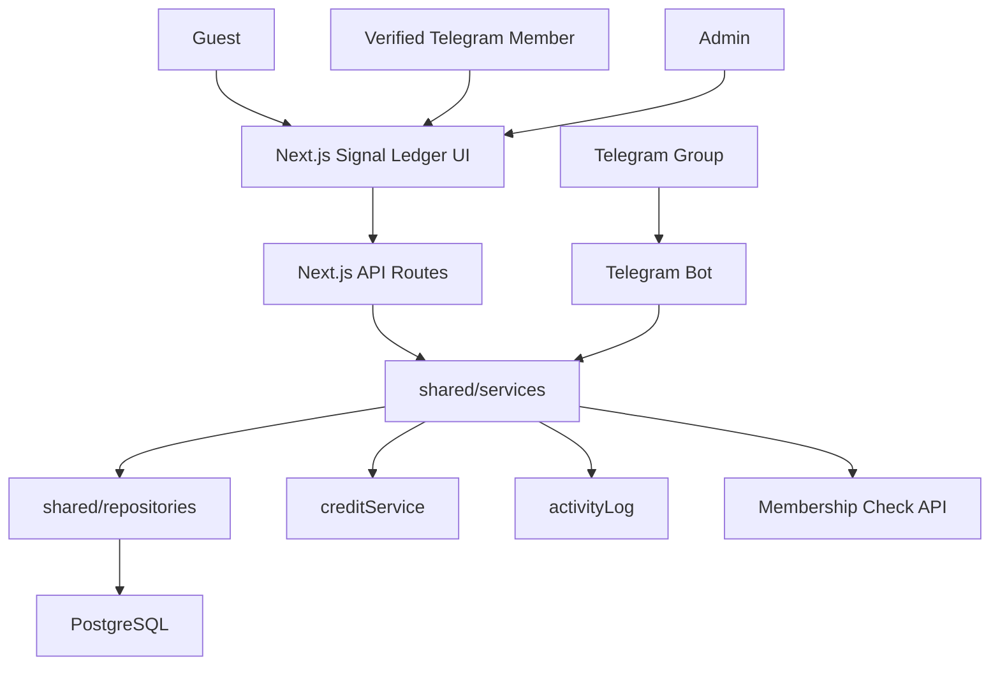
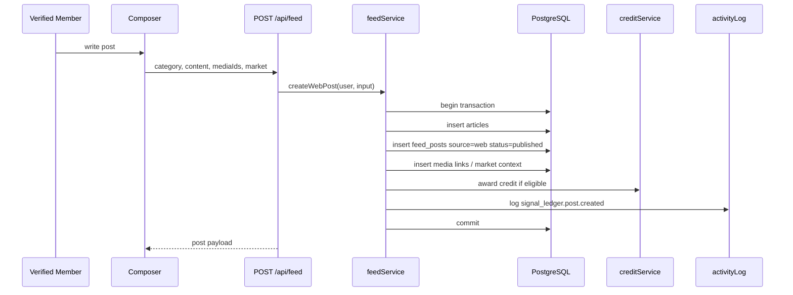
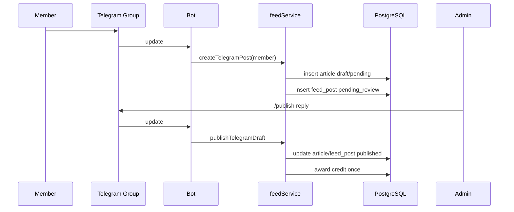

# Design Document: Signal Ledger

## Overview

Signal Ledger is a new social trading feed domain for Horizon. It replaces the visual and interaction model of the home feed while preserving the existing article, media, Telegram bot, admin, and credit foundations.

The implementation follows a layered architecture:

- Next.js app routes render the Signal Ledger UI and expose API routes.
- API routes remain thin.
- Shared services own business rules, transactions, auth checks, credit awards, and activity logs.
- Shared repositories own SQL.
- The Telegram bot calls the same shared services where possible.
- Database changes are additive and live in `db/migrations/008_create_signal_ledger.sql`.

## Architecture



### Home route behavior

```txt
GET /
  -> read SIGNAL_LEDGER_ENABLED
  -> if true: render SignalLedgerPage
  -> if false: render existing feed fallback
```

### Web post flow



### Telegram member publish flow



## Components and Interfaces

### API route layer

API files live under:

```txt
frontend/src/app/api/
  auth/telegram/route.ts
  auth/me/route.ts
  auth/logout/route.ts
  feed/route.ts
  feed/[postId]/route.ts
  feed/[postId]/view/route.ts
  feed/[postId]/signal/route.ts
  feed/[postId]/bookmark/route.ts
  feed/[postId]/repost/route.ts
  feed/[postId]/comments/route.ts
  feed/comments/[commentId]/route.ts
  feed/[postId]/community-notes/route.ts
  feed/community-notes/[noteId]/route.ts
  feed/community-notes/[noteId]/rating/route.ts
  admin/signal-ledger/pending/route.ts
```

API routes are responsible for:

- parsing input,
- resolving current user/session,
- calling services,
- serializing errors.

They are not responsible for large SQL queries or business decisions.

### Shared service layer

```txt
shared/services/
  feedService.ts
  memberAuthService.ts
  membershipService.ts
  memberSessionService.ts
  postReactionService.ts
  postBookmarkService.ts
  postRepostService.ts
  postCommentService.ts
  communityNoteService.ts
  postViewService.ts
  signalLedgerAdminService.ts
```

Service responsibilities:

- enforce permissions,
- hold transactions,
- call repositories,
- call credit and activity log services,
- normalize errors,
- guard idempotency.

### Repository layer

```txt
shared/repositories/
  feedRepository.ts
  memberSessionRepository.ts
  membershipRepository.ts
  postReactionRepository.ts
  postBookmarkRepository.ts
  postRepostRepository.ts
  postCommentRepository.ts
  communityNoteRepository.ts
  postViewRepository.ts
```

Repositories return typed rows or domain DTOs and do not decide permissions.

### Type contracts

```txt
shared/types/
  feed.ts
  membership.ts
  communityNote.ts
```

Key type groups:

- `SignalPost`
- `SignalPostDetail`
- `SignalPostInput`
- `SignalViewerState`
- `SignalPostCounts`
- `SignalAuthor`
- `SignalMedia`
- `MarketContext`
- `CommunityNote`
- `MemberSessionUser`

## Data Models

The migration is `db/migrations/008_create_signal_ledger.sql`.

### Existing tables reused

```txt
users
articles
media
credit_transactions
credit_settings
activity_logs
admin_sessions
```

### Existing table changes

`users` receives profile and moderation fields:

```txt
display_name
avatar_url
telegram_first_name
telegram_last_name
verified_member_at
muted_until
banned_at
```

Badge and moderation decisions:

- A user with active Horizon group membership is displayed as `Verified Member`.
- An admin user is displayed with an admin badge.
- `Pro Member` is not displayed in phase one because no Pro tier exists.
- `muted_until` and `banned_at` prepare the schema for future moderation; phase one can focus on hide/delete actions.

### New tables

```txt
member_sessions
telegram_memberships
feed_posts
post_market_context
post_reactions
post_bookmarks
post_reposts
post_views
post_comments
community_notes
community_note_sources
community_note_ratings
post_reports
```

### feed_posts

Purpose: timeline layer.

Important columns:

```txt
id
article_id
author_id
post_type: original | quote | repost
source: telegram | web | admin | system
category: trading | life_story | general
status: draft | pending_review | published | hidden | rejected | deleted
visibility: public
quoted_post_id
telegram_message_id
telegram_chat_id
pinned_at
edited_at
deleted_at
created_at
updated_at
```

Design decisions:

- Original and quote posts should normally have an article.
- Plain reposts may not need their own article.
- Hidden and deleted posts are excluded from public feed queries.
- Blog and Outlook are excluded from Signal Ledger.
- Existing old articles are testing data and are not a production migration blocker.
- `/artikel/[slug]` remains available, but Signal Ledger opens full reading through `/post/[id]`.

### post_market_context

Purpose: optional Trading Room metadata.

Important columns:

```txt
post_id
pair
timeframe
risk_percent
direction
entry_price
entry_zone
stop_loss
take_profit
take_profit_1
take_profit_2
take_profit_3
setup_type
confidence_percent
broker_or_source
```

Only display fields that exist.

### post_reactions

Purpose: Signal toggle.

Constraint:

```txt
unique active post_id + user_id + reaction_type
```

Use `deleted_at` for soft deletion.

### post_reposts

Purpose: plain repost and quote repost tracking.

Plain repost:

- one active plain repost per user per original post,
- cannot repost own post.

Quote repost:

- creates a new `feed_posts` row,
- can quote own post,
- links back to original post.

### post_comments

Purpose: new member-only Signal Ledger comments.

This avoids carrying legacy anonymous comments into the new system.

### community_notes

Purpose: sourced notes attached to posts.

Rules:

- note is published immediately,
- source URL is required,
- many notes per post,
- feed shows one primary note,
- detail can show many notes.

Primary note selection:

```txt
helpful_count - not_helpful_count DESC
created_at DESC
```

### post_views

Purpose: phase-one Insight count.

Rules:

- accepts guest views,
- dedupes by user/session/IP-ish hashes,
- stores no raw IP address.

## API Design

### Error response

All API errors use:

```json
{
  "error": {
    "code": "ERROR_CODE",
    "message": "Human readable message"
  }
}
```

Important codes:

```txt
UNAUTHENTICATED
FORBIDDEN
NOT_GROUP_MEMBER
MEMBERSHIP_CHECK_UNAVAILABLE
VALIDATION_ERROR
POST_NOT_FOUND
NOTE_SOURCE_REQUIRED
SELF_REPOST_NOT_ALLOWED
RATE_LIMITED
```

### Auth endpoints

```txt
POST /api/auth/telegram
GET  /api/auth/me
POST /api/auth/logout
```

### Feed endpoints

```txt
GET    /api/feed
POST   /api/feed
GET    /api/feed/[postId]
PATCH  /api/feed/[postId]
DELETE /api/feed/[postId]
POST   /api/feed/[postId]/view
POST   /api/feed/[postId]/signal
POST   /api/feed/[postId]/bookmark
POST   /api/feed/[postId]/repost
```

### Comment endpoints

```txt
GET    /api/feed/[postId]/comments
POST   /api/feed/[postId]/comments
PATCH  /api/feed/comments/[commentId]
DELETE /api/feed/comments/[commentId]
```

### Community note endpoints

```txt
GET    /api/feed/[postId]/community-notes
POST   /api/feed/[postId]/community-notes
PATCH  /api/feed/community-notes/[noteId]
DELETE /api/feed/community-notes/[noteId]
POST   /api/feed/community-notes/[noteId]/rating
```

### Admin endpoints

```txt
GET  /api/admin/signal-ledger/pending
POST /api/admin/signal-ledger/posts/[postId]/publish
POST /api/admin/signal-ledger/posts/[postId]/reject
POST /api/admin/signal-ledger/posts/[postId]/hide
POST /api/admin/signal-ledger/posts/[postId]/restore
POST /api/admin/signal-ledger/comments/[commentId]/hide
POST /api/admin/signal-ledger/community-notes/[noteId]/hide
```

## Frontend Design

### Pages

```txt
frontend/src/app/page.tsx
frontend/src/app/post/[id]/page.tsx
frontend/src/app/admin/(dashboard)/signal-ledger/page.tsx
```

### Components

```txt
frontend/src/components/feed/
  SignalLedgerPage.tsx
  SignalLedgerHeader.tsx
  SignalComposer.tsx
  SignalPost.tsx
  SignalPostMedia.tsx
  SignalActionBar.tsx
  SignalMarketMeta.tsx
  SignalAuthorLine.tsx
  CommunityNoteCard.tsx
  QuotePostCard.tsx
  SignalLeftRail.tsx
  SignalRightRail.tsx
  SignalLoginPrompt.tsx
  SignalEmptyState.tsx
  SignalSkeleton.tsx
```

### Visual rules

- Use mock `docs/signal-ledger/signal-ledger-mock-03.png` as the reference.
- Desktop uses three columns: left rail, center timeline, right rail.
- Center timeline width target is about 680px.
- Left rail target is about 230px.
- Right rail target is about 360px.
- Theme uses deep green-black, graphite green surfaces, emerald accents, green-tinted borders, red for down/danger, amber for warnings.
- UI must be social-timeline inspired, but not an exact X/Twitter clone.
- Market Pulse mock data must be labeled `Data sementara`.
- Telegram draft count module appears only for admins.
- The center timeline includes a Signal Spine or equivalent vertical category/source indicator.
- Post cards show verified member badges and admin badges.
- Do not show `Pro Member` anywhere in phase one.
- Long posts are truncated in the feed and open `/post/[id]` via `Baca lanjut` or equivalent.
- Chart/setup media in the feed is uploaded image media, not a tools chart engine.
- Phase-one web upload supports image media; a new web video pipeline is not required.
- The post overflow menu should expose role-appropriate actions:
  - guest: copy link and login prompt for restricted actions,
  - verified member: copy link, report, delete own post when allowed,
  - admin: moderation actions.
- Do not display search or command shortcut hints unless the keyboard shortcut is implemented.

### Mobile rules

- Hide right rail.
- Hide or compact left rail.
- Center timeline full width.
- Keep header sticky and compact.
- Keep action bar within viewport.
- Make media grid responsive.
- Prevent text overlap.

## Telegram Bot Design

Affected areas:

```txt
bot/src/handlers/hashtagHandler.ts
bot/src/handlers/publishHandler.ts
bot/src/middleware/autoRegister.ts
bot/src/utils/hashtag.ts
bot/src/services/mediaService.ts
```

The bot should reuse shared services for creating and publishing Signal Ledger posts where practical.

Hashtag mapping:

```txt
#trading -> trading
#cerita  -> life_story
#general -> general
```

Idempotency keys:

- `telegram_chat_id`
- `telegram_message_id`

Telegram media behavior:

- Existing Telegram image/media behavior should be preserved.
- Telegram video may remain supported only where the current flow already supports it without building a new video pipeline.
- Trading charts in posts are treated as uploaded media.

## Correctness Properties

### Property 1: Guest write prevention

For every Signal Ledger mutation endpoint, if there is no valid member/admin session, the endpoint returns `401 UNAUTHENTICATED` and creates no database mutation.

### Property 2: Membership verification

No user becomes a Verified_Member unless Telegram signature verification succeeds and the membership endpoint returns `isMember: true`.

### Property 3: Web publish immediacy

Every successful web composer post by a Verified_Member creates a published article and a published feed_post in one transaction.

### Property 4: Telegram member review gate

Every Telegram post by a non-admin member creates a pending review feed_post and cannot appear publicly until admin publish.

### Property 5: Telegram admin auto publish

Every Telegram hashtag post by an admin creates a published feed_post immediately, unless validation fails.

### Property 6: Credit idempotency

For every original post, credit can be awarded at most once for the publish event.

### Property 7: Signal uniqueness

For every post and user, there is at most one active Signal reaction.

### Property 8: Bookmark privacy

Bookmark ownership is never exposed to other public users.

### Property 9: Community note source requirement

No community note can be created without at least one valid http/https source URL.

### Property 10: Blog and Outlook separation

No Blog or Outlook content appears in the Signal Ledger main timeline unless a future spec explicitly changes this rule.

### Property 11: Long post detail routing

Every truncated long post in the feed links to `/post/[id]` for full reading.

### Property 12: Verified badge integrity

Verified group members display as `Verified Member`, admins display as admins, and phase one never shows `Pro Member`.

## Error Handling

### Membership errors

- `NOT_GROUP_MEMBER`: show the agreed non-member copy.
- `MEMBERSHIP_CHECK_UNAVAILABLE`: fail closed for new login and mutation requiring revalidation.

### Mutating endpoint errors

- Validation errors return `400 VALIDATION_ERROR`.
- Auth errors return `401 UNAUTHENTICATED`.
- Permission errors return `403 FORBIDDEN`.
- Missing post/note/comment returns `404`.
- Rate limit errors return `429 RATE_LIMITED`.

### Content validation

- User-generated text is sanitized before rendering.
- Community note sources must be valid http/https URLs.
- Membership secrets, session tokens, and raw IP addresses are not logged.

### Telegram errors

Telegram message cleanup and replies should be best-effort where cleanup failure should not break publication if the database transaction already succeeded.

## Testing Strategy

### Unit tests

- membership service success/failure,
- Telegram signature validation,
- Signal toggle,
- bookmark toggle,
- repost own-post rejection,
- quote repost own-post allowed,
- community note source validation,
- credit idempotency.

### Integration tests

- guest cannot mutate,
- verified member can create web post,
- web post awards credit,
- Telegram member post becomes pending,
- admin publish publishes linked feed_post,
- community note without source fails,
- community note with source succeeds.

### UI checks

- desktop screenshot compared with mock 03 direction,
- mobile screenshot for overflow,
- guest login prompt behavior,
- admin-only Telegram Sync module visibility.
- verified/admin badge labels.
- long post truncation and `/post/[id]` routing.
- Signal Spine/category-source indicator.

### Build checks

```txt
npm.cmd --workspace frontend run build
npm.cmd --workspace bot run build
npm.cmd --workspaces=false run test
```
