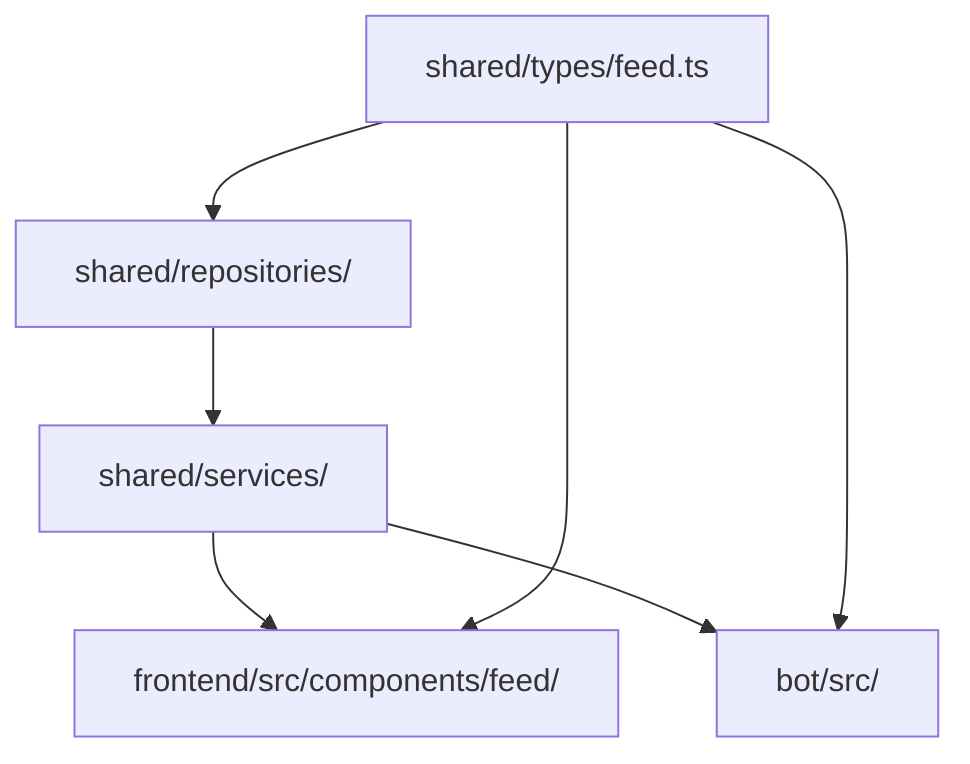

# Design Document: Signal-to-Hertz Rename

## Overview

This design covers a codebase-wide rename/refactoring from "Signal"/"SignalLedger" naming to "Hertz" naming. The application already uses `/hertz` routes and many services already reference "hertz" internally, but 24 frontend component files, shared type definitions, repository interfaces, service layer mappings, environment variables, and seed data still carry the legacy "Signal" naming.

The rename is a mechanical refactoring — no behavioral changes, no new features. The goal is naming consistency across the entire codebase while preserving backward compatibility through type aliases and ensuring unrelated uses of "signal" (AbortSignal, trading signals) remain untouched.

### Design Decisions

1. **Invert type alias direction**: Currently `Hertz*` types are aliases pointing to `Signal*` definitions. After migration, `Hertz*` becomes the primary definition and `Signal*` becomes the backward-compatible alias. This ensures new code uses canonical names while existing consumers don't break.

2. **Phased execution order**: Types → Repositories → Services → Frontend. This bottom-up approach ensures each layer compiles before the next layer is modified.

3. **Preserve SQL column names**: Database column names (`post_reactions.reaction_type = 'pulse'`) are NOT changed — only the TypeScript aliases that SELECT those columns are renamed.

4. **Remove wrapper methods**: `hasSignal()`/`toggleSignal()` are thin wrappers around `hasPulse()`/`togglePulse()`. They are removed rather than renamed, since the underlying methods already have the correct name.

## Architecture

The rename touches four architectural layers in dependency order:



### Execution Order

```
Phase 1: Shared Types (feed.ts)
  └─ Invert aliases: Hertz* = primary, Signal* = alias

Phase 2: Repository Layer
  ├─ feedRepository.ts — update type imports + SQL aliases + FeedListRow interface
  ├─ hertzPostRepository.ts — update type imports
  └─ postReactionRepository.ts — remove hasSignal/toggleSignal wrappers

Phase 3: Service Layer
  ├─ feedService.ts — update type imports + field mappings
  ├─ hertzPostService.ts — update type imports
  ├─ postReactionService.ts — remove toggleSignal wrapper
  └─ signalLedgerAdminService.ts — delete file

Phase 4: Frontend Components
  ├─ Rename 24 files (14 .tsx + 10 .module.css)
  ├─ Update barrel export (index.ts)
  ├─ Update page-level imports
  └─ Rename SignalIcons.tsx → HertzIcons.tsx, SignalIcon → PulseIcon

Phase 5: Bot Code
  └─ Update HertzPostCategory imports in 3 files

Phase 6: Environment & Seed Data
  ├─ .env: SIGNAL_LEDGER_ENABLED → HERTZ_ENABLED
  ├─ Rename seed file 001_signal_ledger_review_seed.sql → 001_hertz_review_seed.sql
  └─ Update slug/image path references in both seed files

Phase 7: Build Verification
  ├─ npm run build (frontend)
  └─ npm run build (bot)
```

## Components and Interfaces

### Frontend File Rename Mapping (24 files)

| Current File | New File |
|---|---|
| `SignalLedgerPage.tsx` | `HertzPage.tsx` |
| `SignalLedgerPage.module.css` | `HertzPage.module.css` |
| `SignalLedgerHeader.tsx` | `HertzHeader.tsx` |
| `SignalLedgerHeader.module.css` | `HertzHeader.module.css` |
| `SignalComposer.tsx` | `HertzComposer.tsx` |
| `SignalComposer.module.css` | `HertzComposer.module.css` |
| `SignalPost.tsx` | `HertzPost.tsx` |
| `SignalPost.module.css` | `HertzPost.module.css` |
| `SignalPostMenu.tsx` | `HertzPostMenu.tsx` |
| `SignalPostMenu.module.css` | `HertzPostMenu.module.css` |
| `SignalPostMedia.tsx` | `HertzPostMedia.tsx` |
| `SignalAuthorLine.tsx` | `HertzAuthorLine.tsx` |
| `SignalMarketMeta.tsx` | `HertzMarketMeta.tsx` |
| `SignalDetailInteractions.tsx` | `HertzDetailInteractions.tsx` |
| `SignalDetailInteractions.module.css` | `HertzDetailInteractions.module.css` |
| `SignalLeftRail.tsx` | `HertzLeftRail.tsx` |
| `SignalRightRail.tsx` | `HertzRightRail.tsx` |
| `SignalRails.module.css` | `HertzRails.module.css` |
| `SignalActionBar.tsx` | `HertzActionBar.tsx` |
| `SignalActionBar.module.css` | `HertzActionBar.module.css` |
| `SignalAvatar.tsx` | `HertzAvatar.tsx` |
| `SignalTelegramLogin.tsx` | `HertzTelegramLogin.tsx` |
| `SignalTelegramLogin.module.css` | `HertzTelegramLogin.module.css` |
| `SignalViewTracker.tsx` | `HertzViewTracker.tsx` |
| `SignalIcons.tsx` | `HertzIcons.tsx` |

### Barrel Export (index.ts) — After

```typescript
export { FeedList } from './FeedList';
export { ArticleCard } from './ArticleCard';
export type { ArticleCardData } from './ArticleCard';
export { ArticleLongCard } from './ArticleLongCard';
export { CategoryTabs } from './CategoryTabs';
export type { CategoryFilter } from './CategoryTabs';
export { HertzPage } from './HertzPage';
export { HertzComposer } from './HertzComposer';
export { HertzPostCard } from './HertzPost';
export { HertzAuthorLine } from './HertzAuthorLine';
export { HertzPostMedia } from './HertzPostMedia';
export { HertzMarketMeta } from './HertzMarketMeta';
export { CommunityNoteCard } from './CommunityNoteCard';
export { QuotePostCard } from './QuotePostCard';
export { HertzDetailInteractions } from './HertzDetailInteractions';
export { HertzLeftRail } from './HertzLeftRail';
export { HertzRightRail } from './HertzRightRail';
```

### Repository Interface Changes

**FeedListRow** (feedRepository.ts):
```typescript
// Before
signal_count: string;
viewer_has_signaled: boolean | null;

// After
pulse_count: string;
viewer_has_pulsed: boolean | null;
```

**SQL Alias Changes** (in `listPublished` and `findById` queries):
```sql
-- Before
COALESCE(pr.signal_count, 0)::text AS signal_count
vr.id IS NOT NULL AS viewer_has_signaled

-- After
COALESCE(pr.pulse_count, 0)::text AS pulse_count
vr.id IS NOT NULL AS viewer_has_pulsed
```

Note: The underlying lateral subquery alias (`signal_count` in `SELECT COUNT(*) AS signal_count`) must also be renamed to `pulse_count` for consistency.

### Method Removal

**postReactionRepository.ts** — Remove:
```typescript
// DELETE these wrapper methods
async hasSignal(...) { return this.hasPulse(...); }
async toggleSignal(...) { return this.togglePulse(...); }
```

**postReactionService.ts** — Remove:
```typescript
// DELETE this wrapper method
async toggleSignal(...) { return this.togglePulse(...); }
```

### Service Layer Field Mapping Changes

**feedService.ts** `mapPosts()`:
```typescript
// Before
viewer: {
  hasSignaled: Boolean(row.viewer_has_signaled),
  hasPulsed: Boolean(row.viewer_has_signaled),
  ...
},
counts: {
  signals: Number(row.signal_count ?? 0),
  pulses: Number(row.signal_count ?? 0),
  ...
}

// After
viewer: {
  hasPulsed: Boolean(row.viewer_has_pulsed),
  ...
},
counts: {
  pulses: Number(row.pulse_count ?? 0),
  ...
}
```

## Data Models

### Type Definition Restructuring (shared/types/feed.ts)

The current structure has `Signal*` as primary definitions with `Hertz*` as aliases. This inverts to:

```typescript
// PRIMARY definitions (Hertz*)
export type HertzPostType = 'original' | 'quote' | 'repost';
export type HertzPostSource = 'telegram' | 'web' | 'admin' | 'system';
export type HertzPostCategory = 'trading_room' | 'life_coffee' | 'general' | 'community_note' | 'trading' | 'life_story';
export type HertzPostStatus = 'draft' | 'pending_review' | 'published' | 'hidden' | 'rejected' | 'deleted';

export interface HertzAuthor {
  id: string;
  name: string;
  username: string | null;
  badge: 'verified_member' | 'admin';
  avatarUrl: string | null;
}

export interface HertzMedia {
  id: string;
  url: string;
  type: 'image' | 'video';
  alt: string | null;
}

export interface HertzViewerState {
  hasPulsed: boolean;       // replaces hasSignaled + hasPulsed
  hasBookmarked: boolean;
  hasReposted: boolean;
  canEdit: boolean;
  canDelete: boolean;
}

export interface HertzPostCounts {
  pulses: number;           // replaces signals + pulses
  comments: number;
  reposts: number;
  views: number;
}

export interface HertzPostContent { ... }
export interface HertzPost { ... }
export interface HertzPostDetail extends HertzPost { ... }
export interface HertzComment { ... }
export interface HertzPostInput { ... }

export interface CursorFeedResult {
  items: HertzPost[];       // was SignalPost[]
  nextCursor: string | null;
}

// BACKWARD-COMPATIBLE aliases (Signal*)
export type SignalPostType = HertzPostType;
export type SignalPostSource = HertzPostSource;
export type SignalPostCategory = HertzPostCategory;
export type SignalPostStatus = HertzPostStatus;
export type SignalAuthor = HertzAuthor;
export type SignalMedia = HertzMedia;
export type SignalViewerState = HertzViewerState;
export type SignalPostCounts = HertzPostCounts;
export type SignalPostContent = HertzPostContent;
export type SignalPost = HertzPost;
export type SignalPostDetail = HertzPostDetail;
export type SignalComment = HertzComment;
export type SignalPostInput = HertzPostInput;
```

### Field Consolidation

| Interface | Before | After |
|---|---|---|
| `HertzPostCounts` | `signals`, `pulses`, `comments`, `reposts`, `views` (5 fields) | `pulses`, `comments`, `reposts`, `views` (4 fields) |
| `HertzViewerState` | `hasSignaled`, `hasPulsed`, `hasBookmarked`, `hasReposted`, `canEdit`, `canDelete` (6 fields) | `hasPulsed`, `hasBookmarked`, `hasReposted`, `canEdit`, `canDelete` (5 fields) |

### Seed Data Changes

| Item | Before | After |
|---|---|---|
| Seed filename | `001_signal_ledger_review_seed.sql` | `001_hertz_review_seed.sql` |
| Slug pattern | `signal-seed-*` | `hertz-seed-*` |
| Image paths | `/images/signal-seed/` | `/images/hertz-seed/` |

### Environment Variable

| File | Before | After |
|---|---|---|
| `.env` | `SIGNAL_LEDGER_ENABLED=true` | `HERTZ_ENABLED=true` |
| `.env.example` | Already uses `HERTZ_PLATFORM_ENABLED` | No change needed |

### Exclusion List (DO NOT RENAME)

- `AbortSignal` — Web API in route handlers
- "Signal" in `ElliottWaveTool.tsx` — trading buy/sell signal concepts
- OS signals, DOM event signals, third-party library signal references

## Error Handling

This is a mechanical refactoring with no new error paths. The primary risk is missed references causing TypeScript compilation errors.

**Mitigation strategy:**
1. Each phase ends with a type-check (`tsc --noEmit`) to catch missed references immediately
2. The backward-compatible `Signal*` type aliases ensure any consumer not yet updated still compiles
3. The `hasSignal()`/`toggleSignal()` removal is safe because grep confirms no external callers exist outside the service layer wrappers

**Rollback approach:**
- Git branch-based: if build fails after all phases, revert the branch
- Each phase can be committed independently for granular rollback

## Testing Strategy

### Build Verification (Primary)

Since this is a rename-only refactoring with no behavioral changes, the primary verification is:

1. **TypeScript compilation**: `tsc --noEmit` after each phase
2. **Frontend build**: `npm run build` in `frontend/` — zero exit code
3. **Bot build**: `npm run build` in `bot/` — zero exit code
4. **Existing test suite**: `npm run test` — all existing tests pass (tests exercise the same logic, just through renamed identifiers)

### Grep Verification

After all phases complete:
```bash
# Should return ZERO results in .ts/.tsx files (excluding specs/docs):
grep -r "SignalLedgerPage\|SignalComposer\|SignalPostCard\|SignalAuthorLine" \
  --include="*.ts" --include="*.tsx" \
  --exclude-dir=".kiro" --exclude-dir="docs" --exclude-dir="node_modules"

# Should return ZERO results for removed methods:
grep -r "hasSignal\|toggleSignal" --include="*.ts" --exclude-dir="node_modules"

# Should return ZERO results for old env var:
grep -r "SIGNAL_LEDGER_ENABLED" --include="*.ts" --include="*.tsx" --include="*.env"
```

### Why Property-Based Testing Does Not Apply

This feature is a **mechanical rename/refactoring** — it changes identifiers and file names without altering any logic, algorithms, or data transformations. There are no:
- Pure functions with varying input/output behavior
- Universal properties that hold across input spaces
- Parsers, serializers, or data transformations being introduced

The appropriate testing strategy is **build verification** (TypeScript compiler catches all type mismatches) combined with **existing integration/unit tests** (which validate that behavior is preserved through the renamed interfaces). Property-based testing would add no value here.
