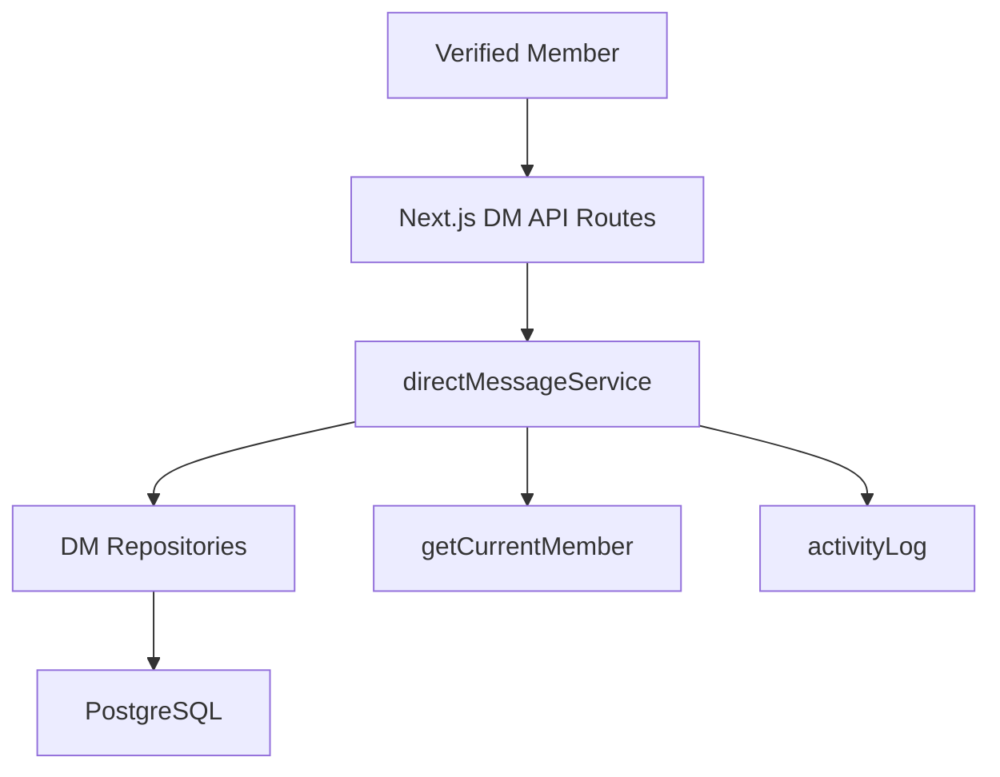
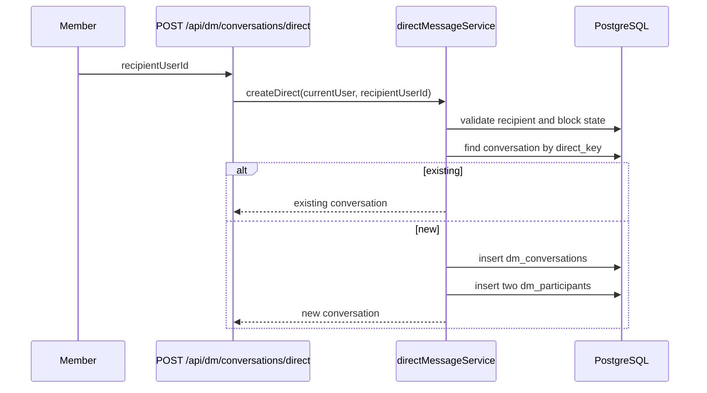
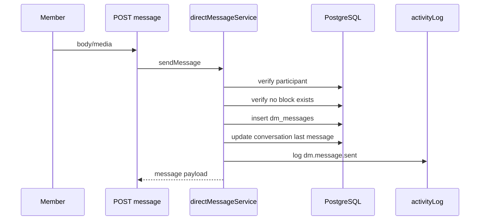

# Design Document: Simple DM Backend

## Overview

Simple DM Backend adds a private X-style chat domain to Horizon. The first phase implements one-on-one conversations only. It reuses existing member authentication, database helpers, shared services, and thin Next.js API routes.

The UI can later render a three-part X-like surface: inbox list, new message search, and active thread. This spec only defines backend contracts and data flow. Group creation shown in X-like modals is intentionally out of scope for this phase.

## Architecture



API routes stay thin. Services enforce permissions, block checks, validation, transactions, and audit logs. Repositories own SQL.

## API Surface

```txt
GET    /api/dm/conversations
POST   /api/dm/conversations/direct
GET    /api/dm/conversations/[conversationId]
GET    /api/dm/conversations/[conversationId]/messages
POST   /api/dm/conversations/[conversationId]/messages
POST   /api/dm/conversations/[conversationId]/read
POST   /api/dm/conversations/[conversationId]/archive
DELETE /api/dm/messages/[messageId]
POST   /api/dm/messages/[messageId]/report
GET    /api/dm/users/search?q=
POST   /api/dm/users/[userId]/block
DELETE /api/dm/users/[userId]/block
```

## Data Models

Migration file:

```txt
db/migrations/009_create_simple_dm.sql
```

### dm_conversations

```txt
id uuid primary key
type varchar(20) default direct
direct_key varchar(100) unique
context_post_id uuid null
last_message_id uuid null
last_message_at timestamptz null
created_at timestamptz
updated_at timestamptz
```

`direct_key` is generated from sorted user IDs. This prevents duplicate direct threads. Phase one only stores `type = direct`; group chat requires a later migration or explicit extension.

### dm_participants

```txt
conversation_id uuid
user_id uuid
role varchar(20) default member
last_read_message_id uuid null
last_read_at timestamptz null
archived_at timestamptz null
muted_until timestamptz null
created_at timestamptz
unique(conversation_id, user_id)
```

### dm_messages

```txt
id uuid primary key
conversation_id uuid
sender_id uuid
body text null
media_id uuid null
media_url varchar(1000) null
media_type varchar(50) null
status varchar(20) default sent
edited_at timestamptz null
deleted_at timestamptz null
created_at timestamptz
```

### dm_blocks

```txt
blocker_user_id uuid
blocked_user_id uuid
created_at timestamptz
unique(blocker_user_id, blocked_user_id)
```

### dm_message_reports

```txt
id uuid primary key
message_id uuid
conversation_id uuid
reporter_user_id uuid
reason varchar(50)
details text null
status varchar(20) default open
reviewed_by uuid null
reviewed_at timestamptz null
created_at timestamptz
```

## Service Layer

```txt
shared/services/directMessageService.ts
```

Responsibilities:

- list inbox conversations,
- search verified members,
- create or reuse direct conversation,
- list messages,
- send messages,
- update read state,
- archive conversation for current viewer,
- soft delete own message,
- block and unblock users,
- create message reports,
- write activity logs.

## Repository Layer

```txt
shared/repositories/dmConversationRepository.ts
shared/repositories/dmMessageRepository.ts
shared/repositories/dmBlockRepository.ts
shared/repositories/dmReportRepository.ts
shared/repositories/dmUserSearchRepository.ts
```

Repositories return typed rows and never decide authorization.

## Type Contracts

```txt
shared/types/directMessage.ts
```

Main DTOs:

- `DmConversationSummary`
- `DmPeer`
- `DmMessage`
- `DmMessageInput`
- `DmUserSearchResult`
- `DmReportReason`

## Response Shapes

### Conversation summary

```txt
id
peer
lastMessage
lastMessageAt
unreadCount
isArchived
isBlocked
```

### Conversation detail

```txt
id
peer
participants
lastReadAt
blockState
contextPost
```

### Message

```txt
id
conversationId
senderId
body
media
status
createdAt
editedAt
deletedAt
isOwn
```

## Direct Conversation Flow



## Message Send Flow



## Out Of Scope

- group chat,
- message request approval,
- voice call,
- video call,
- end-to-end encryption,
- realtime websocket,
- admin browsing all private messages,
- bot integration for sending Telegram DM.

## Discussion Alignment

- Season focus is backend chat flow, not Figma design work.
- DM shape follows X: left inbox, new message search, and active thread.
- Phase one is direct one-on-one chat.
- No message request approval is included.
- No group chat is implemented even though a future UI may reserve that entry point.
- Realtime websocket is deferred; polling or manual refresh can use the same REST endpoints.
`media_id` should reference an existing uploaded media record when available. `media_url` is only a serialized delivery URL for clients and should not bypass media validation.
