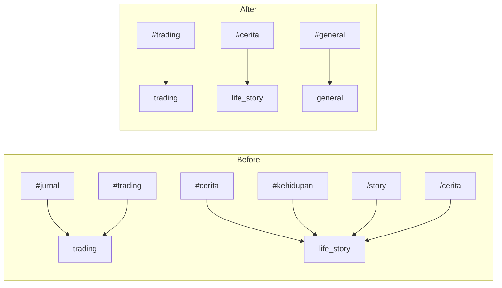

# Design Document: Simplify Bot Commands

## Overview

This feature simplifies the Horizon Trader Platform's Telegram bot by:

1. **Removing redundant slash commands** (`/story`, `/cerita`) — users publish life_story articles exclusively via the `#cerita` hashtag, which already supports media attachments.
2. **Removing hashtag aliases** (`#jurnal`, `#kehidupan`) — establishing a strict 1:1 mapping between hashtags and categories.
3. **Adding `#general`** — filling the gap so every non-outlook category has a hashtag.
4. **Stripping recognized hashtags from article content** — so published articles contain clean text without the routing hashtags.
5. **Dropping the `content_type` column** — removing the unused `short`/`long` distinction from the database schema and all application code.
6. **Deleting dead handler files** — removing `storyHandler.ts` and `ceritaHandler.ts` from the repository.

The changes span the bot service, shared types, database migrations, and frontend components. The core publishing flow through `HashtagHandler` and `PublishHandler` remains intact; only the routing configuration, content cleaning, and schema are modified.

## Architecture

The bot's command processing pipeline is unchanged:

```
Telegram Message → grammy → Middleware Pipeline → CommandRegistry.resolve() → Handler.execute()
```

What changes is the set of registered handlers and the hashtag-to-category mapping:



### Key Design Decisions

1. **Hashtag stripping happens before HTML conversion.** The `stripRecognizedHashtags()` function operates on raw text, then `textToHtml()` converts the cleaned text. This avoids parsing HTML to remove hashtags and keeps the pipeline simple.

2. **Stripping function is a pure utility.** It lives in `bot/src/utils/hashtag.ts` alongside `parseHashtags` and `mapHashtagToCategory`, keeping all hashtag logic co-located. Both `HashtagHandler` and `PublishHandler` call it.

3. **Database migration is additive (column drop).** A new migration `003_drop_content_type.sql` uses `ALTER TABLE articles DROP COLUMN content_type`. This is a one-way migration — the column and its data are permanently removed.

4. **Frontend removes `content_type` references entirely.** The `FeedList` component currently uses `content_type === 'long'` to choose between `ArticleCard` and `ArticleLongCard`. After removal, all feed articles render as `ArticleCard` (the short/compact layout). The `ArticleContent` component drops its `contentType` prop and uses a single layout. The `ArticleEditor` admin component drops the content type selector.

5. **Outlook articles are unaffected.** The outlook category has no hashtag mapping and is published exclusively through the admin dashboard. The outlook editor hardcodes `content_type: 'long'` in its API call, which will be removed along with all other `content_type` references.

## Components and Interfaces

### Modified Components

#### 1. `bot/src/utils/hashtag.ts` — Hashtag Utilities

**Changes:**
- Update `HASHTAG_CATEGORY_MAP` to contain exactly 3 entries: `{ trading: 'trading', cerita: 'life_story', general: 'general' }`
- Add `stripRecognizedHashtags(text: string): string` — removes recognized hashtags from text and normalizes whitespace

```typescript
// Updated map — strict 1:1 mapping
const HASHTAG_CATEGORY_MAP: Record<string, ArticleCategory> = {
  trading: 'trading',
  cerita: 'life_story',
  general: 'general',
};

/**
 * List of recognized hashtag names (without # prefix) used for stripping.
 * Derived from HASHTAG_CATEGORY_MAP keys.
 */
const RECOGNIZED_HASHTAGS: Set<string> = new Set(Object.keys(HASHTAG_CATEGORY_MAP));

/**
 * Remove recognized hashtags from text and normalize whitespace.
 * Unrecognized hashtags (e.g., #bitcoin) are preserved.
 */
export function stripRecognizedHashtags(text: string): string {
  return text
    .replace(/#(\w+)/g, (match, tag) =>
      RECOGNIZED_HASHTAGS.has(tag.toLowerCase()) ? '' : match
    )
    .replace(/\s{2,}/g, ' ')
    .trim();
}
```

#### 2. `bot/src/handlers/hashtagHandler.ts` — Hashtag Handler

**Changes:**
- Call `stripRecognizedHashtags(text)` before `textToHtml(text)`
- Remove `content_type: 'short'` from `insertArticle` call
- Update `insertArticle` dependency type to exclude `content_type`

#### 3. `bot/src/handlers/publishHandler.ts` — Publish Handler

**Changes:**
- Call `stripRecognizedHashtags(text)` before `textToHtml(text)`
- Remove `content_type: 'short'` from `insertArticle` call
- Update `insertArticle` dependency type to exclude `content_type`

#### 4. `bot/src/index.ts` — Bot Entry Point

**Changes:**
- Remove imports of `StoryHandler` and `CeritaHandler`
- Remove instantiation of `storyHandler` and `ceritaHandler`
- Remove `commandRegistry.register(storyHandler)` and `commandRegistry.register(ceritaHandler)`
- Remove `commandRegistry.register(createHashtagAlias('#jurnal'))` and `commandRegistry.register(createHashtagAlias('#kehidupan'))`
- Add `commandRegistry.register(createHashtagAlias('#general'))`
- Update `insertArticle` function: remove `content_type` from parameter type, SQL columns, and values array

#### 5. `bot/src/handlers/helpHandler.ts` — Help Handler

No code changes needed. The `HelpHandler` dynamically reads from `commandRegistry.listCommands()`, so it automatically reflects the updated registrations. Once `/story`, `/cerita`, `#jurnal`, and `#kehidupan` are unregistered and `#general` is added, `/help` output updates accordingly.

#### 6. `shared/types/index.ts` — Shared Types

**Changes:**
- Remove `ContentType` const object and type
- Remove `content_type` field from `Article` interface

#### 7. `frontend/src/app/page.tsx` — Feed Page

**Changes:**
- Remove `content_type` from `ArticleRow` interface
- Remove `content_type` from SQL SELECT query
- Remove `content_type` from the mapping to `ArticleCardData`

#### 8. `frontend/src/components/feed/ArticleCard.tsx`

**Changes:**
- Remove `content_type` from `ArticleCardData` interface

#### 9. `frontend/src/components/feed/FeedList.tsx`

**Changes:**
- Remove conditional rendering based on `content_type === 'long'`
- Always render `ArticleCard` for all articles

#### 10. `frontend/src/components/article/ArticleContent.tsx`

**Changes:**
- Remove `contentType` prop
- Use a single layout style (remove long/short distinction)

#### 11. `frontend/src/app/artikel/[slug]/page.tsx` — Article Detail Page

**Changes:**
- Remove `content_type` from `ArticleRow` and mapped data
- Remove `content_type` from SQL SELECT
- Remove `isLong` variable and related conditional logic
- Update `ArticleContent` usage to remove `contentType` prop

#### 12. `frontend/src/app/outlook/[slug]/page.tsx` — Outlook Detail Page

**Changes:**
- Remove `content_type` from row types and SQL SELECT
- Update `ArticleContent` usage to remove `contentType` prop

#### 13. `frontend/src/app/api/articles/route.ts` — Articles API

**Changes:**
- Remove `content_type` from GET response mapping
- Remove `content_type` from POST body destructuring and INSERT SQL

#### 14. `frontend/src/app/api/articles/[id]/route.ts` — Article Detail API

**Changes:**
- Remove `content_type` from PUT body destructuring and dynamic update logic

#### 15. `frontend/src/components/admin/ArticleEditor.tsx`

**Changes:**
- Remove `content_type` from `ArticleData` interface
- Remove `CONTENT_TYPES` array and the content type `<select>` dropdown
- Remove `contentType` state variable
- Remove `content_type` from the submitted data object

#### 16. `frontend/src/components/admin/OutlookEditor.tsx`

**Changes:**
- Remove `content_type: 'long'` from `OutlookArticleData` interface
- Remove `content_type` from the submitted data object

#### 17. `frontend/src/app/admin/(dashboard)/outlook/new/page.tsx`

**Changes:**
- Remove `content_type: 'long'` from the API request body

#### 18. Other admin pages referencing `content_type`

Files: `articles/page.tsx`, `articles/[id]/edit/page.tsx`, `users/[id]/page.tsx`, `api/users/[id]/route.ts`

**Changes:**
- Remove `content_type` from all row type interfaces, SQL queries, and data mappings

### Deleted Components

#### `bot/src/handlers/storyHandler.ts`
Entire file deleted. The `/story` command is removed.

#### `bot/src/handlers/ceritaHandler.ts`
Entire file deleted. The `/cerita` command is removed.

### Unchanged Components

- **`bot/src/commands/registry.ts`** — No changes. The registry's `resolve()` and `register()` logic is generic.
- **`bot/src/commands/types.ts`** — No changes. The `CommandHandler` interface is unchanged.
- **`bot/src/middleware/*`** — No changes. The middleware pipeline is unaffected.
- **`bot/src/services/mediaService.ts`** — No changes. Media upload logic is unaffected.
- **`db/migrations/001_create_schema.sql`** — Not modified. The original schema remains as historical record; the new migration handles the column drop.
- **`db/migrations/002_seed_data.sql`** — No changes. Credit settings categories (`trading`, `life_story`, `general`) are already correct.

## Data Models

### Database Schema Change

**New migration: `db/migrations/003_drop_content_type.sql`**

```sql
-- Migration 003: Drop unused content_type column from articles table
ALTER TABLE articles DROP COLUMN content_type;
```

### Updated Articles Table (after migration)

| Column | Type | Constraints |
|---|---|---|
| id | UUID | PRIMARY KEY, DEFAULT gen_random_uuid() |
| author_id | UUID | NOT NULL, REFERENCES users(id) |
| content_html | TEXT | NOT NULL |
| title | VARCHAR(500) | nullable |
| category | VARCHAR(50) | NOT NULL |
| source | VARCHAR(50) | NOT NULL |
| status | VARCHAR(20) | NOT NULL, DEFAULT 'published' |
| slug | VARCHAR(500) | UNIQUE, NOT NULL |
| created_at | TIMESTAMPTZ | DEFAULT NOW() |

### Updated Hashtag Map

| Hashtag | Category |
|---|---|
| `#trading` | `trading` |
| `#cerita` | `life_story` |
| `#general` | `general` |

No hashtag maps to `outlook`. Messages with no recognized hashtag default to `general`.

### Updated Command Registry (after changes)

| Name | Type | Permission | Description |
|---|---|---|---|
| `#trading` | hashtag | member | Publish article via hashtag |
| `#cerita` | hashtag | member | Publish article via hashtag |
| `#general` | hashtag | member | Publish article via hashtag |
| `/publish` | command | admin | Publish replied-to message |
| `/help` | command | all | Show available commands |

## Correctness Properties

*A property is a characteristic or behavior that should hold true across all valid executions of a system — essentially, a formal statement about what the system should do. Properties serve as the bridge between human-readable specifications and machine-verifiable correctness guarantees.*

### Property 1: Removed commands resolve to null

*For any* message text starting with `/story` or `/cerita` (followed by any content), the `CommandRegistry.resolve()` function SHALL return `null`.

**Validates: Requirements 1.1, 2.1**

### Property 2: Strict 1:1 hashtag-to-category mapping

*For any* list of parsed hashtags, `mapHashtagToCategory` SHALL return `'trading'` if the first recognized hashtag is `trading`, `'life_story'` if the first recognized hashtag is `cerita`, `'general'` if the first recognized hashtag is `general`, and `'general'` if no recognized hashtag is present. No other category SHALL be returned.

**Validates: Requirements 1.3, 2.3, 3.3, 3.4, 4.1, 5.1, 5.2, 5.3, 5.4, 9.3, 9.4**

### Property 3: First recognized hashtag determines category

*For any* list of hashtags containing multiple recognized hashtags, `mapHashtagToCategory` SHALL return the category corresponding to the first recognized hashtag in the list, regardless of subsequent recognized hashtags.

**Validates: Requirements 5.5**

### Property 4: Hashtag stripping removes only recognized hashtags and normalizes whitespace

*For any* text string containing a mix of recognized hashtags (`#trading`, `#cerita`, `#general`) and unrecognized hashtags (e.g., `#bitcoin`, `#crypto`), `stripRecognizedHashtags` SHALL remove all recognized hashtags, preserve all unrecognized hashtags, and produce output with no leading/trailing whitespace and no consecutive spaces.

**Validates: Requirements 10.1, 10.3, 10.4**

## Error Handling

### Hashtag Stripping Edge Cases

- **Empty text after stripping:** If a message contains only a recognized hashtag (e.g., just `#trading`), stripping produces an empty string. The `HashtagHandler` already checks for empty text and replies with an error message. No additional handling needed.
- **Whitespace-only after stripping:** If a message is `#trading   `, stripping and trimming produces an empty string. Same empty-text guard applies.

### Removed Commands

- Messages starting with `/story` or `/cerita` will not match any handler. The command dispatch middleware simply skips unmatched messages (calls `next()`). No error is surfaced to the user — the message is silently ignored, consistent with how all unrecognized commands behave.

### Database Migration

- The `DROP COLUMN` migration is irreversible. If rollback is needed, a new migration must `ADD COLUMN content_type VARCHAR(20) DEFAULT 'short'` — but historical values will be lost. This is acceptable since the column is unused.
- The migration should be run during a maintenance window or low-traffic period to avoid locking issues on large tables.

### Frontend Graceful Degradation

- After removing `content_type`, the `FeedList` renders all articles with `ArticleCard`. If any cached/stale data still contains `content_type`, it is simply ignored since the field is no longer read.

## Testing Strategy

### Property-Based Tests

Property-based testing is appropriate for this feature because the core changes involve pure functions (`mapHashtagToCategory`, `stripRecognizedHashtags`, `CommandRegistry.resolve`) with clear input/output behavior and large input spaces.

**Library:** [fast-check](https://github.com/dubzzz/fast-check) (already standard for TypeScript PBT)

**Configuration:**
- Minimum 100 iterations per property test
- Each test tagged with: `Feature: simplify-bot-commands, Property {number}: {title}`

**Properties to implement:**
1. Removed commands resolve to null (Property 1)
2. Strict 1:1 hashtag-to-category mapping (Property 2)
3. First recognized hashtag determines category (Property 3)
4. Hashtag stripping removes only recognized hashtags and normalizes whitespace (Property 4)

### Unit Tests (Example-Based)

- **Registry structure:** Verify `listCommands()` does not include `/story`, `/cerita`, `#jurnal`, `#kehidupan` and does include `#general`, `#trading`, `#cerita`, `/publish`, `/help`
- **Hashtag map contents:** Verify the map has exactly 3 entries with correct mappings
- **Help output:** Verify `/help` response includes the correct commands and hashtags
- **Specific stripping example:** `"#trading Hari ini saya belajar"` → `"Hari ini saya belajar"`
- **content_type removal:** Verify `insertArticle` SQL does not reference `content_type`

### Integration Tests

- **Article creation via #general:** End-to-end test with mock DB verifying article insertion with `category: 'general'` and credit award
- **Media attachment with #general:** Test with mock media service verifying photo/video upload
- **Publish handler without content_type:** Verify `/publish` creates articles without `content_type` field

### Smoke Tests

- **Migration verification:** Run `003_drop_content_type.sql` against a test database and verify the column no longer exists
- **File deletion:** Verify `storyHandler.ts` and `ceritaHandler.ts` do not exist in the repository
