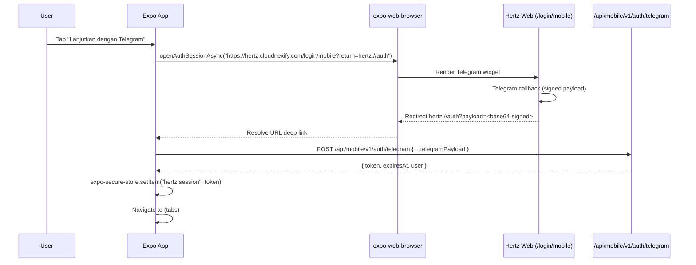

# PRD — Hertz Mobile App (Expo)

- **Versi dokumen**: 1.0 (draft)
- **Tanggal**: 2026-05-25
- **Status**: Proposed — menunggu approval untuk masuk fase plan/tasks
- **Pemilik**: Tim Hertz
- **Lingkup**: Aplikasi mobile Hertz untuk Android (rilis APK / Play Store), dibangun dengan **Expo (React Native + TypeScript)** dan EAS Build
- **Backend acuan**: `frontend/src/app/api/mobile/v1/*` (Next.js 16, Postgres, Redis, FCM)
- **Referensi spec**: [`docs/spec/mobile-readiness/`](../spec/mobile-readiness/)

---

## 1. Ringkasan Eksekutif

Hertz adalah platform sosial trader Indonesia dengan inti komunitas HERTZ feed, analisa Outlook, blog, gallery, dan tools trading. Backend sudah menyediakan **`/api/mobile/v1/*`** dengan auth bearer, feed cursor pagination, content endpoints, dan registrasi push FCM (spec `docs/spec/mobile-readiness/` sudah ✅).

PRD ini mendefinisikan **aplikasi mobile Android pertama** untuk Hertz menggunakan **Expo managed workflow + EAS Build**. Tujuannya: rilis APK MVP yang feel-native, ringan dipakai sesi malam (mobile-first user), dan reuse semua kontrak backend yang sudah stabil tanpa fork business logic.

**Rilis target**:
- **v1.0 MVP** (APK internal + Play Console internal track) — feed read, Outlook, Gallery, login Telegram, push register
- **v1.1** — Posting, komentar, like, bookmark/repost ringan
- **v1.2** — Direct Message + notifikasi in-app
- **v2.0** — Tools, profile lengkap, iOS

---

## 2. Latar Belakang & Masalah

### 2.1 User reality
Audit produk (`PRODUCT.md`) menyebut user inti adalah **trader forex Indonesia** yang membuka Hertz **dari mobile di sesi malam** (London/New York close) untuk membaca bias market dan berinteraksi di feed. Saat ini mereka hanya bisa pakai mobile **browser**, dengan beberapa pain point yang terdokumentasi di `docs/frontend-audit/2026-05-16-frontend-audit.md`:

- DM mobile layout terpotong di 390px/320px (P1)
- Landing page overflow di 320px
- Tabel tools butuh horizontal scroll
- Tidak ada push notification — user kehilangan momentum saat tidak buka browser
- Cookie-based auth membuat sesi mudah hilang ketika browser bersih cache

### 2.2 Backend sudah siap menerima native client
Spec `docs/spec/mobile-readiness/` mengonfirmasi backend sudah:
- Endpoint stabil `/api/mobile/v1/*` (auth, feed, Outlook, Gallery, push register, refresh, logout)
- Bearer token (`Authorization: Bearer <token>`) di samping cookie web
- Rate limiting per kategori (auth/read/mutation/device)
- Skema `device_tokens` + `notification_events` untuk FCM logging
- Envelope respons konsisten `{ success, data | error }`

### 2.3 Kenapa Expo
Detail evaluasi di §10. Ringkas:
- Reuse skill React + TypeScript yang sudah ada di tim
- **EAS Build cloud** menghasilkan APK tanpa perlu Android SDK di VPS
- `expo-secure-store`, `expo-web-browser`, `expo-notifications`, `expo-router` menutupi kebutuhan MVP
- Backend Bearer-based + REST JSON cocok dengan default Expo (tanpa native module aneh)
- Tetap ada jalur keluar: jika butuh modul native berat di v2+, bisa eject ke prebuild/custom dev client

---

## 3. Tujuan, Non-Tujuan, & Definisi Sukses

### 3.1 Tujuan
1. Memberi trader Hertz cara **install-able** untuk masuk feed, baca Outlook, dan menerima notifikasi penting.
2. Bangun mobile app yang **memuat <2 detik** dari cold start di koneksi 4G, dengan UX dark-first konsisten dengan brand Hertz.
3. Validasi kontrak `/api/mobile/v1/*` di production traffic native.
4. Tidak menambah beban operasional — backend tidak di-fork, infrastruktur tetap satu.

### 3.2 Non-Tujuan (out of scope v1)
- Versi iOS (di-defer ke v2.0; pipeline Expo sudah siap untuk dual-platform, tetapi App Store butuh akun developer Apple & review)
- Admin mobile app
- Offline sync engine (cache caching biasa via React Query OK; full offline tidak)
- Realtime DM via WebSocket (DM masuk v1.2 dengan polling/SWR-style)
- Trading tools yang sangat interaktif (Order Book, Profitability calculator, Challenge Tracker) di MVP
- Posting media kompleks (gambar multi-upload + video) di MVP — text-only post di v1.1

### 3.3 Definisi sukses (KPI 90 hari setelah rilis Play Store)
| KPI | Target |
|-----|--------|
| Install organik (member existing Telegram) | ≥ 300 install |
| Crash-free session (Sentry / Expo crash) | ≥ 99.5 % |
| Cold start ke first screen | ≤ 2.0 s (P75 di 4G) |
| DAU/MAU mobile | ≥ 25 % |
| Push opt-in rate setelah onboarding | ≥ 60 % |
| Rasio mobile vs web traffic untuk member login | ≥ 30 % mobile |
| Login Telegram berhasil (success rate end-to-end) | ≥ 95 % |

---

## 4. Target User & Persona

### Persona 1 — "Adi", trader part-time
- 28 tahun, Jakarta, kerja kantoran, trading di sesi malam dari HP.
- Sering check feed Hertz sambil rebahan setelah magrib; ingin tahu bias EURUSD/XAUUSD.
- Kesal kalau harus login ulang setiap pagi.
- **Butuh**: feed cepat, notif komentar di post-nya, baca Outlook penulis favorit.

### Persona 2 — "Sari", trader full-time
- 32 tahun, kontributor aktif di Hertz, sering posting Trading Idea.
- Sebagian besar interaksi dari HP saat menunggu pair confirm.
- Kesal karena composer mobile web kurang nyaman.
- **Butuh**: posting cepat, melihat balasan/like real-time, DM ke trader lain.

### Persona 3 — "Rian", guest pembaca
- 24 tahun, calon member, baru kenal Telegram Hertz.
- Ingin liat-liat konten dulu sebelum verifikasi membership.
- **Butuh**: bisa scroll feed publik, baca Outlook, login mudah via Telegram saat sudah siap.

---

## 5. Lingkup & Fase Rilis

### v1.0 — MVP (target 4–6 minggu kerja)
**Goal**: Login + baca + notifikasi push.

| Layar | Status backend | Catatan |
|-------|---------------|--------|
| Splash / boot | n/a | Cek token + fetch `/me` |
| Onboarding ringkas (3 slide) | n/a | Hanya saat pertama |
| Login Telegram | ✅ `POST /api/mobile/v1/auth/telegram` | Lewat `expo-web-browser` |
| Feed HERTZ (For You / Trending / kategori) | ✅ `GET /api/mobile/v1/hertz/posts` | Cursor pagination |
| Detail post + komentar (read-only) | ✅ `GET /api/mobile/v1/hertz/posts/:shortId` | View only di MVP |
| Outlook list + detail | ✅ `/api/mobile/v1/outlook` | Reuse render HTML aman |
| Gallery grid + lightbox | ✅ `/api/mobile/v1/gallery` | |
| Profile saya (read-only) | ✅ `GET /api/mobile/v1/me` | Avatar, badge, logout |
| Pengaturan + notifikasi opt-in | ✅ `POST /api/mobile/v1/notifications/register` | FCM |
| Logout | ✅ `POST /api/mobile/v1/logout` | |

### v1.1 — Engage (target 3–4 minggu setelah v1.0)
**Goal**: User bisa berinteraksi, bukan cuma baca.

- Like / suka (`POST /api/mobile/v1/hertz/posts/:shortId/like`)
- Buat komentar (`POST /api/mobile/v1/hertz/posts/:shortId/comments`)
- Hapus komentar sendiri (`DELETE /api/mobile/v1/hertz/posts/comments/:commentId`)
- **Backend gap**: composer post (`POST /api/hertz/posts`) belum ada di mobile API — perlu tambah `POST /api/mobile/v1/hertz/posts` dengan Bearer support (lihat §13)

### v1.2 — Talk (target 4 minggu setelah v1.1)
**Goal**: Direct Message + notif center.

- DM inbox + thread (**butuh backend mobile DM endpoints — belum ada**)
- In-app notifications page (**butuh `/api/mobile/v1/hertz/notifications*`** — belum ada)
- Push notification handler in-app (deep link ke post/DM)

### v2.0 — Expand
- iOS build (TestFlight → App Store)
- Tools subset (Outlook viewer + simple calculator)
- Bookmark / repost / quote (butuh mobile endpoints — belum ada)
- Refresh token rotation jika diperlukan
- Telemetri produk (Amplitude/PostHog)

---

## 6. Functional Requirements (v1.0)

Format setiap requirement: **ID — User Story (EARS) — Acceptance Criteria**.

### FR-1 Bootstrap & sesi
- **US**: Sebagai user yang sudah pernah login, saya ingin app membuka langsung ke feed tanpa login ulang selama sesi masih valid.
- **AC**:
  1. App SHALL membaca bearer token dari `expo-secure-store`.
  2. IF token ada, app SHALL memanggil `GET /api/mobile/v1/me`. IF 200, lanjut ke feed; IF 401, hapus token dan ke layar login.
  3. App SHALL menampilkan splash maksimum 1.5 detik sebelum berpindah ke layar tujuan.
  4. App SHALL menangani token expiry dengan memanggil `POST /api/mobile/v1/auth/refresh` ketika respons 401 muncul untuk endpoint protected.

### FR-2 Login Telegram
- **US**: Sebagai user baru, saya ingin login via Telegram tanpa input password manual.
- **AC**:
  1. Tombol "Lanjutkan dengan Telegram" SHALL membuka in-app browser (`expo-web-browser.openAuthSessionAsync`).
  2. Browser SHALL membuka halaman web Hertz `https://hertz.cloudnexify.com/login/mobile?return=hertz://auth` (route bantu yang akan dibuat — lihat §13).
  3. Setelah Telegram widget callback berhasil, web SHALL menyusun deep link `hertz://auth?token=<jwt-or-temp-code>` atau menggunakan one-time-code yang dapat ditukar di `POST /api/mobile/v1/auth/telegram` (mekanisme final ditentukan saat design).
  4. App SHALL menyimpan token via `expo-secure-store` (tidak `AsyncStorage`).
  5. App SHALL menampilkan error envelope `{ success: false, error }` dengan copy Bahasa Indonesia user-friendly.
  6. Rate limit auth (12 / 10 menit) SHALL dihormati; app SHALL menampilkan pesan "Coba lagi sebentar" saat HTTP 429.

### FR-3 Feed HERTZ
- **US**: Sebagai trader, saya ingin scroll feed Hertz dengan infinite scroll yang halus.
- **AC**:
  1. Layar feed SHALL menampilkan tab kategori: `For You`, `Trending`, `Trading`, `Outlook`, `Life`, `General`.
  2. Setiap tab SHALL memanggil `GET /api/mobile/v1/hertz/posts` dengan `cursor`, `limit=20`, `category`, `sort`.
  3. Pull-to-refresh SHALL reset cursor dan re-fetch dari awal.
  4. Saat scroll mencapai 70 % dari list, app SHALL prefetch `nextCursor` halaman berikutnya.
  5. Setiap post card SHALL menampilkan: avatar + display name + badge, timestamp relatif (`5m`, `1h`, `2d`), konten teks (clipped 6 baris), media (jika ada), counts (suka, komentar, repost).
  6. Tap pada card SHALL membuka detail post.
  7. App SHALL menyimpan posisi scroll saat navigasi balik dari detail.

### FR-4 Detail post (read-only di MVP)
- **AC**:
  1. App SHALL memanggil `GET /api/mobile/v1/hertz/posts/:shortId`.
  2. App SHALL render market context (entry, SL, TP, bias) di atas konten jika `category=trading`.
  3. App SHALL render comments inline (top-level + 1 level reply) dengan author + body + timestamp.
  4. App SHALL render community notes jika ada.
  5. Tombol Like / Comment SHALL muncul **disabled** di MVP, dengan tooltip "Tersedia di update berikutnya". (Aktif di v1.1.)
  6. Tombol Share SHALL membuka native share sheet dengan URL `https://hertz.cloudnexify.com/hertz/post/:shortId`.

### FR-5 Outlook list + detail
- **AC**:
  1. List SHALL memanggil `GET /api/mobile/v1/outlook?limit=20&offset=0`.
  2. Detail SHALL memanggil `GET /api/mobile/v1/outlook/:slug` dan render HTML aman menggunakan `react-native-render-html` atau WebView ringan.
  3. Outlook media SHALL menggunakan `thumbnailUrl` di list dan `fullUrl` di detail (sesuai kontrak normalized).
  4. Konten Outlook video SHALL mendukung embed YouTube/Vimeo via WebView.

### FR-6 Gallery
- **AC**:
  1. Grid 3 kolom dengan `aspect-ratio: 1`, lazy load.
  2. Tap item SHALL membuka lightbox full-screen dengan pinch-to-zoom dan swipe horizontal antar item.
  3. Pagination dengan `limit=18&offset=0+...`.

### FR-7 Profile saya & logout
- **AC**:
  1. Layar profil SHALL menampilkan avatar, displayName, username, badge, status verified.
  2. Tombol "Keluar" SHALL memanggil `POST /api/mobile/v1/logout`, lalu hapus `expo-secure-store`, lalu redirect ke login.
  3. Layar SHALL menampilkan versi app dari `expo-application` (untuk debugging support).

### FR-8 Push notification opt-in
- **AC**:
  1. Setelah login pertama, app SHALL minta izin notifikasi (`expo-notifications.requestPermissionsAsync`).
  2. Jika diizinkan, app SHALL ambil push token (FCM token native, **bukan Expo Push token** — lihat §15) dan kirim ke `POST /api/mobile/v1/notifications/register`.
  3. Body: `{ platform: 'android', token, deviceId, appVersion }`.
  4. App SHALL re-register token jika berubah (`addPushTokenListener`).
  5. Layar pengaturan SHALL menyediakan toggle "Notifikasi" yang memanggil `POST /api/mobile/v1/notifications/unregister` saat dimatikan.
  6. App SHALL membuka post terkait saat user tap notifikasi (deep link `hertz://post/:shortId`).

### FR-9 Pengaturan
- **AC**:
  1. Toggle tema (system / dark / light) — default `dark`.
  2. Toggle notifikasi (FR-8).
  3. Versi app + open source licenses + privacy/TOS link ke web.
  4. Tombol logout (FR-7).

### FR-10 Error handling global
- **AC**:
  1. Semua respons `{ success: false, error }` SHALL menampilkan Snackbar Bahasa Indonesia.
  2. Error jaringan SHALL menampilkan empty state retry-able.
  3. Error 401 SHALL trigger logout otomatis + redirect ke login.
  4. Error 429 SHALL menampilkan "Tunggu sebentar, coba lagi dalam X detik" dengan `Retry-After` (jika ada).

---

## 7. Non-Functional Requirements

| Kategori | Target |
|---------|--------|
| Cold start ke first frame | ≤ 2.0 s di 4G (P75), ≤ 4.0 s di 3G |
| Bundle size APK | ≤ 30 MB |
| Memory footprint idle | ≤ 180 MB |
| Crash-free session | ≥ 99.5 % |
| Aksesibilitas | Touch target ≥ 44 px; contrast WCAG AA; screen reader label di semua tombol icon-only |
| Offline | Layar feed terakhir + post yang sudah dibaca tetap render (React Query cache); aksi mutasi tidak antri di MVP |
| Localization | Bahasa Indonesia default; copy English hanya untuk istilah produk (HERTZ, Outlook) |
| Min Android version | Android 8.0 (SDK 26) — sesuai Expo SDK 53 default |
| Target Android version | Android 14 (SDK 34) — sesuai requirement Play Console 2026 |
| Network resilience | Retry 1× untuk GET dengan exponential backoff; mutasi tidak auto-retry |
| Privasi | Tidak log raw token; tidak log isi DM; PII di Sentry → scrubbed |

---

## 8. Stack Teknologi

### 8.1 Core
| Layer | Pilihan | Catatan |
|-------|---------|---------|
| Framework | **Expo SDK 53+** (managed → custom dev client jika perlu) | RN 0.76+, Hermes engine |
| Bahasa | TypeScript strict | Reuse pattern dari frontend web |
| Bundler | Metro (default Expo) | |
| Routing | **expo-router v4** | File-based, tipe-safe |
| State / data fetching | **@tanstack/react-query v5** | Cache, retry, optimistic |
| HTTP client | `fetch` native + thin wrapper | Auto-attach Bearer, parse envelope |
| Storage aman | **expo-secure-store** | Bearer token, FCM token cache |
| Storage biasa | **expo-sqlite** atau `@react-native-async-storage/async-storage` | React Query persistence (opsional) |
| Auth flow | **expo-web-browser** + **expo-linking** | Telegram callback |
| Push | **expo-notifications** + **FCM native (bukan Expo Push)** | Sesuai backend yang pakai FCM_SERVER_KEY |
| HTML rendering | `react-native-render-html` atau WebView | Untuk Outlook/Blog konten kaya |
| UI primitives | **tamagui** atau native + **react-native-reanimated** + `react-native-svg` | Tema sesuai DESIGN.md |
| Form | `react-hook-form` + `zod` (v1.1+) | |
| Tanggal | `date-fns` + `date-fns/locale/id` | Bahasa Indonesia |
| Icon | `lucide-react-native` | Konsisten dengan web (`lucide-react`) |
| Crash & error tracking | **Sentry Expo (sentry-expo)** | DSN via EAS secrets |
| Analytics | **PostHog React Native** (v2.0) | Opsional di MVP |

### 8.2 Tooling
- `eas-cli` — Build + Submit
- `eslint` + `@typescript-eslint` — selaras config root
- `vitest` (logic) + `@testing-library/react-native` (komponen)
- `detox` atau `maestro` — E2E (v1.1+)

### 8.3 Penolakan stack alternatif
| Opsi | Kenapa ditolak |
|------|----------------|
| Bare React Native | Setup signing/keystore lebih repot di VPS; EAS Build menyederhanakan |
| Capacitor wrap web | DM mobile masih bermasalah, cookie auth ribet, UX 1 langkah dari WebView |
| Flutter | Bahasa berbeda dari tim, reuse type/komponen web hilang |
| Kotlin native | Effort UI 3× lebih besar untuk MVP |
| TWA dari PWA | Belum ada PWA manifest + service worker |

---

## 9. Arsitektur

### 9.1 Diagram tinggi-level

```
┌────────────────────────────┐         HTTPS / Bearer        ┌─────────────────────────────┐
│  Expo App (Android APK)    │ ───────────────────────────► │  Next.js Backend (Hertz)    │
│                            │                               │  /api/mobile/v1/*           │
│  ┌──────────────────────┐  │                               │                             │
│  │ UI (expo-router)     │  │  ◄──── push (FCM)             │  shared/services/*          │
│  │ React Query cache    │  │                               │  shared/repositories/*      │
│  │ Auth context         │  │                               └─────────────────────────────┘
│  │ Push handler         │  │                                          │
│  │ Deep link router     │  │                                          ▼
│  └──────────────────────┘  │                               ┌─────────────────────────────┐
│  expo-secure-store         │                               │  Postgres + Redis           │
└────────────────────────────┘                               └─────────────────────────────┘
                                       FCM provider
                                  (Google Cloud Messaging)
```

### 9.2 Layer dalam app (folder)

```
mobile/
├── app/                     # expo-router file-based routes
│   ├── _layout.tsx          # Root provider stack (QueryClient, Theme, Auth)
│   ├── (auth)/
│   │   ├── login.tsx
│   │   └── onboarding.tsx
│   ├── (tabs)/
│   │   ├── _layout.tsx      # Tab bar 5 entry
│   │   ├── index.tsx        # Feed
│   │   ├── outlook.tsx
│   │   ├── gallery.tsx
│   │   ├── profile.tsx
│   │   └── notifications.tsx  (v1.2)
│   ├── post/[shortId].tsx
│   ├── outlook/[slug].tsx
│   └── settings.tsx
├── src/
│   ├── api/                 # fetch wrapper + endpoint clients
│   │   ├── client.ts
│   │   ├── auth.ts
│   │   ├── hertz.ts
│   │   ├── outlook.ts
│   │   ├── gallery.ts
│   │   └── notifications.ts
│   ├── auth/                # Auth provider, token storage
│   ├── components/          # UI primitives + composite
│   ├── lib/                 # utils (date, format, deepLink)
│   ├── hooks/               # useAuth, useFeed, useOutlook, ...
│   ├── theme/               # Tokens dari DESIGN.md
│   ├── i18n/                # id-ID copy
│   └── types/               # mirror @shared/types relevan
├── assets/                  # icon, splash, fonts (DM Sans)
├── app.json                 # Expo config
├── eas.json                 # EAS Build profiles
└── package.json
```

> Catatan: `mobile/` ditempatkan di **root repo Hertz** (monorepo ringan). Backend dan mobile share TypeScript types dari `shared/types/*` via path alias `@shared/types/*` di tsconfig mobile.

### 9.3 Auth flow detail



> **Catatan teknis penting**: backend mobile saat ini menerima signed Telegram payload mentah (`id`, `auth_date`, `hash`, ...). Untuk mobile, payload tersebut perlu ditangkap dari web page bridge. Alternatif: backend tambah endpoint **bot deep link + one-time code** (lihat §13 gap).

### 9.4 API client (sketsa)

```ts
// src/api/client.ts (sketsa)
const BASE = "https://hertz.cloudnexify.com/api/mobile/v1";

export async function apiFetch<T>(path: string, init: RequestInit = {}): Promise<T> {
  const token = await getStoredToken();
  const res = await fetch(`${BASE}${path}`, {
    ...init,
    headers: {
      "Content-Type": "application/json",
      ...(token ? { Authorization: `Bearer ${token}` } : {}),
      ...init.headers,
    },
  });
  const json = await res.json();
  if (!json.success) throw new HertzApiError(json.error, res.status);
  return json.data as T;
}
```

---

## 10. Information Architecture & Navigasi

### 10.1 Bottom tab v1.0
1. **Home** — feed HERTZ
2. **Outlook** — list analisa
3. **Gallery** — media grid
4. **Profil** — me + settings shortcut

### 10.2 Bottom tab v1.2 (target final)
1. Home → 2. Outlook → 3. **Notif** → 4. **DM** → 5. Profil
(Gallery digeser ke menu drawer/profile shortcut karena terbatas slot.)

### 10.3 Deep links
| Skema | Tujuan |
|------|--------|
| `hertz://post/:shortId` | Buka detail post |
| `hertz://outlook/:slug` | Buka Outlook detail |
| `hertz://dm/:conversationId` | (v1.2) buka thread DM |
| `hertz://auth?...` | Callback login Telegram |
| `https://hertz.cloudnexify.com/hertz/post/:shortId` | Universal link → buka app jika terinstall |

### 10.4 Navigation states
- Guest: bisa lihat Feed (`category=outlook,general,life_story`), Outlook, Gallery; tombol like/comment/DM nampak tapi tap → modal login.
- Member: full access sesuai layar di FR-1..FR-9.
- Admin badge: tampil di profile + post, tetapi fitur admin tidak masuk mobile.

---

## 11. UX/UI Design Direction

### 11.1 Tema (mengikuti `DESIGN.md` web)
| Token | Nilai | Pemakaian |
|-------|-------|----------|
| `color.background` | `#0a0a0f` | App background |
| `color.surface` | `#0f1312` | Card |
| `color.surface-strong` | `#141c18` | Modal |
| `color.text` | `#f3fff8` | Primary |
| `color.text-muted` | `#91a79a` | Caption |
| `color.accent` | `#13d27b` | CTA, active tab |
| `color.border` | `rgba(19,210,123,0.24)` | Divider |
| `radius.card` | 14 | Card corner |
| `space.unit` | 4 | Base scale 4/8/12/16/24/32 |

### 11.2 Typography
- **DM Sans** loaded via `expo-font` (weight 400/500/600/700).
- Scale: `xs 12 / sm 13 / base 15 / lg 17 / xl 20 / 2xl 24 / 3xl 28`.
- Line-height: 1.4 body, 1.2 heading.

### 11.3 Motion
- `react-native-reanimated` v3.
- Transition page: fade + slide-from-right 220 ms.
- Tap feedback: `react-native-gesture-handler` scale 0.97 → 1.
- Respect `AccessibilityInfo.isReduceMotionEnabled` → animasi minimal.

### 11.4 Empty / error / loading states
Setiap layar yang fetch data SHALL punya 4 state: `loading skeleton`, `data`, `empty (zero state)`, `error (with retry)`. Skeleton mengikuti shape kontrak, bukan spinner generik.

### 11.5 Copy patterns (Bahasa Indonesia)
- "Belum ada postingan" / "Tidak ada Outlook minggu ini"
- "Gagal memuat. Coba lagi."
- "Login member diperlukan"
- "Tersedia di update berikutnya"

---

## 12. Integrasi API — Mapping Layar ↔ Endpoint

| Layar / Aksi | HTTP | Path | Status backend |
|--------------|------|------|----------------|
| Splash session check | GET | `/me` | ✅ |
| Login Telegram | POST | `/auth/telegram` | ✅ |
| Refresh token | POST | `/auth/refresh` | ✅ |
| Logout | POST | `/logout` | ✅ |
| Feed list | GET | `/hertz/posts?cursor&limit&category&q&sort` | ✅ |
| Post detail | GET | `/hertz/posts/:shortId` | ✅ |
| Like toggle | POST | `/hertz/posts/:shortId/like` | ✅ (v1.1) |
| Create comment | POST | `/hertz/posts/:shortId/comments` | ✅ (v1.1) |
| Delete comment | DELETE | `/hertz/posts/comments/:commentId` | ✅ (v1.1) |
| Outlook list | GET | `/outlook?limit&offset&q` | ✅ |
| Outlook detail | GET | `/outlook/:slug` | ✅ |
| Gallery list | GET | `/gallery?limit&offset` | ✅ |
| Push register | POST | `/notifications/register` | ✅ |
| Push unregister | POST | `/notifications/unregister` | ✅ |

### Backend gap (di-track terpisah, lihat §13)
| Layar v1.1+ | Endpoint dibutuhkan | Status |
|-------------|---------------------|--------|
| Buat post | `POST /api/mobile/v1/hertz/posts` | ❌ Belum |
| Bookmark | `POST /api/mobile/v1/hertz/posts/:shortId/bookmark` | ❌ Belum |
| Repost | `POST /api/mobile/v1/hertz/posts/:shortId/repost` | ❌ Belum |
| Edit/hapus post sendiri | `PATCH/DELETE /api/mobile/v1/hertz/posts/:shortId` | ❌ Belum |
| Profile aktivitas | `GET /api/mobile/v1/profile/me/activity` | ❌ Belum |
| Public profile + posts | `GET /api/mobile/v1/profile/:atUsername` | ❌ Belum |
| DM inbox | `GET /api/mobile/v1/messages/inbox` | ❌ Belum |
| DM thread | `GET/POST /api/mobile/v1/messages/conversations/:id` | ❌ Belum |
| In-app notifications | `GET /api/mobile/v1/hertz/notifications` | ❌ Belum |
| Blog list/detail (jika diaktifkan) | `GET /api/mobile/v1/blog` | ❌ Dokumentasi ada, kode tidak |

---

## 13. Backend Gap & Aksi Pendukung

PRD ini menahan mobile **v1.0 di scope yang sudah ada**, tetapi v1.1+ butuh tambahan backend. Aksi minimum:

### 13.1 Tambahan endpoint mobile (v1.1)
1. `POST /api/mobile/v1/hertz/posts` (text + image upload optional)
2. `POST /api/mobile/v1/hertz/posts/:shortId/bookmark`
3. `POST /api/mobile/v1/hertz/posts/:shortId/repost`
4. `GET /api/mobile/v1/profile/:atUsername` + `GET /api/mobile/v1/profile/me`

### 13.2 Login bridge web → mobile
Buat halaman web `/login/mobile` di Next.js (~half page) yang:
- Render Telegram widget dengan callback URL kosong (`data-onauth="onTelegramAuth(user)"`).
- Saat callback diterima, susun URL `hertz://auth?token=<one-time-code>` dan window.location ganti.
- One-time code di-exchange di `POST /api/mobile/v1/auth/telegram` (sudah ada).

**Alternatif** (kalau Telegram widget tidak mendukung custom scheme reliable di browser Android):
- Backend tambah dua endpoint:
  - `POST /api/auth/telegram/mobile-bridge` (server-side capture, tukar dengan kode pendek 8 char, simpan di Redis 60 detik)
  - `POST /api/mobile/v1/auth/exchange-code` (tukar kode → bearer token).

Keputusan final ditentukan di fase design (lihat §22 open questions).

### 13.3 Mobile DM (v1.2)
Add `frontend/src/app/api/mobile/v1/messages/*` routes yang reuse `HertzDmService` dengan Bearer auth.

### 13.4 Push provider modernisasi
FCM HTTP Legacy API yang dipakai `pushNotificationService.ts` (`https://fcm.googleapis.com/fcm/send`) **deprecated oleh Google sejak 2024**. Sebelum mobile rilis, backend SHALL migrasi ke **FCM HTTP v1** (`https://fcm.googleapis.com/v1/projects/<project>/messages:send`) menggunakan service account JSON. Ini bukan blocker mobile build tetapi blocker untuk push delivery realistis.

---

## 14. State Management & Cache

- **Server state**: `@tanstack/react-query`. Stale time per resource:
  - Feed list: 30 s
  - Post detail: 30 s
  - Outlook list: 5 min
  - Outlook detail: 1 jam
  - Gallery: 5 min
  - `/me`: tidak di-cache (selalu fresh saat boot)
- **Mutation**: optimistic update untuk like (v1.1).
- **Persistence cache**: opsional v1.1 — `@tanstack/query-async-storage-persister`.
- **Client state**: React Context (`AuthContext`, `ThemeContext`). Tidak pakai Redux/Zustand global di MVP.

---

## 15. Push Notification Strategy

### 15.1 Provider keputusan
Backend Hertz pakai **FCM langsung** (`shared/services/pushNotificationService.ts`). Mobile **SHALL menggunakan FCM token native**, BUKAN Expo Push token, karena:
- Backend tidak punya integrasi Expo Push (tidak ada `exp.host/--/api/v2/push/send`).
- Konsistensi dengan endpoint register existing.

Konsekuensi:
1. Build mobile **tidak bisa pakai Expo Go** untuk push end-to-end — perlu **custom dev client** (`expo prebuild` + `eas build --profile development`).
2. `google-services.json` SHALL di-commit (atau via EAS secret) untuk Firebase project Android.
3. `expo-notifications` di-set `useGoogleServicesFile: true` dan ambil token via `Notifications.getDevicePushTokenAsync()` (bukan `getExpoPushTokenAsync`).

### 15.2 Flow registrasi
```
boot → login OK → ask permission
  → grant → getDevicePushTokenAsync() → POST /notifications/register
  → deny  → skip; tombol di Pengaturan untuk minta lagi
```

### 15.3 Payload yang ditangani app
| `event_type` (backend) | Aksi app |
|-----------------------|----------|
| `hertz.comment.created` | Buka `hertz://post/:shortId` ke section komentar |
| `dm.message.created` (v1.2) | Buka `hertz://dm/:conversationId` |
| `hertz.post.announcement` | Buka feed Home + highlight |
| (lainnya) | Tampil saja, tap → buka app home |

### 15.4 In-app banner
Saat app foreground dan notifikasi datang, tampilkan **in-app banner** (custom, bukan default OS) selama 4 detik dengan tap action.

---

## 16. Build & Distribusi (EAS Build)

### 16.1 `eas.json` profiles
| Profile | Tujuan | Distribusi |
|---------|--------|------------|
| `development` | Custom dev client (FCM enabled) | Internal install (.apk) |
| `preview` | APK staging untuk QA | Diupload ke Google Drive / Telegram channel internal |
| `production` | AAB untuk Play Store | Submit ke Play Console |

### 16.2 Konfigurasi penting
- `runtimeVersion: { policy: "appVersion" }` — OTA update via EAS Update aman untuk patch JS.
- `android.package = "com.hertz.app"` (perlu reservasi di Firebase + Play Console).
- `android.versionCode` auto-increment via EAS.
- Signing keystore di-manage EAS (atau bawa keystore sendiri jika sudah ada).

### 16.3 Pipeline rilis
1. Tag git `mobile-vX.Y.Z` → trigger GitHub Action / manual `eas build --profile production --platform android`.
2. EAS Build cloud → output `.aab`.
3. `eas submit --platform android --track internal` → Play Console internal track.
4. QA approve → promote ke `closed-testing` → `production`.
5. JS-only fix: `eas update --branch production` (tanpa rebuild native).

### 16.4 Catatan VPS
Backend Hertz di VPS — TIDAK perlu build Android di VPS. EAS Build berjalan di cloud Expo. VPS hanya melayani API.

---

## 17. Observability

| Layer | Tool | Catatan |
|-------|------|---------|
| Crash / error | Sentry (sentry-expo) | DSN via EAS secret; user.id = `MemberSessionUser.id` |
| Logs network | Sentry breadcrumb + log lokal dev | Tidak log raw token, tidak log body DM |
| Analytics produk | PostHog (v2.0) | Event: `app_open`, `feed_view`, `post_open`, `login_success`, `push_opt_in` |
| Performance | Sentry performance + RN built-in metrics | Cold start, screen transition |
| Backend correlation | Header `X-Hertz-Client: mobile/1.0.0` di setiap request | Backend log bisa filter |

---

## 18. Keamanan & Privasi

1. **Token storage**: hanya `expo-secure-store` (Android Keystore-backed).
2. **TLS**: HTTPS only, hostname pinning untuk `hertz.cloudnexify.com` (opsional v1.1).
3. **Tidak ada raw token di log** — log hanya `tokenFingerprint` 24-char (selaras `frontend/src/lib/mobileApi.ts`).
4. **Push payload sanitized**: title/body generic ("Komentar baru di postingan kamu") tanpa konten sensitif.
5. **Privacy policy & TOS**: linked dari Pengaturan, hosted di web.
6. **Permission yang diminta**: `POST_NOTIFICATIONS` (Android 13+), `INTERNET`. Tidak minta kamera/lokasi/kontak di MVP.
7. **Play Console Data safety form**: deklarasi Telegram ID + display name dikirim ke backend untuk identitas.
8. **DSAR**: user bisa logout + delete session via app; deletion akun penuh tetap via Telegram support (sama dengan web).

---

## 19. Aksesibilitas & Lokalisasi

### 19.1 Aksesibilitas
- Semua tombol icon-only SHALL punya `accessibilityLabel`.
- Tema dark dengan kontras AA (`#f3fff8` di `#0a0a0f` = 18:1).
- Touch target ≥ 44×44 px.
- Dynamic font scaling SHALL menghormati `PixelRatio.getFontScale()` hingga 1.3×.
- VoiceOver/TalkBack reading order rapi: header → konten → aksi.

### 19.2 Lokalisasi
- Default: `id-ID`.
- Tidak ada multi-bahasa di MVP; struktur i18n disiapkan untuk masa depan via `i18n-js` atau `expo-localization`.
- Format tanggal: `dd MMM yyyy HH:mm` (id locale, contoh "25 Mei 2026 21:30").
- Relative time: "baru saja", "5 menit lalu", "kemarin".

---

## 20. Testing & Quality Gates

| Level | Cakupan | Tool |
|-------|---------|------|
| Static | Type check, lint, format | `tsc --noEmit`, eslint |
| Unit | Util (date, parsing, deep link), API client | Vitest |
| Component | Render + interaction snapshot | `@testing-library/react-native` |
| Integration | Auth flow, feed pagination | MSW + RTL |
| E2E (v1.1+) | Login, feed scroll, push tap | Maestro |
| Visual (v2+) | Screenshot regression | Detox / Playwright web for design system |
| Pre-release manual | Daftar 30 skenario QA di `docs/mobile/qa-checklist.md` (akan dibuat) | Manual + device farm |

**Quality gate sebelum tag release**:
- `tsc --noEmit` PASS
- `eslint .` PASS
- `vitest run` PASS
- Cold start ≤ target di Pixel 4 (Android 13) reference device
- Manual checklist PASS

---

## 21. Milestones & Timeline (perkiraan)

| Minggu | Milestone | Output |
|--------|-----------|--------|
| W1 | Foundation | Repo `mobile/`, Expo SDK 53, navigation skeleton, theme tokens, API client wrapper |
| W2 | Auth | Login Telegram, secure storage, `/me`, session persistence, splash |
| W3 | Read | Feed list + detail, Outlook list + detail, Gallery |
| W4 | Polish + Push | Pengaturan, push opt-in & register, Sentry, error states |
| W5 | QA | Internal alpha (5–10 internal testers via APK direct) |
| W6 | Rilis MVP | Play Console internal track v1.0.0 |
| W7–W9 | v1.1 build | Like, comment, create post (+ backend), bookmark/repost |
| W10–W13 | v1.2 build | DM + notif center (+ backend DM mobile endpoints) |
| W14+ | v2.0 prep | iOS pipeline + tools |

> Catatan: backend gap (§13) berjalan paralel dengan tim backend; mobile v1.1 dapat dimulai meski endpoint baru belum lengkap.

---

## 22. Risiko & Mitigasi

| Risiko | Dampak | Likelihood | Mitigasi |
|--------|--------|------------|----------|
| Telegram widget tidak ramah deep link Android | Login gagal | Sedang | Pakai web bridge `/login/mobile` + one-time code (§13.2) |
| FCM HTTP legacy API dimatikan Google | Push tidak terkirim | Tinggi | Migrasi ke FCM HTTP v1 sebelum rilis (track di backend backlog) |
| Membership check (`MEMBERSHIP_CHECK_URL`) lambat | Login lambat | Sedang | Tambah loading state explicit + cache hasil 1 jam di sisi backend |
| Expo SDK upgrade breaking | Build gagal | Rendah | Pin SDK + uji upgrade di branch terpisah |
| Play Console review penolakan | Rilis delay | Sedang | Privacy policy lengkap, screenshot rapi, Data safety form lengkap |
| Backend mobile endpoint regress | Crash / 500 | Rendah | Contract tests existing (`tests/unit/frontend/mobileRoutes.test.ts`) + monitor |
| Token leak via log | Security | Rendah | Tidak pernah log raw token; gunakan fingerprint |
| Cold start lambat di low-end Android | Churn install | Sedang | Hermes ON, lazy load layar non-tab utama, splash + skeleton, ukur via Sentry |
| User confusion split: bahasa mix | Frustrasi | Rendah | i18n key terpisah + lint copy English di MVP |

---

## 23. Open Questions (perlu jawaban sebelum design final)

1. **Telegram login mekanisme**: web bridge dengan deep link atau bot one-time code? (preferensi tim backend?)
2. **Apakah Blog mobile akan diaktifkan lagi?** (Saat ini kontrak ada di dokumentasi, route tidak ada di kode.)
3. **Apakah Tools subset akan masuk MVP?** (PRD ini menahan di v2.0 — confirm.)
4. **Apakah perlu support guest browsing penuh atau wajib login dari awal?** (PRD asumsi: guest bisa baca feed publik + Outlook + Gallery.)
5. **Refresh token policy**: rotate per refresh atau pakai token yang sama? Implementasi saat ini me-return token yang sama → cukup untuk MVP.
6. **Brand identity APK**: nama paket (`com.hertz.app`?), nama display ("Hertz" / "Horizon Hertz"?), icon final.
7. **Privacy policy URL** untuk Play Console.
8. **Akun developer Play Console**: sudah ada?

---

## 24. Definition of Done — v1.0

PRD ini dianggap selesai (v1.0 mobile rilis) ketika:

1. APK terpasang di minimal 1 device dari setiap kategori: low-end (RAM ≤ 3 GB), mid-range, high-end.
2. Login Telegram end-to-end sukses untuk 5 internal tester.
3. Feed scroll 5+ halaman tanpa freeze.
4. Outlook list + detail render dengan media benar.
5. Gallery lightbox swipe & zoom berfungsi.
6. Push notification dikirim dari backend (FCM v1 atau legacy) dan deep link membuka post yang benar.
7. Logout membersihkan secure storage dan kembali ke layar login.
8. Crash-free rate ≥ 99 % selama internal testing 1 minggu.
9. Play Console internal track approved.
10. Privacy policy + Data safety form Play Console terisi & disetujui.

---

## 25. Appendix

### 25.1 Glossary
- **Bearer token**: raw member session token (UUID v4) yang dikirim via `Authorization: Bearer ...`. Backend menyimpan hanya hash (HMAC-SHA256).
- **MemberSessionUser**: shape user — lihat `shared/types/membership.ts`.
- **HERTZ feed**: feed sosial trader Hertz.
- **Outlook**: artikel analisa market kurasi admin.
- **EAS Build**: cloud build service Expo (`expo.dev/eas`).
- **FCM**: Firebase Cloud Messaging.

### 25.2 Referensi internal
- Spec backend mobile: `docs/spec/mobile-readiness/{requirements,design,tasks,api-contract}.md`
- Backend mobile API: `frontend/src/app/api/mobile/v1/*`
- Auth resolver: `frontend/src/lib/memberAuth.ts` (`resolveCurrentMemberFromRequest`)
- Rate limit util: `frontend/src/lib/mobileApi.ts`
- Push service: `shared/services/pushNotificationService.ts`
- Migrations: `db/migrations/011_create_mobile_notifications.sql`
- Design system web: `DESIGN.md`
- Product context: `PRODUCT.md`

### 25.3 Referensi eksternal
- Expo docs: https://docs.expo.dev/
- EAS Build: https://docs.expo.dev/build/introduction/
- expo-router v4: https://docs.expo.dev/router/introduction/
- expo-notifications: https://docs.expo.dev/versions/latest/sdk/notifications/
- FCM HTTP v1 migration: https://firebase.google.com/docs/cloud-messaging/migrate-v1
- Telegram Login Widget: https://core.telegram.org/widgets/login

### 25.4 Changelog
| Versi | Tanggal | Catatan |
|-------|---------|---------|
| 1.0 | 2026-05-25 | Draft awal — menunggu approval untuk lanjut ke `docs/mobile/design.md` + `docs/mobile/tasks.md` |
