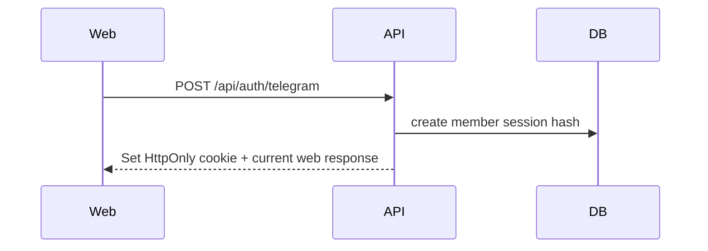
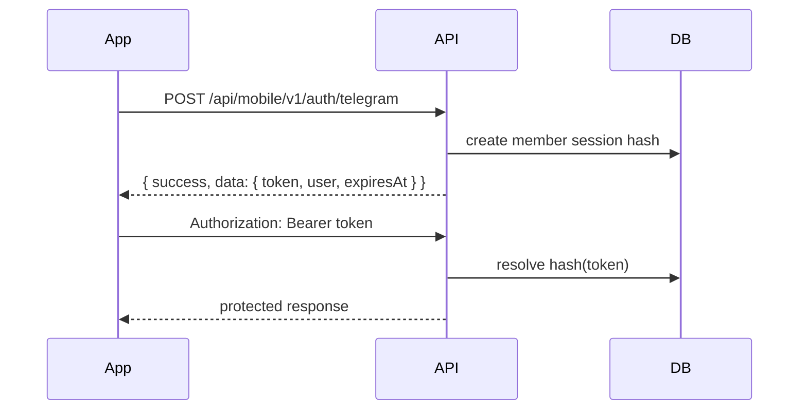

# Design Document: Mobile Readiness

## Overview

The mobile readiness work prepares Hertz for Android and iPhone clients without splitting the backend. The mobile apps will consume the same backend and database as the web app, but through a stable mobile API layer under `/api/mobile/v1/*`.

The backend already has strong primitives for mobile: cursor-based HERTZ feed pagination, RESTful JSON route handlers, consistent response envelopes, shared service/repository layers, and reusable TypeScript types. The major missing pieces are bearer-token auth and push notification infrastructure.

## Design Decisions

1. **Single backend, versioned mobile API layer**
   - Keep one backend and one database.
   - Add `/api/mobile/v1/*` endpoints for mobile-stable contracts.
   - Reuse existing services such as `HertzPostService`, article services, member auth services, and repository modules.

2. **Cookie auth remains for web**
   - Existing web flows keep using HttpOnly cookies.
   - Mobile receives and sends bearer tokens.
   - Shared auth resolution supports both cookie and bearer token.

3. **Member session token reuse**
   - Use the existing member session token model rather than introducing a separate JWT system first.
   - The raw token is returned once to the mobile client and stored in SecureStore/Keychain.
   - The database stores only the hashed token.
   - A refresh strategy must be chosen before production mobile release.

4. **Push notification as additive infrastructure**
   - Add `device_tokens` and `notification_events`.
   - Integrate FCM as the first provider for both Android and iOS.
   - Use event logging so delivery can be audited and retried later.

5. **Mobile MVP before full native parity**
   - Phase 1 focuses on auth, read feed/content, like/comment, and notification registration.
   - DM and push triggers can be expanded after the base app is stable.

## Architecture

```mermaid
graph TD
    A[Next.js Web] --> D[Hertz Backend]
    B[Android App] --> C[/api/mobile/v1/*]
    E[iPhone App] --> C
    C --> D
    D --> F[Shared Services]
    F --> G[Repositories]
    G --> H[(Postgres)]
    D --> I[Storage/R2]
    D --> J[Telegram/WordPress Integrations]
    D --> K[FCM Push Provider]
```

## Mobile API Surface

### Auth

| Method | Path | Auth | Purpose |
|---|---|---|---|
| `POST` | `/api/mobile/v1/auth/telegram` | Public | Verify Telegram login payload and return bearer token |
| `POST` | `/api/mobile/v1/auth/refresh` | Bearer or refresh token | Rotate mobile session token before expiry |
| `GET` | `/api/mobile/v1/me` | Bearer | Return current member profile/session |
| `POST` | `/api/mobile/v1/logout` | Bearer | Revoke current bearer token |

### HERTZ

| Method | Path | Auth | Purpose |
|---|---|---|---|
| `GET` | `/api/mobile/v1/hertz/posts` | Optional bearer | Cursor feed list |
| `GET` | `/api/mobile/v1/hertz/posts/:shortId` | Optional bearer | Post detail |
| `POST` | `/api/mobile/v1/hertz/posts/:shortId/like` | Bearer | Toggle suka/like using existing pulse backend |
| `POST` | `/api/mobile/v1/hertz/posts/:shortId/comments` | Bearer | Create comment |
| `DELETE` | `/api/mobile/v1/hertz/posts/comments/:commentId` | Bearer | Delete own/admin comment |

### Content

| Method | Path | Auth | Purpose |
|---|---|---|---|
| `GET` | `/api/mobile/v1/outlook` | Public | Outlook list |
| `GET` | `/api/mobile/v1/outlook/:slug` | Public | Outlook detail |
| `GET` | `/api/mobile/v1/gallery` | Public | Gallery media list |

Mobile media responses should prefer this normalized shape:

```json
{
  "id": "media-id",
  "type": "image",
  "thumbnailUrl": "https://image.example/thumb.jpg",
  "fullUrl": "https://image.example/full.jpg",
  "width": 1200,
  "height": 720,
  "article": {
    "slug": "related-article",
    "title": "Related article"
  }
}
```

If the CDN supports dynamic resizing, document the supported query parameters instead of materializing every thumbnail size.

### Notifications

| Method | Path | Auth | Purpose |
|---|---|---|---|
| `POST` | `/api/mobile/v1/notifications/register` | Bearer | Upsert device token |
| `POST` | `/api/mobile/v1/notifications/unregister` | Bearer | Disable device token |

## Authentication Flow

### Mobile Telegram Login Options

Native mobile cannot rely on the desktop web Telegram Login Widget without a wrapper flow. Choose one implementation path before coding the mobile login endpoint:

| Option | Description | Tradeoff |
|---|---|---|
| Telegram OAuth/Web login in WebView | Open Telegram auth page in a WebView or browser tab and capture callback payload | Closest to current web widget, but callback handling must be robust |
| Bot deep link + one-time code | Mobile app opens Telegram bot `/start`, bot generates short-lived code, app submits code to API | Works well with Telegram users, requires extra bot/API code |
| External browser auth callback | Use browser-based auth and deep link back into app | Cleaner than embedded WebView, requires mobile deep link setup |

Recommendation for first production mobile release: use **bot deep link + one-time code** if the community already depends on the Telegram bot, otherwise use external browser auth callback. The endpoint name can remain `/api/mobile/v1/auth/telegram`, but the request payload must match the selected flow.

### Web Flow



### Mobile Flow



### Token Refresh Strategy

The current member session expiry is suitable for web but short for native mobile expectations. Production mobile should choose one of these strategies:

1. **Refresh endpoint with rotation**
   - Add `POST /api/mobile/v1/auth/refresh`.
   - Mobile calls refresh before session expiry.
   - Backend issues a new raw session token and revokes or expires the previous token.
   - Recommended for production.

2. **No refresh in MVP**
   - Mobile re-runs Telegram auth when the bearer token expires.
   - Simpler to ship, but worse user experience.
   - Acceptable only for internal prototype.

## Auth Resolver

The auth helper should resolve member identity in this order:

1. Read existing member session cookie.
2. If cookie is absent or invalid, read `Authorization`.
3. Accept only `Bearer <token>` format.
4. Hash the raw token and look up the member session.
5. Return `MemberSessionUser` or `null`.

This preserves current web behavior while adding mobile support.

## Data Models

### `device_tokens`

```sql
CREATE TABLE device_tokens (
  id UUID PRIMARY KEY DEFAULT gen_random_uuid(),
  user_id UUID NOT NULL REFERENCES users(id) ON DELETE CASCADE,
  platform VARCHAR(16) NOT NULL CHECK (platform IN ('android', 'ios')),
  token TEXT NOT NULL,
  device_id TEXT NULL,
  app_version TEXT NULL,
  enabled BOOLEAN NOT NULL DEFAULT true,
  created_at TIMESTAMPTZ NOT NULL DEFAULT NOW(),
  updated_at TIMESTAMPTZ NOT NULL DEFAULT NOW(),
  last_seen_at TIMESTAMPTZ NOT NULL DEFAULT NOW(),
  UNIQUE (user_id, token)
);
```

Recommended indexes:

```sql
CREATE INDEX idx_device_tokens_user_enabled ON device_tokens(user_id, enabled);
CREATE INDEX idx_device_tokens_token ON device_tokens(token);
```

### `notification_events`

```sql
CREATE TABLE notification_events (
  id UUID PRIMARY KEY DEFAULT gen_random_uuid(),
  user_id UUID NOT NULL REFERENCES users(id) ON DELETE CASCADE,
  device_token_id UUID NULL REFERENCES device_tokens(id) ON DELETE SET NULL,
  event_type VARCHAR(64) NOT NULL,
  title TEXT NOT NULL,
  body TEXT NOT NULL,
  payload JSONB NOT NULL DEFAULT '{}'::jsonb,
  provider VARCHAR(32) NOT NULL DEFAULT 'fcm',
  provider_message_id TEXT NULL,
  status VARCHAR(24) NOT NULL DEFAULT 'pending',
  error_message TEXT NULL,
  created_at TIMESTAMPTZ NOT NULL DEFAULT NOW(),
  sent_at TIMESTAMPTZ NULL,
  failed_at TIMESTAMPTZ NULL
);
```

Recommended statuses:

- `pending`
- `sent`
- `failed`
- `skipped`

Recommended event types:

- `dm.message.created`
- `hertz.comment.created`
- `hertz.post.announcement`
- `credit.transaction.created`

## Response Shapes

### Mobile Auth Success

```json
{
  "success": true,
  "data": {
    "token": "raw-session-token-returned-once",
    "expiresAt": "2026-06-14T00:00:00.000Z",
    "user": {
      "id": "uuid",
      "telegramId": 123,
      "username": "member",
      "displayName": "Member",
      "avatarUrl": "https://...",
      "role": "member",
      "badge": "verified_member"
    }
  }
}
```

### Mobile Feed Success

```json
{
  "success": true,
  "data": {
    "items": [],
    "nextCursor": null
  }
}
```

### Error Response

```json
{
  "success": false,
  "error": {
    "code": "AUTH_REQUIRED",
    "message": "Login member diperlukan"
  }
}
```

## Rate Limiting

Mobile clients can generate retry traffic from unstable networks and background tasks. Rate limiting should be applied by the best available identity:

1. Authenticated mutation endpoints: member session token hash plus user id.
2. Device endpoints: user id plus device token or device id.
3. Public reads: IP plus user agent, with more generous limits.
4. Auth endpoints: IP plus Telegram id or one-time code when available.

Recommended initial policy:

| Endpoint group | Initial policy |
|---|---|
| Auth login/refresh | Strict, burst-protected |
| Like/comment/register device | Moderate per user/token |
| Feed/content reads | Generous per IP/session |
| Upload/media mutations | Strict per user |

Rate limit responses must use the standard error envelope and a stable code such as `RATE_LIMIT_EXCEEDED`.

## Cache and Offline Resilience

Full offline sync is out of scope, but mobile APIs should be cache-friendly:

- Public Blog/Outlook/Gallery responses can include `Cache-Control` where safe.
- Detail endpoints can support `ETag` or `Last-Modified` later.
- HERTZ feed should remain dynamic by default, but can include short-lived cache hints for guest reads.
- Mobile clients should treat `nextCursor` as the primary infinite-scroll state.

## Notification Preferences

`device_tokens.enabled` controls whether a device can receive notifications at all. Per-event preferences should be a later phase, likely with a `notification_preferences` table:

```sql
CREATE TABLE notification_preferences (
  user_id UUID NOT NULL REFERENCES users(id) ON DELETE CASCADE,
  event_type VARCHAR(64) NOT NULL,
  enabled BOOLEAN NOT NULL DEFAULT true,
  updated_at TIMESTAMPTZ NOT NULL DEFAULT NOW(),
  PRIMARY KEY (user_id, event_type)
);
```

Initial release can send only critical triggers, then add preferences once notification volume grows.

## File/Module Impact

Expected implementation touchpoints:

- `frontend/src/lib/memberAuth.ts`
- `shared/services/memberSessionService.ts`
- `shared/services/membershipService.ts`
- `frontend/src/app/api/auth/telegram/route.ts`
- `frontend/src/app/api/mobile/v1/auth/telegram/route.ts`
- `frontend/src/app/api/mobile/v1/auth/refresh/route.ts`
- `frontend/src/app/api/mobile/v1/me/route.ts`
- `frontend/src/app/api/mobile/v1/logout/route.ts`
- `frontend/src/app/api/mobile/v1/hertz/posts/route.ts`
- `frontend/src/app/api/mobile/v1/notifications/register/route.ts`
- `shared/repositories/deviceTokenRepository.ts`
- `shared/services/pushNotificationService.ts`
- `db/migrations/*_create_mobile_notifications.sql`

## Security Considerations

- Raw bearer tokens must never be logged.
- Raw bearer tokens must never be stored in the database.
- Mobile clients should store tokens in Keychain/SecureStore, not AsyncStorage/plain storage.
- Token revocation must work per session/device.
- Device tokens should be associated with authenticated users only.
- FCM credentials must be stored as environment variables or mounted secrets.
- Push notification payloads should avoid sensitive message bodies until privacy policy is finalized.

## Rollout Plan

1. Add bearer-token fallback to auth resolver.
2. Add mobile auth endpoints.
3. Add mobile HERTZ read/action endpoints.
4. Add Blog/Outlook/Gallery mobile endpoints.
5. Add device token schema and registration.
6. Add FCM service and first triggers.
7. Add tests and contract examples for mobile app developers.

## Out of Scope

- Separate mobile backend service.
- Replacing cookie auth for the web.
- Full offline sync engine.
- WebSocket realtime messaging.
- Native app implementation.
- Admin mobile app.
